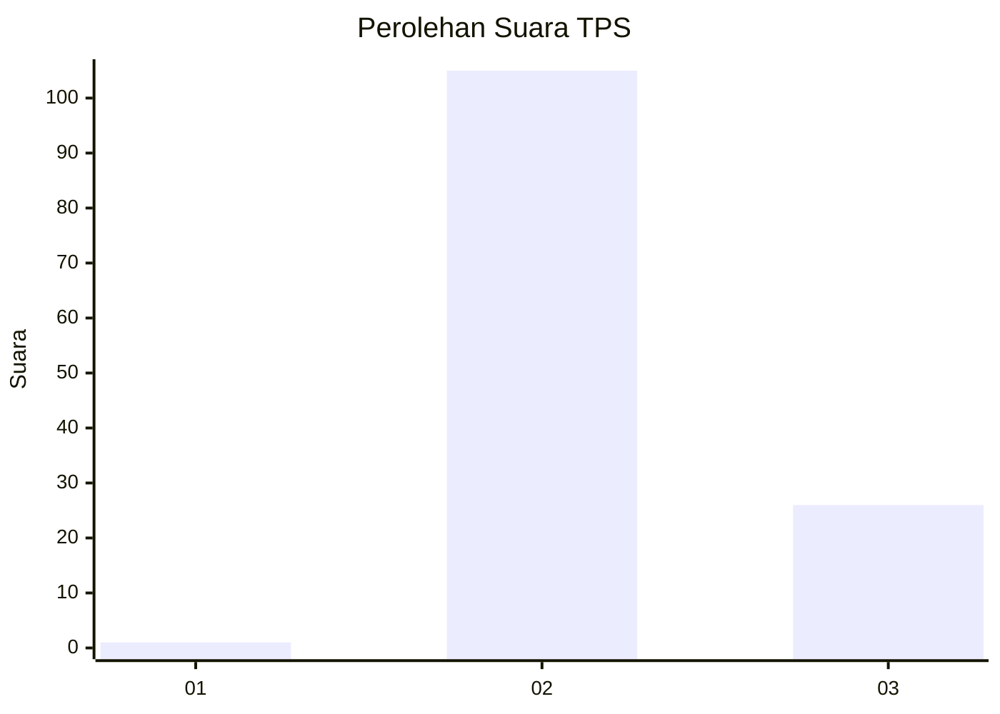
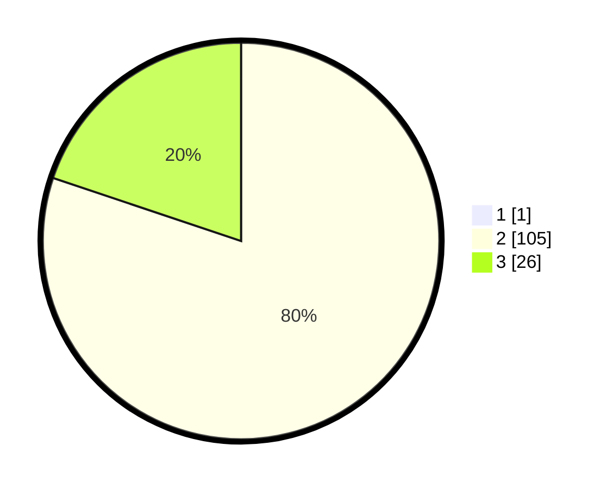

# Hasil

## Grafik

## Tabel

| No. | Nama Paslon    | Suara | Suara (raw) | Persentase |
|:--- |:-------------- | -----:| -----------:| ----------:|
| 1   | ANIES MUHAIMIN | 1     | [1][p-1]    | 0,76       |
| 2   | PRABOWO GIBRAN | 105   | [105][p-2]  | 79,55      |
| 3   | GANJAR MAHFUD  | 26    | [26][p-3]   | 19,70      |

[p-1]: https://github.com/gigit-pemilu/pemilu-2024/blob/main/pilpres/hitung-suara/sub/12-sumatera-utara/sub/14-nias-selatan/sub/22-onohazumba/sub/2004-sisarahili-oyo/sub/002-tps/sub/paslon-1.txt
[p-2]: https://github.com/gigit-pemilu/pemilu-2024/blob/main/pilpres/hitung-suara/sub/12-sumatera-utara/sub/14-nias-selatan/sub/22-onohazumba/sub/2004-sisarahili-oyo/sub/002-tps/sub/paslon-2.txt
[p-3]: https://github.com/gigit-pemilu/pemilu-2024/blob/main/pilpres/hitung-suara/sub/12-sumatera-utara/sub/14-nias-selatan/sub/22-onohazumba/sub/2004-sisarahili-oyo/sub/002-tps/sub/paslon-3.txt

## Foto C Plano

https://sirekap-obj-formc.kpu.go.id/9a5b/pemilu/ppwp/12/14/22/20/04/1214222004002-20240215-074234--6910868f-52f6-4e15-964c-8ace32cc7076.jpg

https://sirekap-obj-formc.kpu.go.id/9a5b/pemilu/ppwp/12/14/22/20/04/1214222004002-20240215-074418--d79c8671-6cc0-4299-9fe4-b9c3823b9a1e.jpg

https://sirekap-obj-formc.kpu.go.id/9a5b/pemilu/ppwp/12/14/22/20/04/1214222004002-20240215-074604--c02fc208-f880-4a6d-a866-3d16a0c43379.jpg

## Metadata

| Key        | Value               |
| ---------- | ------------------- |
| Time Stamp | 2024-02-19 13:00:00 |

