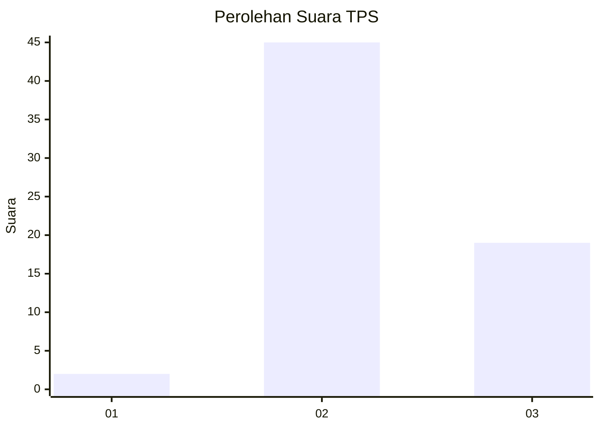
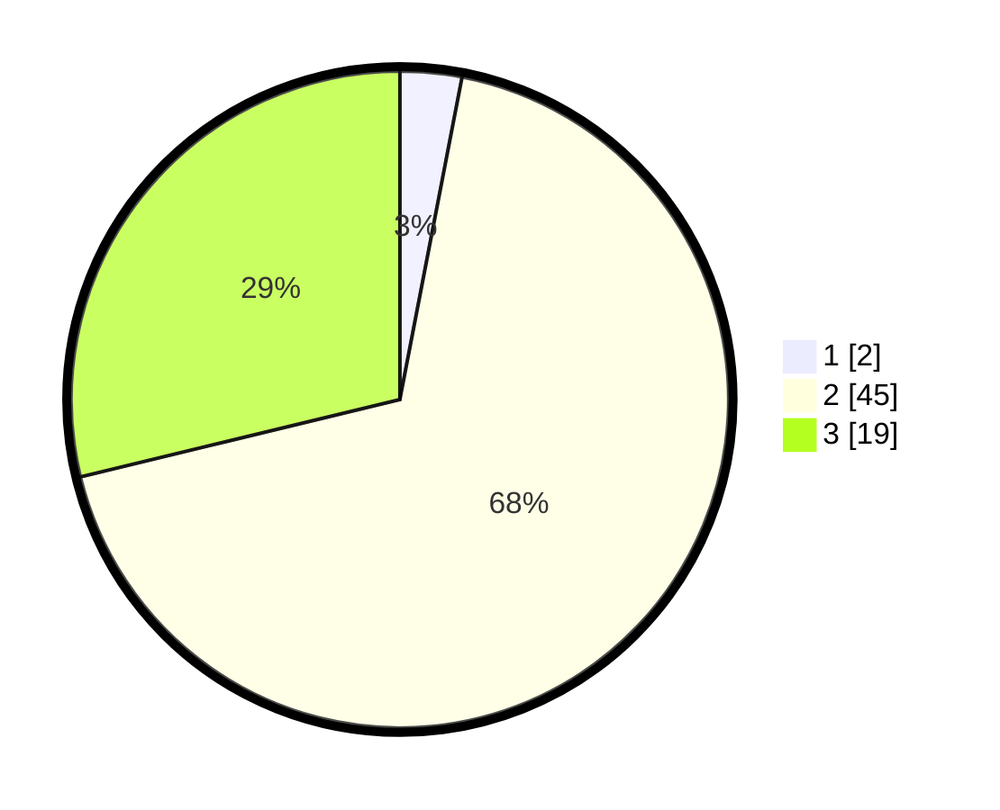

# Hasil

## Grafik

## Tabel

| No. | Nama Paslon    | Suara | Suara (raw) | Persentase |
|:--- |:-------------- | -----:| -----------:| ----------:|
| 1   | ANIES MUHAIMIN | 2     | [2][p-1]    | 3,03       |
| 2   | PRABOWO GIBRAN | 45    | [45][p-2]   | 68,18      |
| 3   | GANJAR MAHFUD  | 19    | [19][p-3]   | 28,79      |

[p-1]: https://github.com/gigit-pemilu/pemilu-2024/blob/main/pilpres/hitung-suara/sub/12-sumatera-utara/sub/14-nias-selatan/sub/22-onohazumba/sub/2009-tetehosi/sub/001-tps/sub/paslon-1.txt
[p-2]: https://github.com/gigit-pemilu/pemilu-2024/blob/main/pilpres/hitung-suara/sub/12-sumatera-utara/sub/14-nias-selatan/sub/22-onohazumba/sub/2009-tetehosi/sub/001-tps/sub/paslon-2.txt
[p-3]: https://github.com/gigit-pemilu/pemilu-2024/blob/main/pilpres/hitung-suara/sub/12-sumatera-utara/sub/14-nias-selatan/sub/22-onohazumba/sub/2009-tetehosi/sub/001-tps/sub/paslon-3.txt

## Foto C Plano

https://sirekap-obj-formc.kpu.go.id/5399/pemilu/ppwp/12/14/22/20/09/1214222009001-20240215-034433--e2ce5cf3-303d-4105-a6e9-7ae4d6893229.jpg

https://sirekap-obj-formc.kpu.go.id/5399/pemilu/ppwp/12/14/22/20/09/1214222009001-20240214-231605--a3220b75-e191-4aca-b58f-ae1ebf14b9a5.jpg

https://sirekap-obj-formc.kpu.go.id/5399/pemilu/ppwp/12/14/22/20/09/1214222009001-20240214-231946--c90f7cdb-0f59-40d5-ac0d-644b7bd26714.jpg

## Metadata

| Key        | Value               |
| ---------- | ------------------- |
| Time Stamp | 2024-02-15 22:30:27 |

