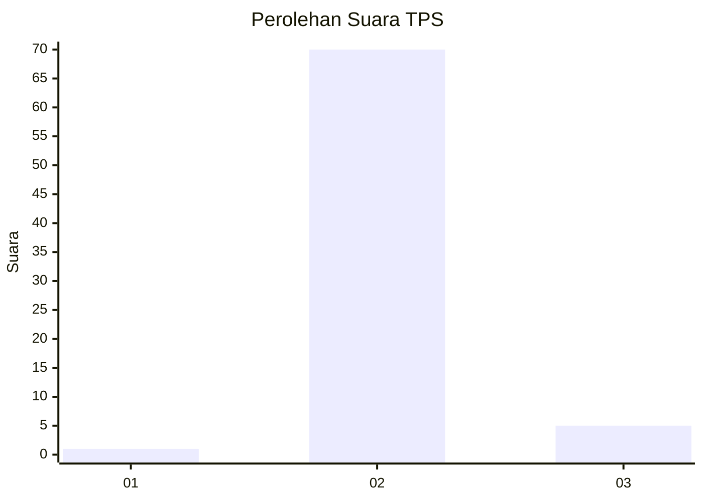
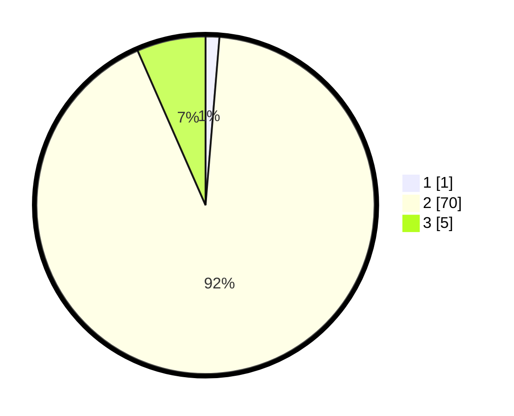

# Hasil

## Grafik

## Tabel

| No. | Nama Paslon    | Suara | Suara (raw) | Persentase |
|:--- |:-------------- | -----:| -----------:| ----------:|
| 1   | ANIES MUHAIMIN | 1     | [1][p-1]    | 1,32       |
| 2   | PRABOWO GIBRAN | 70    | [70][p-2]   | 92,11      |
| 3   | GANJAR MAHFUD  | 5     | [5][p-3]    | 6,58       |

[p-1]: https://github.com/gigit-pemilu/pemilu-2024/blob/main/pilpres/hitung-suara/sub/12-sumatera-utara/sub/14-nias-selatan/sub/22-onohazumba/sub/2009-tetehosi/sub/002-tps/sub/paslon-1.txt
[p-2]: https://github.com/gigit-pemilu/pemilu-2024/blob/main/pilpres/hitung-suara/sub/12-sumatera-utara/sub/14-nias-selatan/sub/22-onohazumba/sub/2009-tetehosi/sub/002-tps/sub/paslon-2.txt
[p-3]: https://github.com/gigit-pemilu/pemilu-2024/blob/main/pilpres/hitung-suara/sub/12-sumatera-utara/sub/14-nias-selatan/sub/22-onohazumba/sub/2009-tetehosi/sub/002-tps/sub/paslon-3.txt

## Foto C Plano

https://sirekap-obj-formc.kpu.go.id/9bc9/pemilu/ppwp/12/14/22/20/09/1214222009002-20240214-220615--9d18a628-4fdc-40c4-89c9-17b8377894ee.jpg

https://sirekap-obj-formc.kpu.go.id/9bc9/pemilu/ppwp/12/14/22/20/09/1214222009002-20240214-220828--3a23ecae-28d3-4253-ab4b-4a55a642f2c5.jpg

https://sirekap-obj-formc.kpu.go.id/9bc9/pemilu/ppwp/12/14/22/20/09/1214222009002-20240214-220848--e7a30819-41da-4fc0-80a5-985abdc862be.jpg

## Metadata

| Key        | Value               |
| ---------- | ------------------- |
| Time Stamp | 2024-02-20 12:00:00 |

