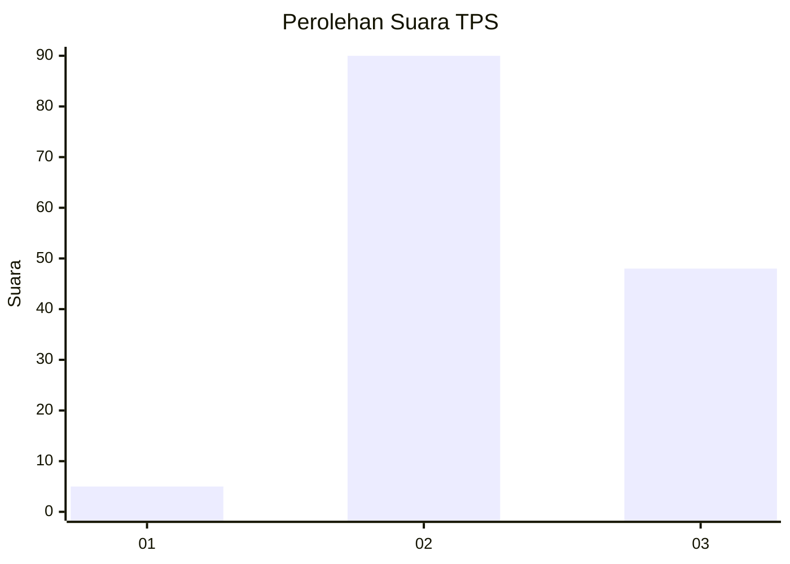
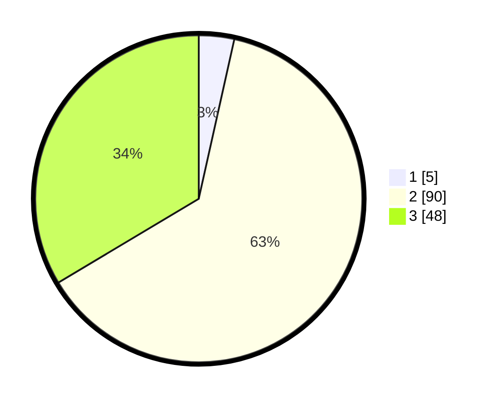

# Hasil

## Grafik

## Tabel

| No. | Nama Paslon    | Suara | Suara (raw) | Persentase |
|:--- |:-------------- | -----:| -----------:| ----------:|
| 1   | ANIES MUHAIMIN | 5     | [5][p-1]    | 3,50       |
| 2   | PRABOWO GIBRAN | 90    | [90][p-2]   | 62,94      |
| 3   | GANJAR MAHFUD  | 48    | [48][p-3]   | 33,57      |

[p-1]: https://github.com/gigit-pemilu/pemilu-2024/blob/main/pilpres/hitung-suara/sub/12-sumatera-utara/sub/14-nias-selatan/sub/23-hilisalawa'ahe/sub/2008-berua-siwalawa/sub/001-tps/sub/paslon-1.txt
[p-2]: https://github.com/gigit-pemilu/pemilu-2024/blob/main/pilpres/hitung-suara/sub/12-sumatera-utara/sub/14-nias-selatan/sub/23-hilisalawa'ahe/sub/2008-berua-siwalawa/sub/001-tps/sub/paslon-2.txt
[p-3]: https://github.com/gigit-pemilu/pemilu-2024/blob/main/pilpres/hitung-suara/sub/12-sumatera-utara/sub/14-nias-selatan/sub/23-hilisalawa'ahe/sub/2008-berua-siwalawa/sub/001-tps/sub/paslon-3.txt

## Foto C Plano

https://sirekap-obj-formc.kpu.go.id/901a/pemilu/ppwp/12/14/23/20/08/1214232008001-20240214-211552--90a1e7a4-c46d-4fbd-b996-81a717d29be3.jpg

https://sirekap-obj-formc.kpu.go.id/901a/pemilu/ppwp/12/14/23/20/08/1214232008001-20240215-024849--c6176c8f-5c17-4f00-bac7-167d8957b80c.jpg

https://sirekap-obj-formc.kpu.go.id/901a/pemilu/ppwp/12/14/23/20/08/1214232008001-20240214-211109--4133a8ec-7013-4a34-9119-9846a47cf528.jpg

## Metadata

| Key        | Value               |
| ---------- | ------------------- |
| Time Stamp | 2024-02-15 22:30:27 |

