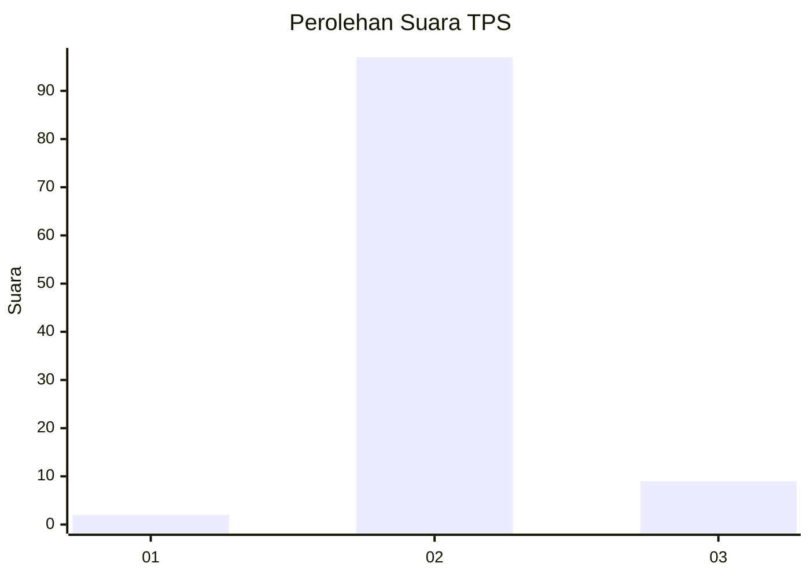
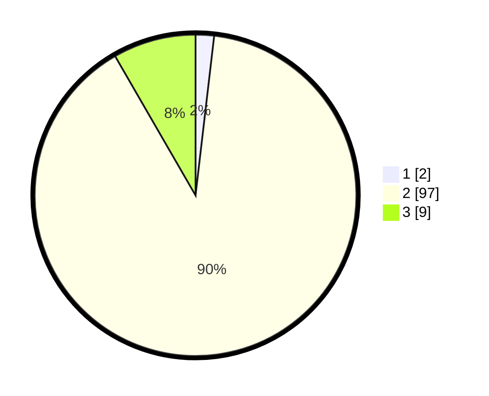

# Hasil

## Grafik

## Tabel

| No. | Nama Paslon    | Suara | Suara (raw) | Persentase |
|:--- |:-------------- | -----:| -----------:| ----------:|
| 1   | ANIES MUHAIMIN | 2     | [2][p-1]    | 1,85       |
| 2   | PRABOWO GIBRAN | 97    | [97][p-2]   | 89,81      |
| 3   | GANJAR MAHFUD  | 9     | [9][p-3]    | 8,33       |

[p-1]: https://github.com/gigit-pemilu/pemilu-2024-12-sumatera-utara/blob/main/pilpres/hitung-suara/sub/12-sumatera-utara/sub/14-nias-selatan/sub/24-ulususua/sub/2001-fondrakoraya/sub/001-tps/sub/paslon-1.txt
[p-2]: https://github.com/gigit-pemilu/pemilu-2024-12-sumatera-utara/blob/main/pilpres/hitung-suara/sub/12-sumatera-utara/sub/14-nias-selatan/sub/24-ulususua/sub/2001-fondrakoraya/sub/001-tps/sub/paslon-2.txt
[p-3]: https://github.com/gigit-pemilu/pemilu-2024-12-sumatera-utara/blob/main/pilpres/hitung-suara/sub/12-sumatera-utara/sub/14-nias-selatan/sub/24-ulususua/sub/2001-fondrakoraya/sub/001-tps/sub/paslon-3.txt

## Foto C Plano

https://sirekap-obj-formc.kpu.go.id/af82/pemilu/ppwp/12/14/24/20/01/1214242001001-20240215-130714--ded1593d-25a8-4876-ae4e-cafc0e972fd7.jpg

https://sirekap-obj-formc.kpu.go.id/af82/pemilu/ppwp/12/14/24/20/01/1214242001001-20240215-131236--16923a2c-18ab-4440-8cbe-6dd5d98182ce.jpg

https://sirekap-obj-formc.kpu.go.id/af82/pemilu/ppwp/12/14/24/20/01/1214242001001-20240215-130854--8eacff97-0d6c-43e5-8370-6e8eac52b3a5.jpg

## Metadata

| Key        | Value               |
| ---------- | ------------------- |
| Time Stamp | 2024-02-16 00:30:27 |

