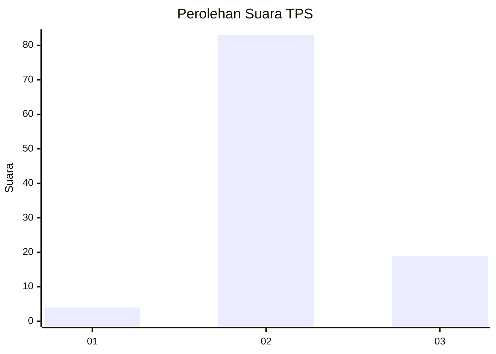
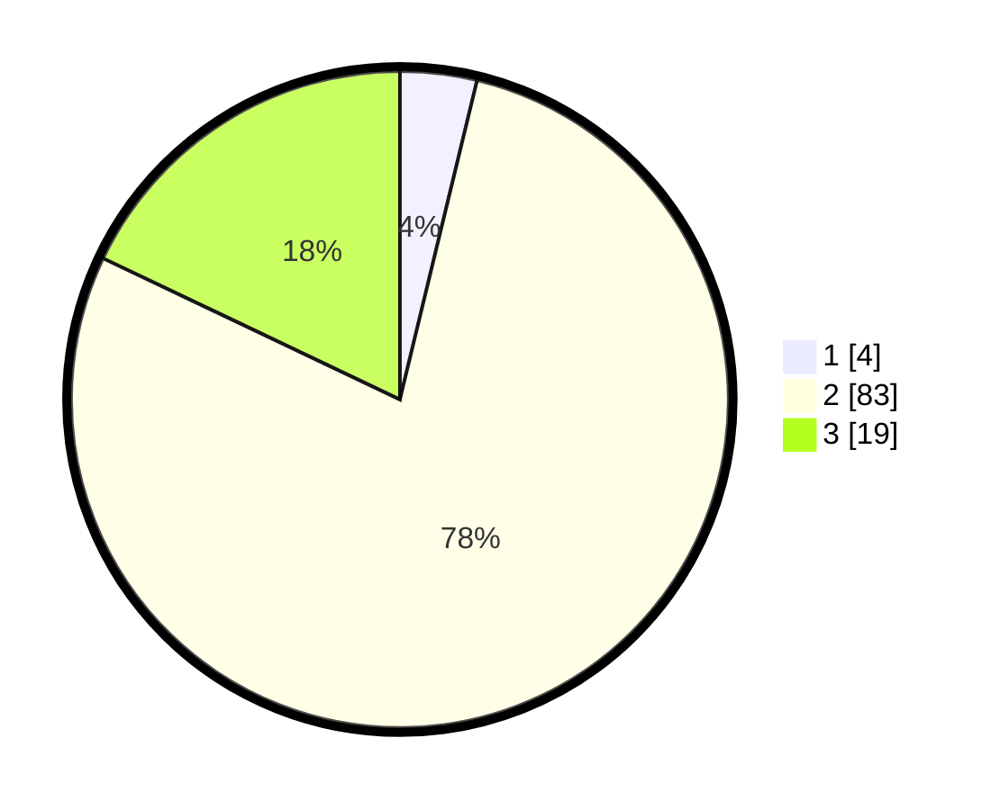

# Hasil

## Grafik

## Tabel

| No. | Nama Paslon    | Suara | Suara (raw) | Persentase |
|:--- |:-------------- | -----:| -----------:| ----------:|
| 1   | ANIES MUHAIMIN | 4     | [4][p-1]    | 3,77       |
| 2   | PRABOWO GIBRAN | 83    | [83][p-2]   | 78,30      |
| 3   | GANJAR MAHFUD  | 19    | [19][p-3]   | 17,92      |

[p-1]: https://github.com/gigit-pemilu/pemilu-2024-12-sumatera-utara/blob/main/pilpres/hitung-suara/sub/12-sumatera-utara/sub/14-nias-selatan/sub/24-ulususua/sub/2003-sisarahili-susua/sub/002-tps/sub/paslon-1.txt
[p-2]: https://github.com/gigit-pemilu/pemilu-2024-12-sumatera-utara/blob/main/pilpres/hitung-suara/sub/12-sumatera-utara/sub/14-nias-selatan/sub/24-ulususua/sub/2003-sisarahili-susua/sub/002-tps/sub/paslon-2.txt
[p-3]: https://github.com/gigit-pemilu/pemilu-2024-12-sumatera-utara/blob/main/pilpres/hitung-suara/sub/12-sumatera-utara/sub/14-nias-selatan/sub/24-ulususua/sub/2003-sisarahili-susua/sub/002-tps/sub/paslon-3.txt

## Foto C Plano

https://sirekap-obj-formc.kpu.go.id/5c9b/pemilu/ppwp/12/14/24/20/03/1214242003002-20240215-232117--02aa7e01-2e0a-4e83-9d0e-c3aa90dd86c8.jpg

https://sirekap-obj-formc.kpu.go.id/5c9b/pemilu/ppwp/12/14/24/20/03/1214242003002-20240215-232249--0ffa2c0a-3d52-41be-9cc6-5b692317c125.jpg

https://sirekap-obj-formc.kpu.go.id/5c9b/pemilu/ppwp/12/14/24/20/03/1214242003002-20240215-232425--7e615519-78f5-4c5d-925f-d52007ea1129.jpg

## Metadata

| Key        | Value               |
| ---------- | ------------------- |
| Time Stamp | 2024-02-20 12:00:00 |

