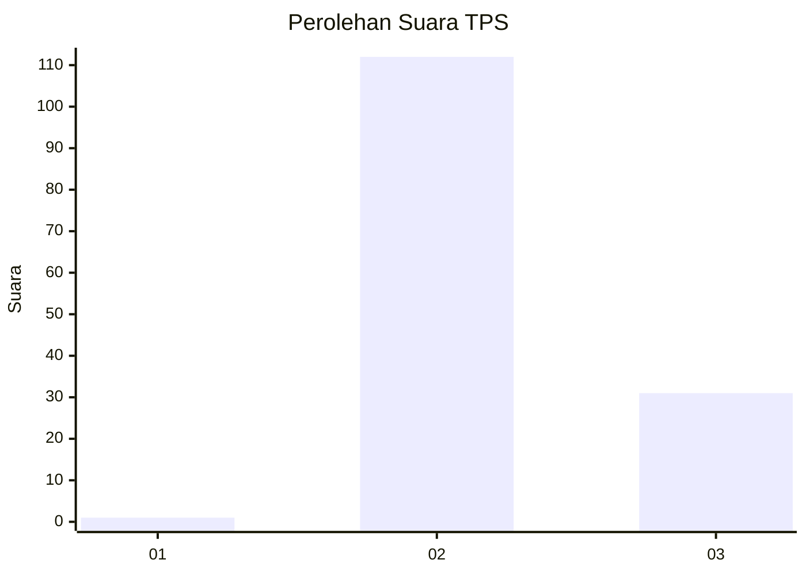
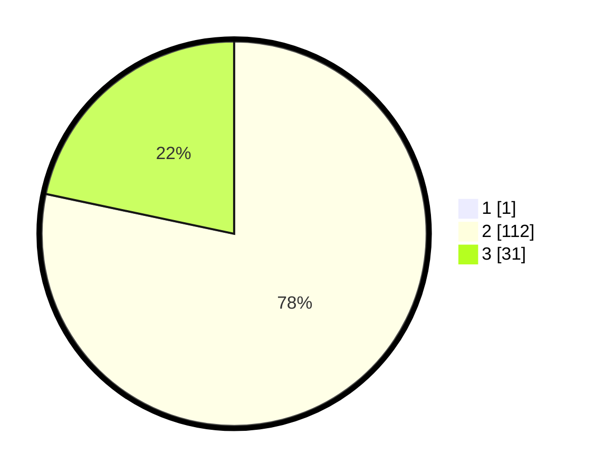

# Hasil

## Grafik

## Tabel

| No. | Nama Paslon    | Suara | Suara (raw) | Persentase |
|:--- |:-------------- | -----:| -----------:| ----------:|
| 1   | ANIES MUHAIMIN | 1     | [1][p-1]    | 0,69       |
| 2   | PRABOWO GIBRAN | 112   | [112][p-2]  | 77,78      |
| 3   | GANJAR MAHFUD  | 31    | [31][p-3]   | 21,53      |

[p-1]: https://github.com/gigit-pemilu/pemilu-2024-12-sumatera-utara/blob/main/pilpres/hitung-suara/sub/12-sumatera-utara/sub/14-nias-selatan/sub/24-ulususua/sub/2004-susua/sub/002-tps/sub/paslon-1.txt
[p-2]: https://github.com/gigit-pemilu/pemilu-2024-12-sumatera-utara/blob/main/pilpres/hitung-suara/sub/12-sumatera-utara/sub/14-nias-selatan/sub/24-ulususua/sub/2004-susua/sub/002-tps/sub/paslon-2.txt
[p-3]: https://github.com/gigit-pemilu/pemilu-2024-12-sumatera-utara/blob/main/pilpres/hitung-suara/sub/12-sumatera-utara/sub/14-nias-selatan/sub/24-ulususua/sub/2004-susua/sub/002-tps/sub/paslon-3.txt

## Foto C Plano

https://sirekap-obj-formc.kpu.go.id/8ccf/pemilu/ppwp/12/14/24/20/04/1214242004002-20240215-142459--67e036c8-f804-4ada-9a71-46d122a74be3.jpg

https://sirekap-obj-formc.kpu.go.id/8ccf/pemilu/ppwp/12/14/24/20/04/1214242004002-20240215-160849--9dca18fb-b250-448a-a4f2-fbadbe7dfaff.jpg

https://sirekap-obj-formc.kpu.go.id/8ccf/pemilu/ppwp/12/14/24/20/04/1214242004002-20240215-142550--0e9f1512-08bd-44f4-8e57-afbe2bf9821f.jpg

## Metadata

| Key        | Value               |
| ---------- | ------------------- |
| Time Stamp | 2024-02-20 12:00:00 |

## DATA PEMILIH TETAP

Jumlah pemilih dalam DPT: **802**.
 * L: **90**.
 * P: **99**.

## DATA PENGGUNA HAK PILIH

Jumlah pengguna hak pilih dalam DPT: **862**.
 * L: **0**.
 * P: **2**.

Jumlah pengguna hak pilih dalam DPTb: **555**.
 * L: **550**.
 * P: **2**.

Jumlah pengguna hak pilih dalam DPK: **605**.
 * L: **600**.
 * P: **10**.

Jumlah pengguna hak pilih: **162**.
 * L: **80**.
 * P: **92**.

## JUMLAH SUARA SAH DAN TIDAK SAH

JUMLAH SELURUH SUARA SAH: **144**.

JUMLAH SUARA TIDAK SAH: **19**.

JUMLAH SELURUH SUARA SAH DAN SUARA TIDAK SAH: **163**.

