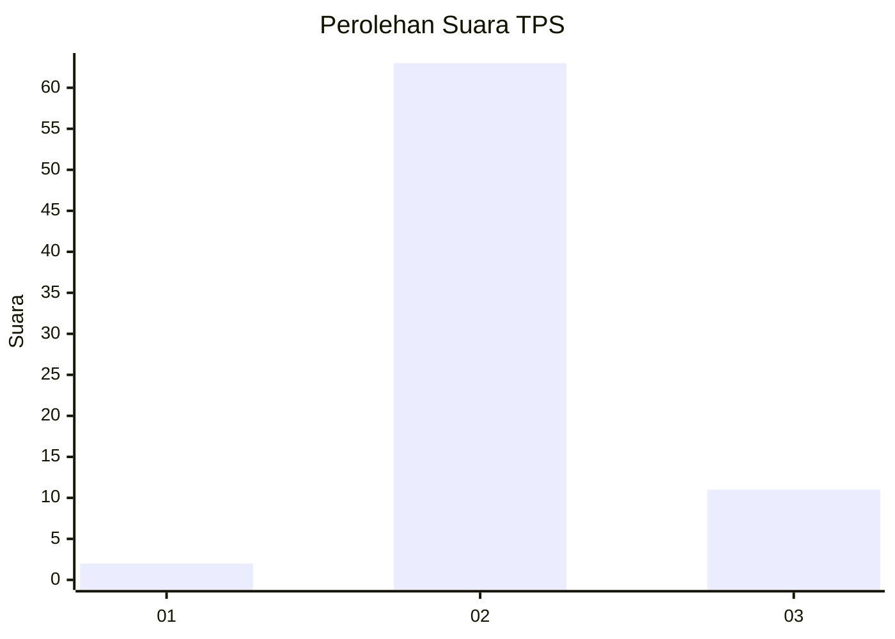
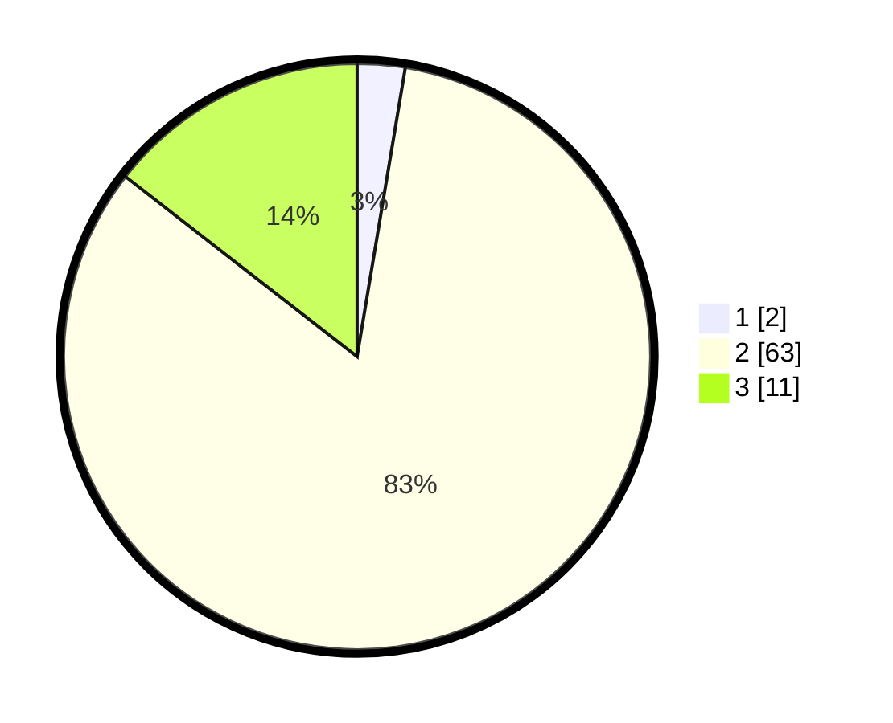

# Hasil

## Grafik

## Tabel

| No. | Nama Paslon    | Suara | Suara (raw) | Persentase |
|:--- |:-------------- | -----:| -----------:| ----------:|
| 1   | ANIES MUHAIMIN | 2     | [2][p-1]    | 2,63       |
| 2   | PRABOWO GIBRAN | 63    | [63][p-2]   | 82,89      |
| 3   | GANJAR MAHFUD  | 11    | [11][p-3]   | 14,47      |

[p-1]: https://github.com/gigit-pemilu/pemilu-2024/blob/main/pilpres/hitung-suara/sub/12-sumatera-utara/sub/14-nias-selatan/sub/24-ulususua/sub/2005-lahusa-susua/sub/002-tps/sub/paslon-1.txt
[p-2]: https://github.com/gigit-pemilu/pemilu-2024/blob/main/pilpres/hitung-suara/sub/12-sumatera-utara/sub/14-nias-selatan/sub/24-ulususua/sub/2005-lahusa-susua/sub/002-tps/sub/paslon-2.txt
[p-3]: https://github.com/gigit-pemilu/pemilu-2024/blob/main/pilpres/hitung-suara/sub/12-sumatera-utara/sub/14-nias-selatan/sub/24-ulususua/sub/2005-lahusa-susua/sub/002-tps/sub/paslon-3.txt

## Foto C Plano

https://sirekap-obj-formc.kpu.go.id/6798/pemilu/ppwp/12/14/24/20/05/1214242005002-20240215-093028--429da1a3-1219-4cfa-8269-b0ed83714481.jpg

https://sirekap-obj-formc.kpu.go.id/6798/pemilu/ppwp/12/14/24/20/05/1214242005002-20240215-093207--1d266bb7-613b-4293-af19-11cb309381a5.jpg

https://sirekap-obj-formc.kpu.go.id/6798/pemilu/ppwp/12/14/24/20/05/1214242005002-20240215-093325--7df72db2-7398-496d-a292-9912ac0a5519.jpg

## Metadata

| Key        | Value               |
| ---------- | ------------------- |
| Time Stamp | 2024-02-15 22:30:27 |

