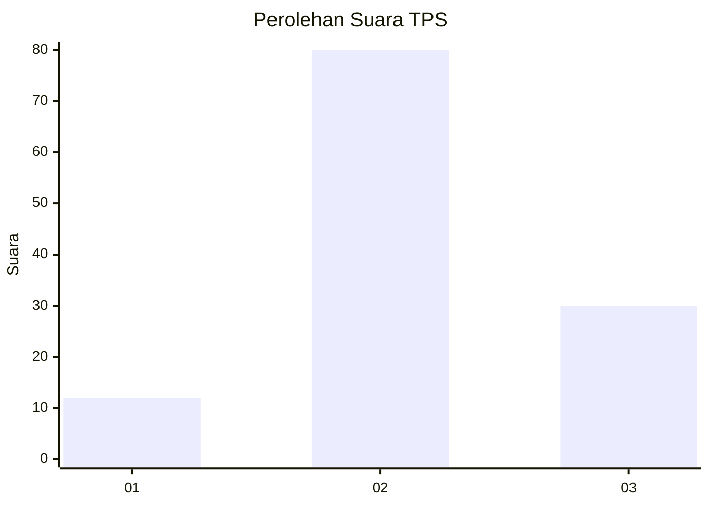
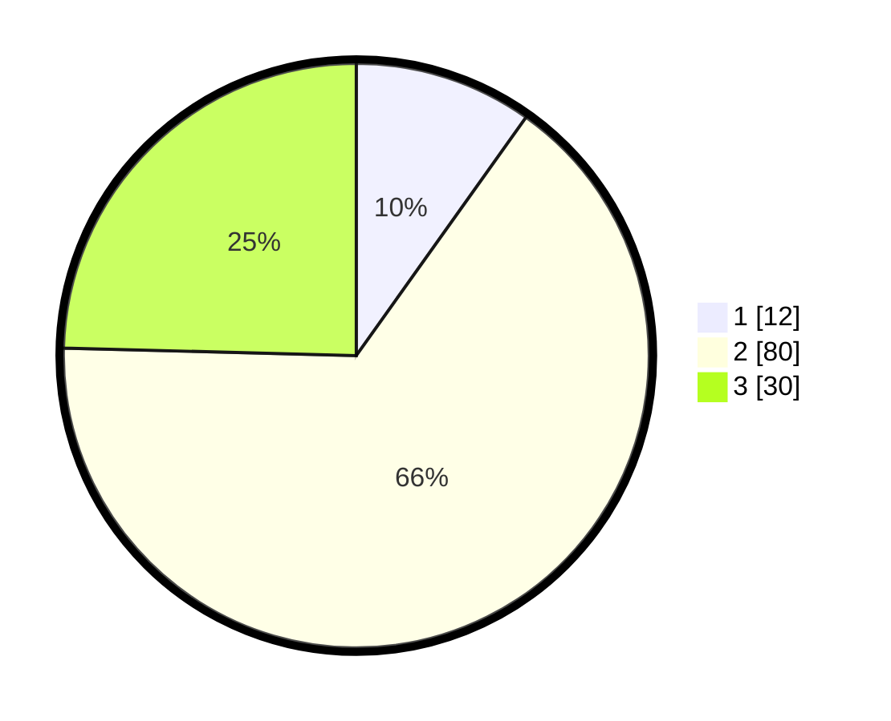

# Hasil

## Grafik

## Tabel

| No. | Nama Paslon    | Suara | Suara (raw) | Persentase |
|:--- |:-------------- | -----:| -----------:| ----------:|
| 1   | ANIES MUHAIMIN | 12    | [12][p-1]   | 9,84       |
| 2   | PRABOWO GIBRAN | 80    | [80][p-2]   | 65,57      |
| 3   | GANJAR MAHFUD  | 30    | [30][p-3]   | 24,59      |

[p-1]: https://github.com/gigit-pemilu/pemilu-2024-12-sumatera-utara/blob/main/pilpres/hitung-suara/sub/12-sumatera-utara/sub/14-nias-selatan/sub/25-sidua'ori/sub/2002-hilidohona/sub/001-tps/sub/paslon-1.txt
[p-2]: https://github.com/gigit-pemilu/pemilu-2024-12-sumatera-utara/blob/main/pilpres/hitung-suara/sub/12-sumatera-utara/sub/14-nias-selatan/sub/25-sidua'ori/sub/2002-hilidohona/sub/001-tps/sub/paslon-2.txt
[p-3]: https://github.com/gigit-pemilu/pemilu-2024-12-sumatera-utara/blob/main/pilpres/hitung-suara/sub/12-sumatera-utara/sub/14-nias-selatan/sub/25-sidua'ori/sub/2002-hilidohona/sub/001-tps/sub/paslon-3.txt

## Foto C Plano

https://sirekap-obj-formc.kpu.go.id/67c4/pemilu/ppwp/12/14/25/20/02/1214252002001-20240215-093116--b72f6605-81ec-4b78-986b-33445899d2a0.jpg

https://sirekap-obj-formc.kpu.go.id/67c4/pemilu/ppwp/12/14/25/20/02/1214252002001-20240215-093251--590bd35e-cb73-4bba-87b0-65601071b5fa.jpg

https://sirekap-obj-formc.kpu.go.id/67c4/pemilu/ppwp/12/14/25/20/02/1214252002001-20240215-093504--38113876-8d86-43ec-87d4-1db894ea47ca.jpg

## Metadata

| Key        | Value               |
| ---------- | ------------------- |
| Time Stamp | 2024-02-20 12:00:00 |

