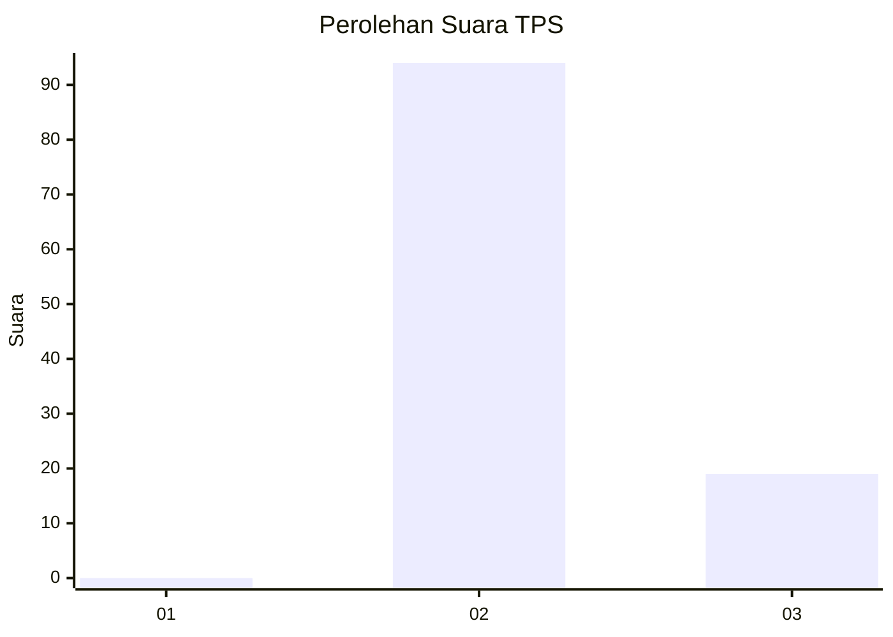
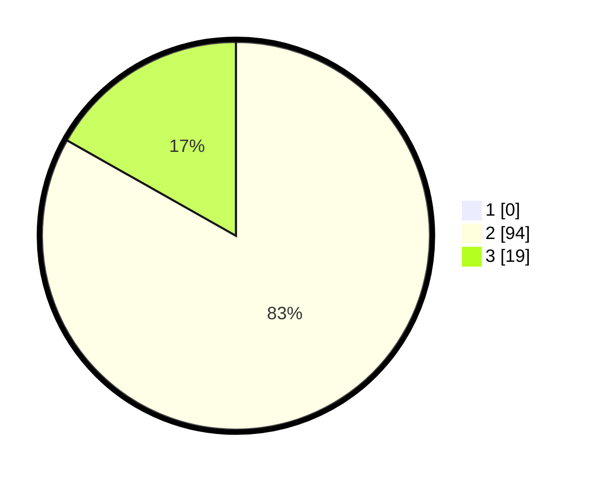

# Hasil

## Grafik

## Tabel

| No. | Nama Paslon    | Suara | Suara (raw) | Persentase |
|:--- |:-------------- | -----:| -----------:| ----------:|
| 1   | ANIES MUHAIMIN | 0     | [0][p-1]    | 0,00       |
| 2   | PRABOWO GIBRAN | 94    | [94][p-2]   | 83,19      |
| 3   | GANJAR MAHFUD  | 19    | [19][p-3]   | 16,81      |

[p-1]: https://github.com/gigit-pemilu/pemilu-2024-12-sumatera-utara/blob/main/pilpres/hitung-suara/sub/12-sumatera-utara/sub/14-nias-selatan/sub/25-sidua'ori/sub/2002-hilidohona/sub/002-tps/sub/paslon-1.txt
[p-2]: https://github.com/gigit-pemilu/pemilu-2024-12-sumatera-utara/blob/main/pilpres/hitung-suara/sub/12-sumatera-utara/sub/14-nias-selatan/sub/25-sidua'ori/sub/2002-hilidohona/sub/002-tps/sub/paslon-2.txt
[p-3]: https://github.com/gigit-pemilu/pemilu-2024-12-sumatera-utara/blob/main/pilpres/hitung-suara/sub/12-sumatera-utara/sub/14-nias-selatan/sub/25-sidua'ori/sub/2002-hilidohona/sub/002-tps/sub/paslon-3.txt

## Foto C Plano

https://sirekap-obj-formc.kpu.go.id/bfea/pemilu/ppwp/12/14/25/20/02/1214252002002-20240215-092625--c1a65b59-f333-498e-b126-cf9d533cd2e3.jpg

https://sirekap-obj-formc.kpu.go.id/bfea/pemilu/ppwp/12/14/25/20/02/1214252002002-20240215-092206--a5a73703-c03e-4856-9eb9-f9b41cda45f7.jpg

https://sirekap-obj-formc.kpu.go.id/bfea/pemilu/ppwp/12/14/25/20/02/1214252002002-20240215-092328--fac8c624-9ba6-4569-a888-a19dcc62b66e.jpg

## Metadata

| Key        | Value               |
| ---------- | ------------------- |
| Time Stamp | 2024-02-20 12:00:00 |

