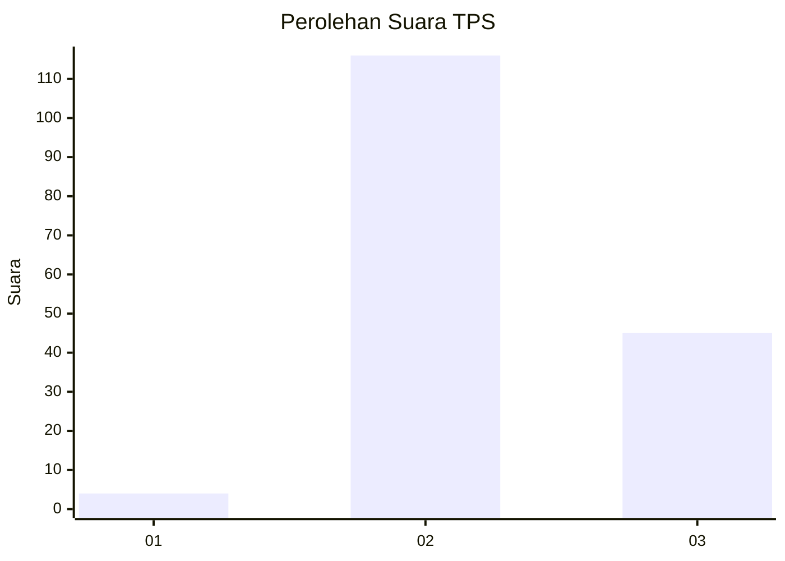
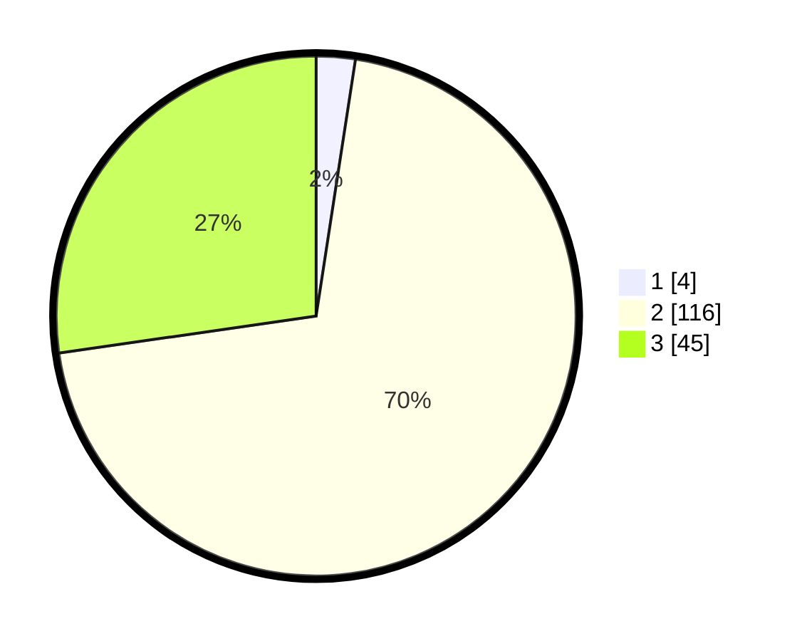

# Hasil

## Grafik

## Tabel

| No. | Nama Paslon    | Suara | Suara (raw) | Persentase |
|:--- |:-------------- | -----:| -----------:| ----------:|
| 1   | ANIES MUHAIMIN | 4     | [4][p-1]    | 2,42       |
| 2   | PRABOWO GIBRAN | 116   | [116][p-2]  | 70,30      |
| 3   | GANJAR MAHFUD  | 45    | [45][p-3]   | 27,27      |

[p-1]: https://github.com/gigit-pemilu/pemilu-2024/blob/main/pilpres/hitung-suara/sub/12-sumatera-utara/sub/14-nias-selatan/sub/25-sidua'ori/sub/2002-hilidohona/sub/003-tps/sub/paslon-1.txt
[p-2]: https://github.com/gigit-pemilu/pemilu-2024/blob/main/pilpres/hitung-suara/sub/12-sumatera-utara/sub/14-nias-selatan/sub/25-sidua'ori/sub/2002-hilidohona/sub/003-tps/sub/paslon-2.txt
[p-3]: https://github.com/gigit-pemilu/pemilu-2024/blob/main/pilpres/hitung-suara/sub/12-sumatera-utara/sub/14-nias-selatan/sub/25-sidua'ori/sub/2002-hilidohona/sub/003-tps/sub/paslon-3.txt

## Foto C Plano

https://sirekap-obj-formc.kpu.go.id/1637/pemilu/ppwp/12/14/25/20/02/1214252002003-20240215-080727--3a0626d3-6b34-4c21-831f-13aa53b05fc1.jpg

https://sirekap-obj-formc.kpu.go.id/1637/pemilu/ppwp/12/14/25/20/02/1214252002003-20240215-081012--305b1cb6-a811-4aae-a169-12c85d1a590c.jpg

https://sirekap-obj-formc.kpu.go.id/1637/pemilu/ppwp/12/14/25/20/02/1214252002003-20240215-081204--06ef1cb0-0d53-4018-9fd1-3a506483dc32.jpg

## Metadata

| Key        | Value               |
| ---------- | ------------------- |
| Time Stamp | 2024-02-20 12:00:00 |

