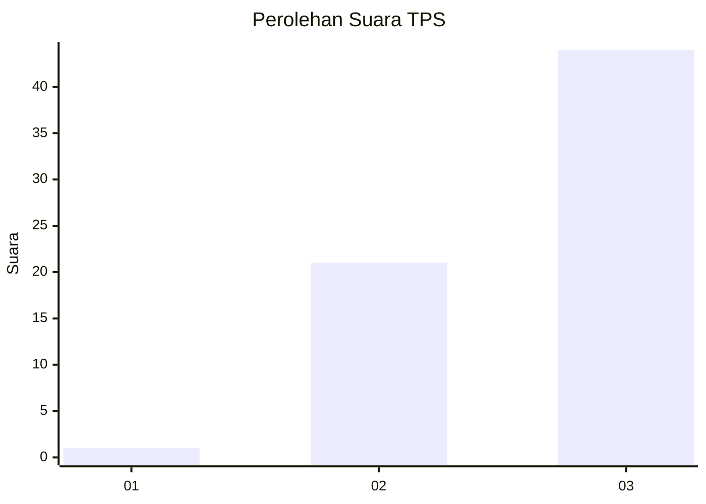
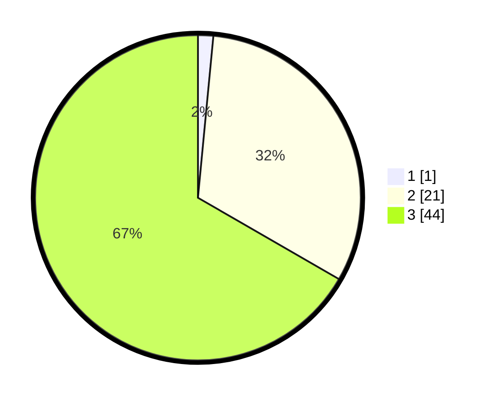

# Hasil

## Grafik

## Tabel

| No. | Nama Paslon    | Suara | Suara (raw) | Persentase |
|:--- |:-------------- | -----:| -----------:| ----------:|
| 1   | ANIES MUHAIMIN | 1     | [1][p-1]    | 1,52       |
| 2   | PRABOWO GIBRAN | 21    | [21][p-2]   | 31,82      |
| 3   | GANJAR MAHFUD  | 44    | [44][p-3]   | 66,67      |

[p-1]: https://github.com/gigit-pemilu/pemilu-2024-12-sumatera-utara/blob/main/pilpres/hitung-suara/sub/12-sumatera-utara/sub/14-nias-selatan/sub/25-sidua'ori/sub/2005-umbu-sohahau/sub/003-tps/sub/paslon-1.txt
[p-2]: https://github.com/gigit-pemilu/pemilu-2024-12-sumatera-utara/blob/main/pilpres/hitung-suara/sub/12-sumatera-utara/sub/14-nias-selatan/sub/25-sidua'ori/sub/2005-umbu-sohahau/sub/003-tps/sub/paslon-2.txt
[p-3]: https://github.com/gigit-pemilu/pemilu-2024-12-sumatera-utara/blob/main/pilpres/hitung-suara/sub/12-sumatera-utara/sub/14-nias-selatan/sub/25-sidua'ori/sub/2005-umbu-sohahau/sub/003-tps/sub/paslon-3.txt

## Foto C Plano

https://sirekap-obj-formc.kpu.go.id/70d2/pemilu/ppwp/12/14/25/20/05/1214252005003-20240215-125200--50be338c-cad4-42e6-9dc3-33f4faf55447.jpg

https://sirekap-obj-formc.kpu.go.id/70d2/pemilu/ppwp/12/14/25/20/05/1214252005003-20240215-125220--dcbaf6c5-472d-4e8d-bb49-6a233745058b.jpg

https://sirekap-obj-formc.kpu.go.id/70d2/pemilu/ppwp/12/14/25/20/05/1214252005003-20240215-125237--b26c34ec-d5a4-4240-89ac-a27aa62cc55f.jpg

## Metadata

| Key        | Value               |
| ---------- | ------------------- |
| Time Stamp | 2024-02-20 12:00:00 |

