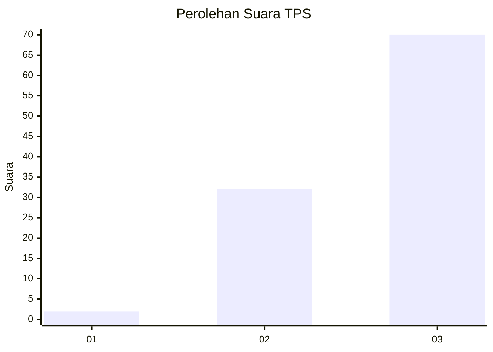
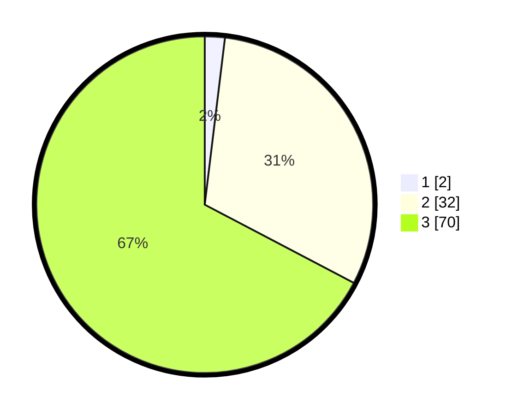

# Hasil

## Grafik

## Tabel

| No. | Nama Paslon    | Suara | Suara (raw) | Persentase |
|:--- |:-------------- | -----:| -----------:| ----------:|
| 1   | ANIES MUHAIMIN | 2     | [2][p-1]    | 1,92       |
| 2   | PRABOWO GIBRAN | 32    | [32][p-2]   | 30,77      |
| 3   | GANJAR MAHFUD  | 70    | [70][p-3]   | 67,31      |

[p-1]: https://github.com/gigit-pemilu/pemilu-2024-12-sumatera-utara/blob/main/pilpres/hitung-suara/sub/12-sumatera-utara/sub/14-nias-selatan/sub/25-sidua'ori/sub/2006-hilisao'oto/sub/001-tps/sub/paslon-1.txt
[p-2]: https://github.com/gigit-pemilu/pemilu-2024-12-sumatera-utara/blob/main/pilpres/hitung-suara/sub/12-sumatera-utara/sub/14-nias-selatan/sub/25-sidua'ori/sub/2006-hilisao'oto/sub/001-tps/sub/paslon-2.txt
[p-3]: https://github.com/gigit-pemilu/pemilu-2024-12-sumatera-utara/blob/main/pilpres/hitung-suara/sub/12-sumatera-utara/sub/14-nias-selatan/sub/25-sidua'ori/sub/2006-hilisao'oto/sub/001-tps/sub/paslon-3.txt

## Foto C Plano

https://sirekap-obj-formc.kpu.go.id/48af/pemilu/ppwp/12/14/25/20/06/1214252006001-20240214-213757--a0be4add-363a-4e4f-8d44-e274597e8a18.jpg

https://sirekap-obj-formc.kpu.go.id/48af/pemilu/ppwp/12/14/25/20/06/1214252006001-20240214-214012--95f5337e-43ce-4aa5-9948-43cbaa71e84f.jpg

https://sirekap-obj-formc.kpu.go.id/48af/pemilu/ppwp/12/14/25/20/06/1214252006001-20240214-221724--1a230bcc-12c8-406e-96c8-511c5b7494fd.jpg

## Metadata

| Key        | Value               |
| ---------- | ------------------- |
| Time Stamp | 2024-02-20 12:00:00 |

