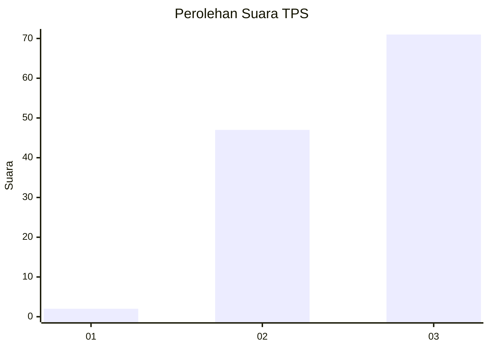
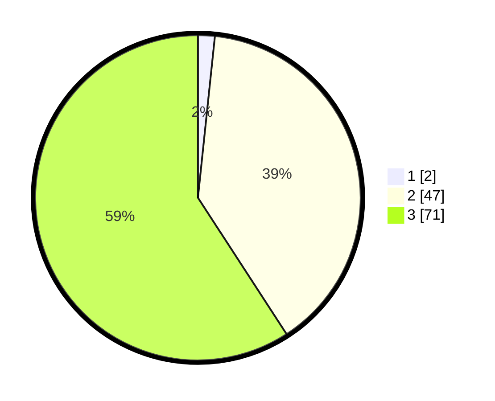

# Hasil

## Grafik

## Tabel

| No. | Nama Paslon    | Suara | Suara (raw) | Persentase |
|:--- |:-------------- | -----:| -----------:| ----------:|
| 1   | ANIES MUHAIMIN | 2     | [2][p-1]    | 1,67       |
| 2   | PRABOWO GIBRAN | 47    | [47][p-2]   | 39,17      |
| 3   | GANJAR MAHFUD  | 71    | [71][p-3]   | 59,17      |

[p-1]: https://github.com/gigit-pemilu/pemilu-2024/blob/main/pilpres/hitung-suara/sub/12-sumatera-utara/sub/14-nias-selatan/sub/25-sidua'ori/sub/2006-hilisao'oto/sub/002-tps/sub/paslon-1.txt
[p-2]: https://github.com/gigit-pemilu/pemilu-2024/blob/main/pilpres/hitung-suara/sub/12-sumatera-utara/sub/14-nias-selatan/sub/25-sidua'ori/sub/2006-hilisao'oto/sub/002-tps/sub/paslon-2.txt
[p-3]: https://github.com/gigit-pemilu/pemilu-2024/blob/main/pilpres/hitung-suara/sub/12-sumatera-utara/sub/14-nias-selatan/sub/25-sidua'ori/sub/2006-hilisao'oto/sub/002-tps/sub/paslon-3.txt

## Foto C Plano

https://sirekap-obj-formc.kpu.go.id/2deb/pemilu/ppwp/12/14/25/20/06/1214252006002-20240215-101351--20b9fb0c-5cae-435f-bba0-c8e00048b0ec.jpg

https://sirekap-obj-formc.kpu.go.id/2deb/pemilu/ppwp/12/14/25/20/06/1214252006002-20240215-102226--edd49c32-7daf-447c-84a8-5e9aee819d92.jpg

https://sirekap-obj-formc.kpu.go.id/2deb/pemilu/ppwp/12/14/25/20/06/1214252006002-20240215-102717--5a311389-89f3-4ea7-8be7-c10e100a66c7.jpg

## Metadata

| Key        | Value               |
| ---------- | ------------------- |
| Time Stamp | 2024-02-20 13:00:00 |

