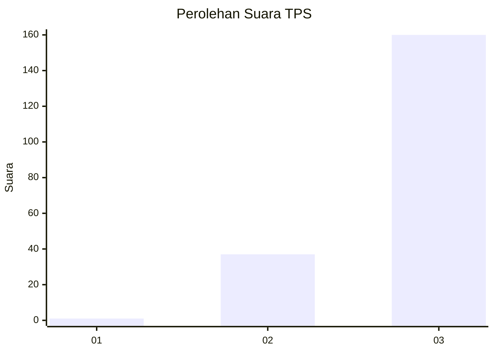
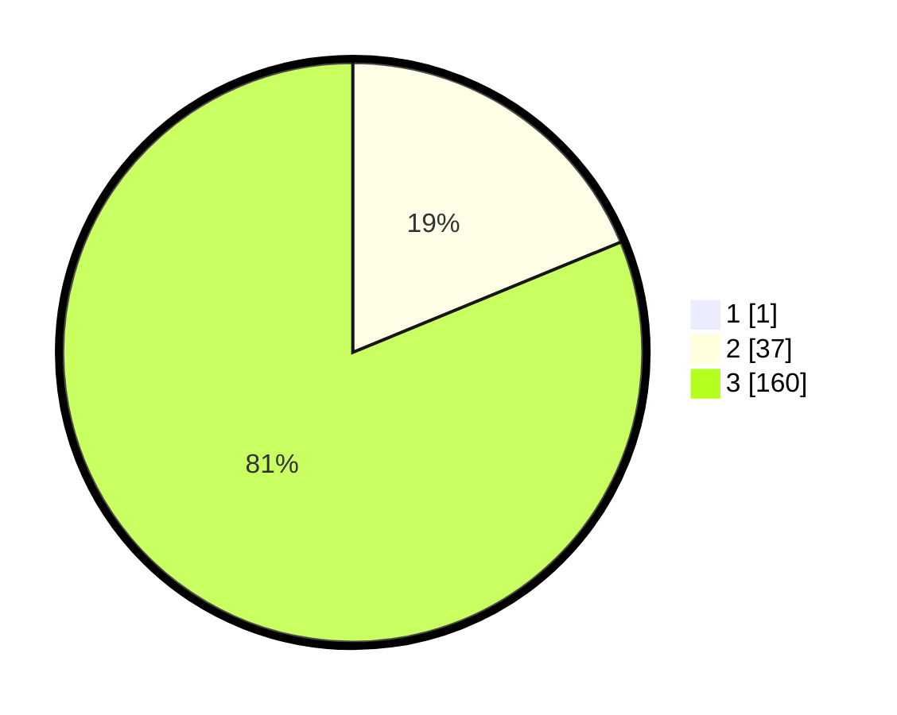

# Hasil

## Grafik

## Tabel

| No. | Nama Paslon    | Suara | Suara (raw) | Persentase |
|:--- |:-------------- | -----:| -----------:| ----------:|
| 1   | ANIES MUHAIMIN | 1     | [1][p-1]    | 0,51       |
| 2   | PRABOWO GIBRAN | 37    | [37][p-2]   | 18,69      |
| 3   | GANJAR MAHFUD  | 160   | [160][p-3]  | 80,81      |

[p-1]: https://github.com/gigit-pemilu/pemilu-2024-12-sumatera-utara/blob/main/pilpres/hitung-suara/sub/12-sumatera-utara/sub/14-nias-selatan/sub/26-somambawa/sub/2001-sifitubanua/sub/002-tps/sub/paslon-1.txt
[p-2]: https://github.com/gigit-pemilu/pemilu-2024-12-sumatera-utara/blob/main/pilpres/hitung-suara/sub/12-sumatera-utara/sub/14-nias-selatan/sub/26-somambawa/sub/2001-sifitubanua/sub/002-tps/sub/paslon-2.txt
[p-3]: https://github.com/gigit-pemilu/pemilu-2024-12-sumatera-utara/blob/main/pilpres/hitung-suara/sub/12-sumatera-utara/sub/14-nias-selatan/sub/26-somambawa/sub/2001-sifitubanua/sub/002-tps/sub/paslon-3.txt

## Foto C Plano

https://sirekap-obj-formc.kpu.go.id/3aef/pemilu/ppwp/12/14/26/20/01/1214262001002-20240215-125742--88dc75b9-2a81-4572-a194-fb81b957016c.jpg

https://sirekap-obj-formc.kpu.go.id/3aef/pemilu/ppwp/12/14/26/20/01/1214262001002-20240215-125908--09d343ee-7dc8-443a-87be-37b2b10221d2.jpg

https://sirekap-obj-formc.kpu.go.id/3aef/pemilu/ppwp/12/14/26/20/01/1214262001002-20240215-130013--8d89bea0-d5e0-4432-91cc-446971800354.jpg

## Metadata

| Key        | Value               |
| ---------- | ------------------- |
| Time Stamp | 2024-02-20 13:00:00 |

