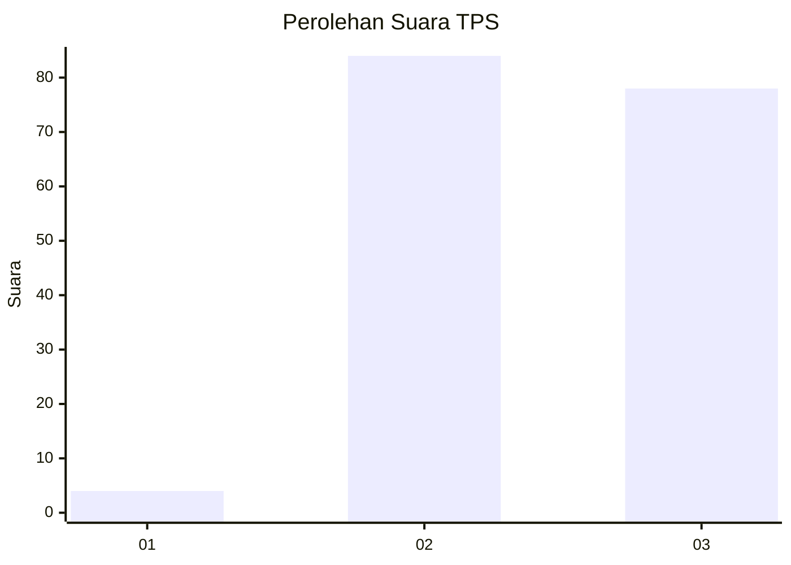
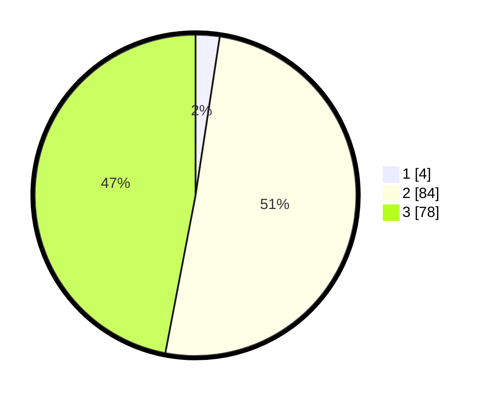

# Hasil

## Grafik

## Tabel

| No. | Nama Paslon    | Suara | Suara (raw) | Persentase |
|:--- |:-------------- | -----:| -----------:| ----------:|
| 1   | ANIES MUHAIMIN | 4     | [4][p-1]    | 2,41       |
| 2   | PRABOWO GIBRAN | 84    | [84][p-2]   | 50,60      |
| 3   | GANJAR MAHFUD  | 78    | [78][p-3]   | 46,99      |

[p-1]: https://github.com/gigit-pemilu/pemilu-2024-12-sumatera-utara/blob/main/pilpres/hitung-suara/sub/12-sumatera-utara/sub/14-nias-selatan/sub/26-somambawa/sub/2001-sifitubanua/sub/003-tps/sub/paslon-1.txt
[p-2]: https://github.com/gigit-pemilu/pemilu-2024-12-sumatera-utara/blob/main/pilpres/hitung-suara/sub/12-sumatera-utara/sub/14-nias-selatan/sub/26-somambawa/sub/2001-sifitubanua/sub/003-tps/sub/paslon-2.txt
[p-3]: https://github.com/gigit-pemilu/pemilu-2024-12-sumatera-utara/blob/main/pilpres/hitung-suara/sub/12-sumatera-utara/sub/14-nias-selatan/sub/26-somambawa/sub/2001-sifitubanua/sub/003-tps/sub/paslon-3.txt

## Foto C Plano

https://sirekap-obj-formc.kpu.go.id/38be/pemilu/ppwp/12/14/26/20/01/1214262001003-20240215-102006--146374de-a005-4b64-827b-8b75303714dd.jpg

https://sirekap-obj-formc.kpu.go.id/38be/pemilu/ppwp/12/14/26/20/01/1214262001003-20240215-102224--c0ea12a5-83d2-4ae6-b31e-8b180c115690.jpg

https://sirekap-obj-formc.kpu.go.id/38be/pemilu/ppwp/12/14/26/20/01/1214262001003-20240215-102422--853f369e-3acd-4180-800a-887f728a70d6.jpg

## Metadata

| Key        | Value               |
| ---------- | ------------------- |
| Time Stamp | 2024-02-20 13:00:00 |

