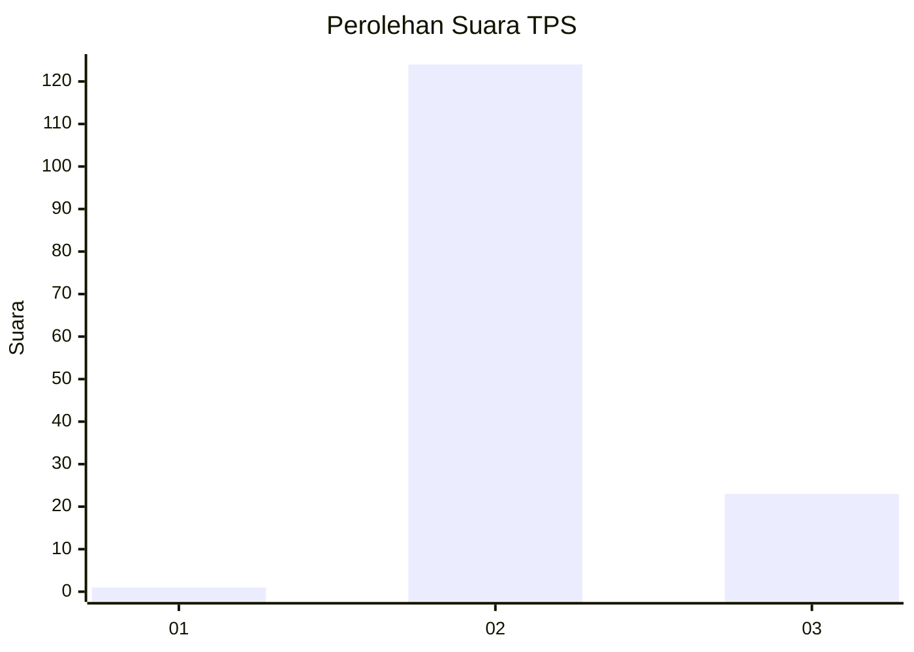
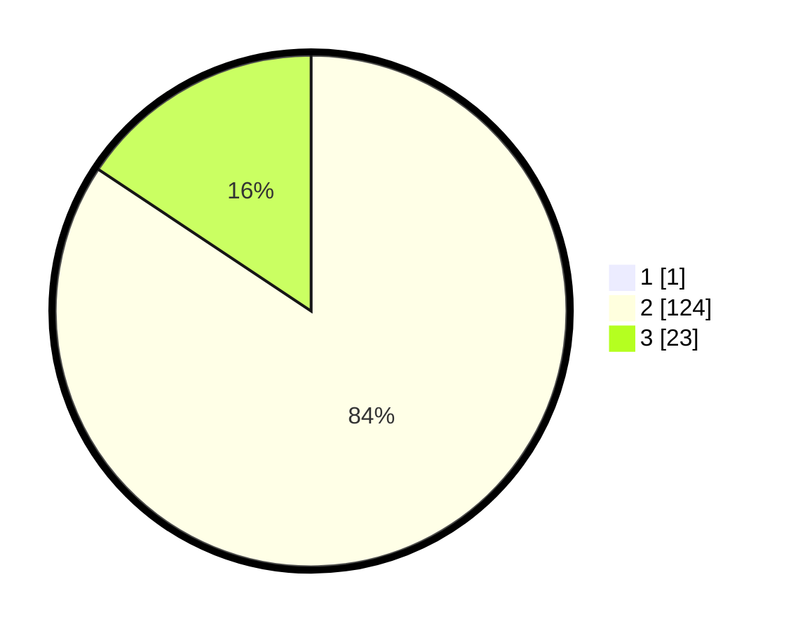

# Hasil

## Grafik

## Tabel

| No. | Nama Paslon    | Suara | Suara (raw) | Persentase |
|:--- |:-------------- | -----:| -----------:| ----------:|
| 1   | ANIES MUHAIMIN | 1     | [1][p-1]    | 0,68       |
| 2   | PRABOWO GIBRAN | 124   | [124][p-2]  | 83,78      |
| 3   | GANJAR MAHFUD  | 23    | [23][p-3]   | 15,54      |

[p-1]: https://github.com/gigit-pemilu/pemilu-2024/blob/main/pilpres/hitung-suara/sub/12-sumatera-utara/sub/14-nias-selatan/sub/26-somambawa/sub/2004-silima-banua/sub/002-tps/sub/paslon-1.txt
[p-2]: https://github.com/gigit-pemilu/pemilu-2024/blob/main/pilpres/hitung-suara/sub/12-sumatera-utara/sub/14-nias-selatan/sub/26-somambawa/sub/2004-silima-banua/sub/002-tps/sub/paslon-2.txt
[p-3]: https://github.com/gigit-pemilu/pemilu-2024/blob/main/pilpres/hitung-suara/sub/12-sumatera-utara/sub/14-nias-selatan/sub/26-somambawa/sub/2004-silima-banua/sub/002-tps/sub/paslon-3.txt

## Foto C Plano

https://sirekap-obj-formc.kpu.go.id/2bb6/pemilu/ppwp/12/14/26/20/04/1214262004002-20240215-010800--031a87d9-aa1d-4b0f-b0d2-f808221d1964.jpg

https://sirekap-obj-formc.kpu.go.id/2bb6/pemilu/ppwp/12/14/26/20/04/1214262004002-20240215-010923--b97c744a-f2d8-431a-9711-86e95f107ea0.jpg

https://sirekap-obj-formc.kpu.go.id/2bb6/pemilu/ppwp/12/14/26/20/04/1214262004002-20240215-011037--325ca625-1f46-447f-bcb1-4f905f16d538.jpg

## Metadata

| Key        | Value               |
| ---------- | ------------------- |
| Time Stamp | 2024-02-20 13:00:00 |

