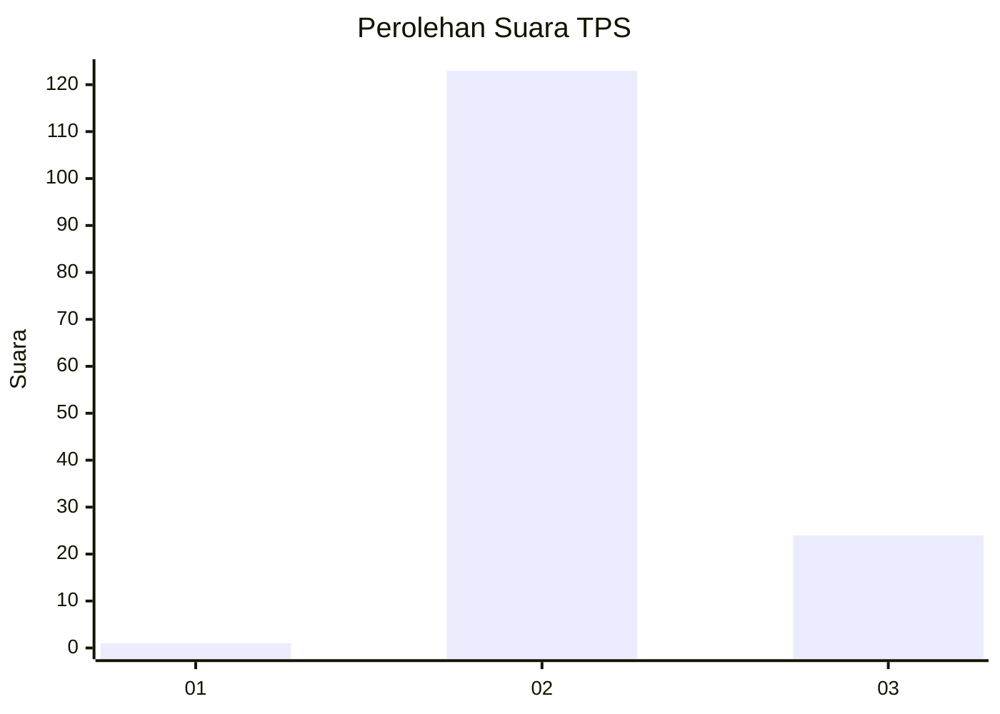
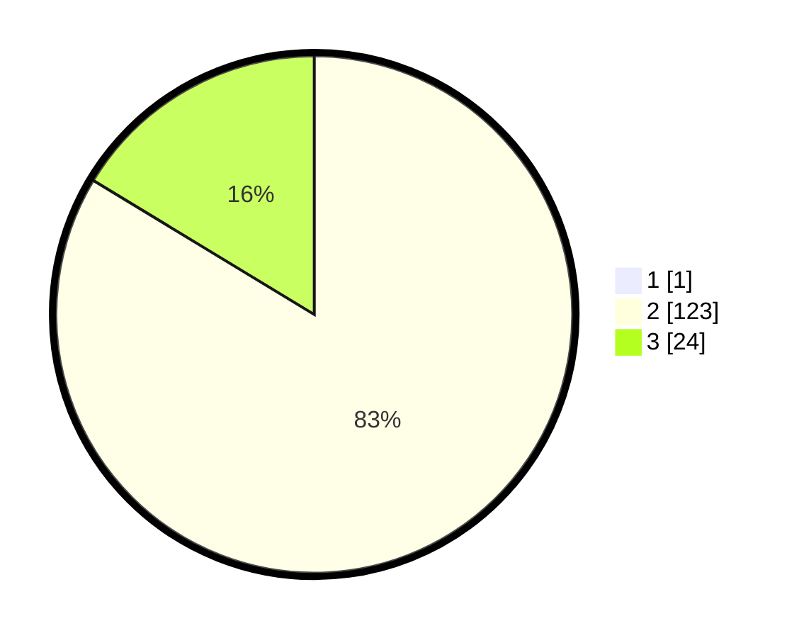

# Hasil

## Grafik

## Tabel

| No. | Nama Paslon    | Suara | Suara (raw) | Persentase |
|:--- |:-------------- | -----:| -----------:| ----------:|
| 1   | ANIES MUHAIMIN | 1     | [1][p-1]    | 0,68       |
| 2   | PRABOWO GIBRAN | 123   | [123][p-2]  | 83,11      |
| 3   | GANJAR MAHFUD  | 24    | [24][p-3]   | 16,22      |

[p-1]: https://github.com/gigit-pemilu/pemilu-2024/blob/main/pilpres/hitung-suara/sub/12-sumatera-utara/sub/14-nias-selatan/sub/26-somambawa/sub/2005-mehaga/sub/001-tps/sub/paslon-1.txt
[p-2]: https://github.com/gigit-pemilu/pemilu-2024/blob/main/pilpres/hitung-suara/sub/12-sumatera-utara/sub/14-nias-selatan/sub/26-somambawa/sub/2005-mehaga/sub/001-tps/sub/paslon-2.txt
[p-3]: https://github.com/gigit-pemilu/pemilu-2024/blob/main/pilpres/hitung-suara/sub/12-sumatera-utara/sub/14-nias-selatan/sub/26-somambawa/sub/2005-mehaga/sub/001-tps/sub/paslon-3.txt

## Foto C Plano

https://sirekap-obj-formc.kpu.go.id/c100/pemilu/ppwp/12/14/26/20/05/1214262005001-20240215-135630--1f2254aa-032e-46e4-ab85-cac73bf22863.jpg

https://sirekap-obj-formc.kpu.go.id/c100/pemilu/ppwp/12/14/26/20/05/1214262005001-20240215-135820--b3c58a51-453c-4b04-87b6-513bff5fcfc0.jpg

https://sirekap-obj-formc.kpu.go.id/c100/pemilu/ppwp/12/14/26/20/05/1214262005001-20240215-140028--0b56070a-6df0-4c6e-9357-9e2deffe0ed9.jpg

## Metadata

| Key        | Value               |
| ---------- | ------------------- |
| Time Stamp | 2024-02-20 13:00:00 |

