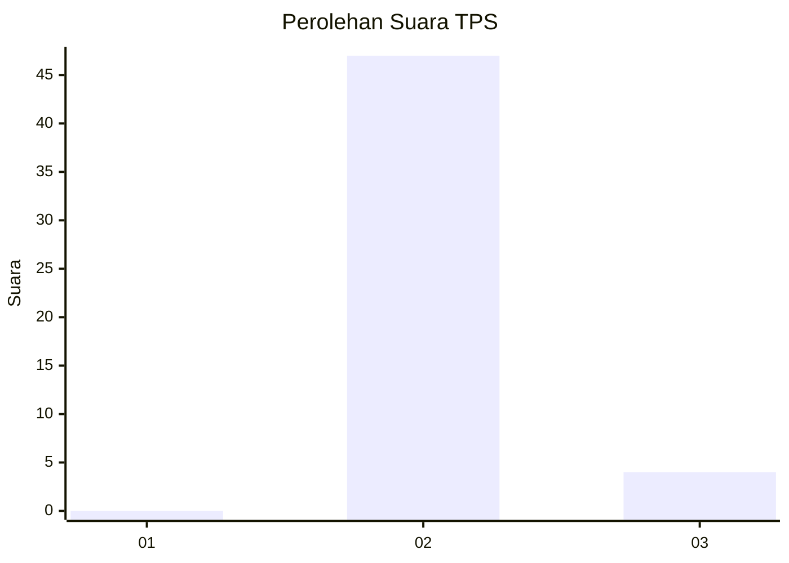
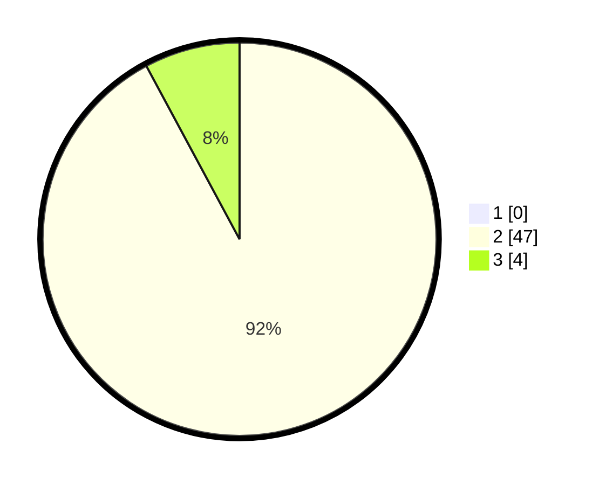

# Hasil

## Grafik

## Tabel

| No. | Nama Paslon    | Suara | Suara (raw) | Persentase |
|:--- |:-------------- | -----:| -----------:| ----------:|
| 1   | ANIES MUHAIMIN | 0     | [0][p-1]    | 0,00       |
| 2   | PRABOWO GIBRAN | 47    | [47][p-2]   | 92,16      |
| 3   | GANJAR MAHFUD  | 4     | [4][p-3]    | 7,84       |

[p-1]: https://github.com/gigit-pemilu/pemilu-2024/blob/main/pilpres/hitung-suara/sub/12-sumatera-utara/sub/14-nias-selatan/sub/26-somambawa/sub/2005-mehaga/sub/004-tps/sub/paslon-1.txt
[p-2]: https://github.com/gigit-pemilu/pemilu-2024/blob/main/pilpres/hitung-suara/sub/12-sumatera-utara/sub/14-nias-selatan/sub/26-somambawa/sub/2005-mehaga/sub/004-tps/sub/paslon-2.txt
[p-3]: https://github.com/gigit-pemilu/pemilu-2024/blob/main/pilpres/hitung-suara/sub/12-sumatera-utara/sub/14-nias-selatan/sub/26-somambawa/sub/2005-mehaga/sub/004-tps/sub/paslon-3.txt

## Foto C Plano

https://sirekap-obj-formc.kpu.go.id/5f82/pemilu/ppwp/12/14/26/20/05/1214262005004-20240215-101311--6f862126-e8c1-4c46-ba6d-337e73a2e03a.jpg

https://sirekap-obj-formc.kpu.go.id/5f82/pemilu/ppwp/12/14/26/20/05/1214262005004-20240215-101643--1da2cd7a-855b-4f83-aca7-156cbcc8ddda.jpg

https://sirekap-obj-formc.kpu.go.id/5f82/pemilu/ppwp/12/14/26/20/05/1214262005004-20240215-101535--ad4cb3f6-1b43-4353-b385-338bc6d2a055.jpg

## Metadata

| Key        | Value               |
| ---------- | ------------------- |
| Time Stamp | 2024-02-20 13:00:00 |

