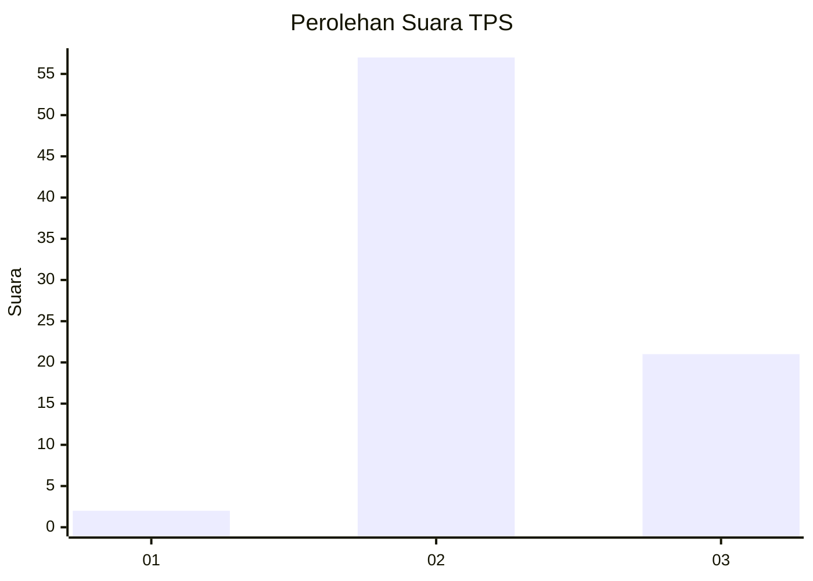
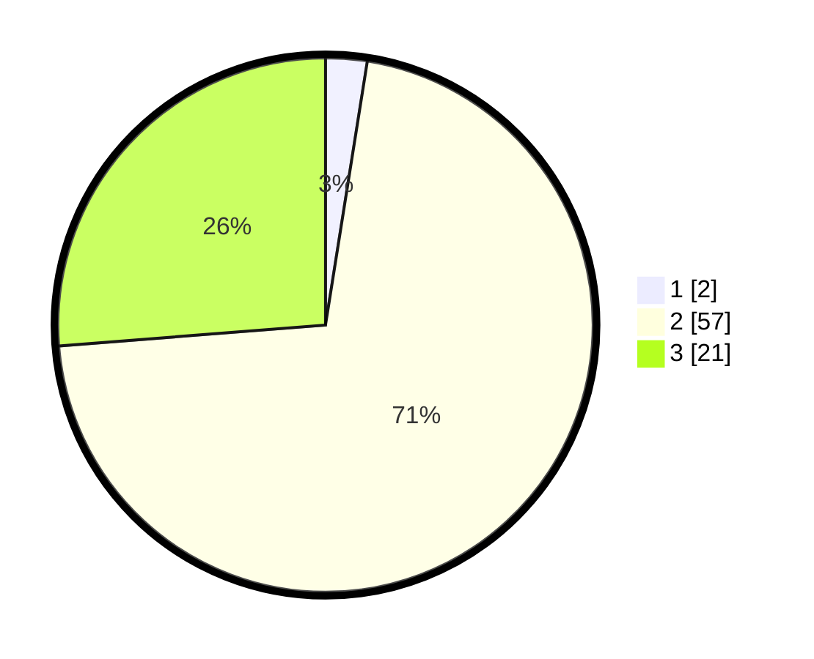

# Hasil

## Grafik

## Tabel

| No. | Nama Paslon    | Suara | Suara (raw) | Persentase |
|:--- |:-------------- | -----:| -----------:| ----------:|
| 1   | ANIES MUHAIMIN | 2     | [2][p-1]    | 2,50       |
| 2   | PRABOWO GIBRAN | 57    | [57][p-2]   | 71,25      |
| 3   | GANJAR MAHFUD  | 21    | [21][p-3]   | 26,25      |

[p-1]: https://github.com/gigit-pemilu/pemilu-2024/blob/main/pilpres/hitung-suara/sub/12-sumatera-utara/sub/14-nias-selatan/sub/26-somambawa/sub/2009-fanedanu/sub/003-tps/sub/paslon-1.txt
[p-2]: https://github.com/gigit-pemilu/pemilu-2024/blob/main/pilpres/hitung-suara/sub/12-sumatera-utara/sub/14-nias-selatan/sub/26-somambawa/sub/2009-fanedanu/sub/003-tps/sub/paslon-2.txt
[p-3]: https://github.com/gigit-pemilu/pemilu-2024/blob/main/pilpres/hitung-suara/sub/12-sumatera-utara/sub/14-nias-selatan/sub/26-somambawa/sub/2009-fanedanu/sub/003-tps/sub/paslon-3.txt

## Foto C Plano

https://sirekap-obj-formc.kpu.go.id/5102/pemilu/ppwp/12/14/26/20/09/1214262009003-20240214-234439--7190f5c2-125d-44e0-b977-e8c668cc59a1.jpg

https://sirekap-obj-formc.kpu.go.id/5102/pemilu/ppwp/12/14/26/20/09/1214262009003-20240214-210123--6d704329-a29a-4d6b-86e6-d73fd796f4b6.jpg

https://sirekap-obj-formc.kpu.go.id/5102/pemilu/ppwp/12/14/26/20/09/1214262009003-20240214-210321--fa73cea1-986c-4f7d-a698-d5b2d1ed4494.jpg

## Metadata

| Key        | Value               |
| ---------- | ------------------- |
| Time Stamp | 2024-02-20 13:00:00 |

