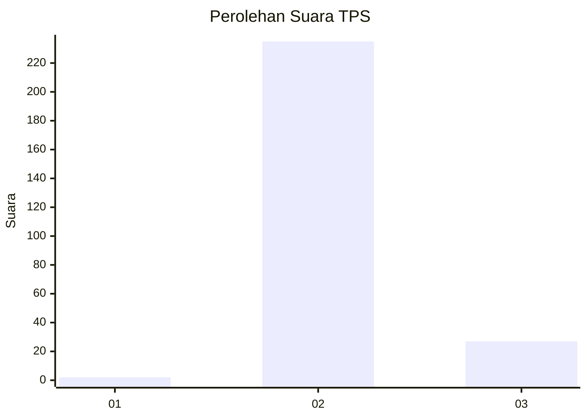
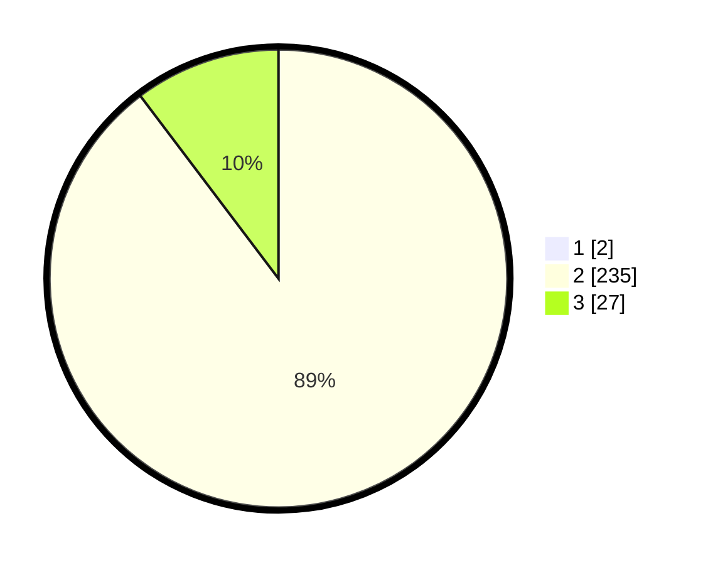

# Hasil

## Grafik

## Tabel

| No. | Nama Paslon    | Suara | Suara (raw) | Persentase |
|:--- |:-------------- | -----:| -----------:| ----------:|
| 1   | ANIES MUHAIMIN | 2     | [2][p-1]    | 0,76       |
| 2   | PRABOWO GIBRAN | 235   | [235][p-2]  | 89,02      |
| 3   | GANJAR MAHFUD  | 27    | [27][p-3]   | 10,23      |

[p-1]: https://github.com/gigit-pemilu/pemilu-2024-12-sumatera-utara/blob/main/pilpres/hitung-suara/sub/12-sumatera-utara/sub/14-nias-selatan/sub/27-boronadu/sub/2001-sifalago-gomo/sub/001-tps/sub/paslon-1.txt
[p-2]: https://github.com/gigit-pemilu/pemilu-2024-12-sumatera-utara/blob/main/pilpres/hitung-suara/sub/12-sumatera-utara/sub/14-nias-selatan/sub/27-boronadu/sub/2001-sifalago-gomo/sub/001-tps/sub/paslon-2.txt
[p-3]: https://github.com/gigit-pemilu/pemilu-2024-12-sumatera-utara/blob/main/pilpres/hitung-suara/sub/12-sumatera-utara/sub/14-nias-selatan/sub/27-boronadu/sub/2001-sifalago-gomo/sub/001-tps/sub/paslon-3.txt

## Foto C Plano

https://sirekap-obj-formc.kpu.go.id/fa59/pemilu/ppwp/12/14/27/20/01/1214272001001-20240215-183506--4e13641c-1831-4845-87e9-b070bf5724f7.jpg

https://sirekap-obj-formc.kpu.go.id/fa59/pemilu/ppwp/12/14/27/20/01/1214272001001-20240215-183640--cc871bdc-603a-427a-899c-f759bed62a8c.jpg

https://sirekap-obj-formc.kpu.go.id/fa59/pemilu/ppwp/12/14/27/20/01/1214272001001-20240215-183802--02ce8913-586a-4d37-937d-0cdf88959e41.jpg

## Metadata

| Key        | Value               |
| ---------- | ------------------- |
| Time Stamp | 2024-02-15 22:00:27 |

