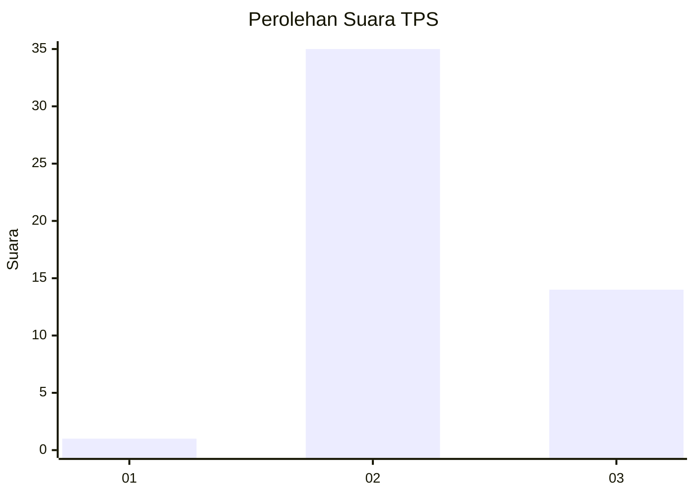
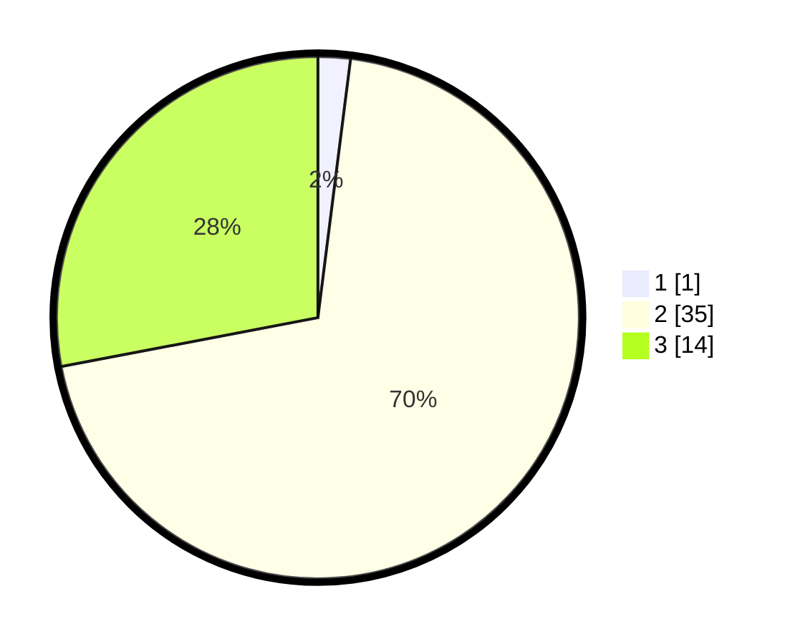

# Hasil

## Grafik

## Tabel

| No. | Nama Paslon    | Suara | Suara (raw) | Persentase |
|:--- |:-------------- | -----:| -----------:| ----------:|
| 1   | ANIES MUHAIMIN | 1     | [1][p-1]    | 2,00       |
| 2   | PRABOWO GIBRAN | 35    | [35][p-2]   | 70,00      |
| 3   | GANJAR MAHFUD  | 14    | [14][p-3]   | 28,00      |

[p-1]: https://github.com/gigit-pemilu/pemilu-2024-12-sumatera-utara/blob/main/pilpres/hitung-suara/sub/12-sumatera-utara/sub/14-nias-selatan/sub/27-boronadu/sub/2002-balohili-gomo/sub/002-tps/sub/paslon-1.txt
[p-2]: https://github.com/gigit-pemilu/pemilu-2024-12-sumatera-utara/blob/main/pilpres/hitung-suara/sub/12-sumatera-utara/sub/14-nias-selatan/sub/27-boronadu/sub/2002-balohili-gomo/sub/002-tps/sub/paslon-2.txt
[p-3]: https://github.com/gigit-pemilu/pemilu-2024-12-sumatera-utara/blob/main/pilpres/hitung-suara/sub/12-sumatera-utara/sub/14-nias-selatan/sub/27-boronadu/sub/2002-balohili-gomo/sub/002-tps/sub/paslon-3.txt

## Foto C Plano

https://sirekap-obj-formc.kpu.go.id/d1e3/pemilu/ppwp/12/14/27/20/02/1214272002002-20240216-102304--9c2a7e99-3184-4abc-9386-46ffd4b811f9.jpg

https://sirekap-obj-formc.kpu.go.id/d1e3/pemilu/ppwp/12/14/27/20/02/1214272002002-20240216-103006--ab5614b2-e5dd-485d-a55d-0786d8fea0dd.jpg

## Metadata

| Key        | Value               |
| ---------- | ------------------- |
| Time Stamp | 2024-02-25 12:00:00 |

