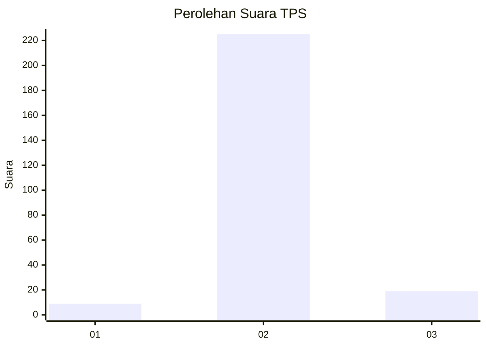
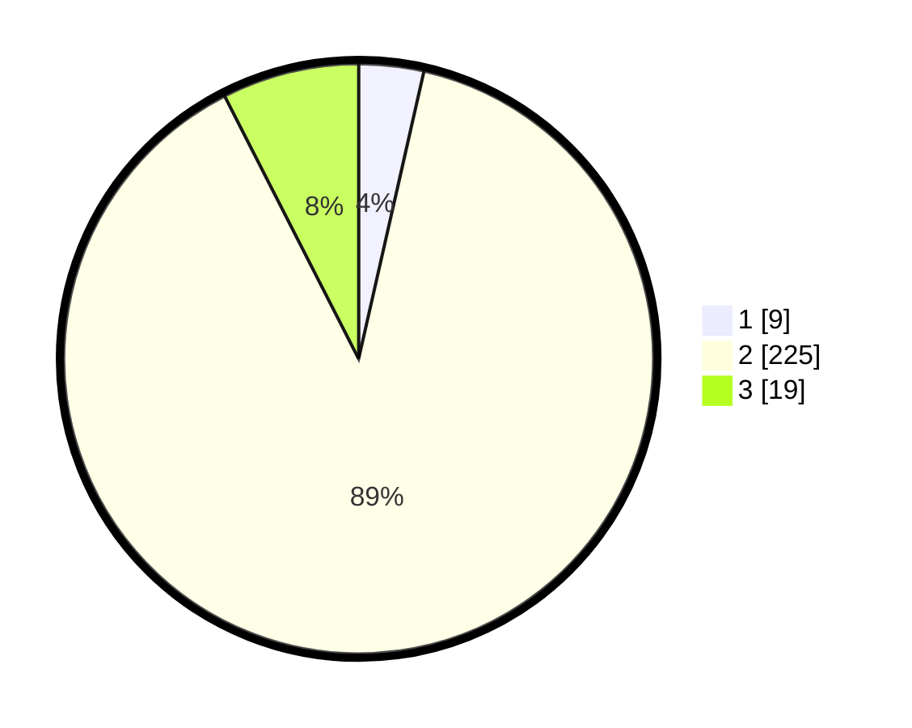

# Hasil

## Grafik

## Tabel

| No. | Nama Paslon    | Suara | Suara (raw) | Persentase |
|:--- |:-------------- | -----:| -----------:| ----------:|
| 1   | ANIES MUHAIMIN | 9     | [9][p-1]    | 3,56       |
| 2   | PRABOWO GIBRAN | 225   | [225][p-2]  | 88,93      |
| 3   | GANJAR MAHFUD  | 19    | [19][p-3]   | 7,51       |

[p-1]: https://github.com/gigit-pemilu/pemilu-2024/blob/main/pilpres/hitung-suara/sub/12-sumatera-utara/sub/14-nias-selatan/sub/27-boronadu/sub/2004-orsedes/sub/001-tps/sub/paslon-1.txt
[p-2]: https://github.com/gigit-pemilu/pemilu-2024/blob/main/pilpres/hitung-suara/sub/12-sumatera-utara/sub/14-nias-selatan/sub/27-boronadu/sub/2004-orsedes/sub/001-tps/sub/paslon-2.txt
[p-3]: https://github.com/gigit-pemilu/pemilu-2024/blob/main/pilpres/hitung-suara/sub/12-sumatera-utara/sub/14-nias-selatan/sub/27-boronadu/sub/2004-orsedes/sub/001-tps/sub/paslon-3.txt

## Foto C Plano

https://sirekap-obj-formc.kpu.go.id/57ed/pemilu/ppwp/12/14/27/20/04/1214272004001-20240215-190537--12e90deb-d3cb-4e53-95ca-3b2313fcc486.jpg

https://sirekap-obj-formc.kpu.go.id/57ed/pemilu/ppwp/12/14/27/20/04/1214272004001-20240215-190629--1eeb1c35-0994-4711-a06c-2dfad16a5f4f.jpg

https://sirekap-obj-formc.kpu.go.id/57ed/pemilu/ppwp/12/14/27/20/04/1214272004001-20240215-190825--0f9e8417-42ce-4238-a0df-5cf415a17f29.jpg

## Metadata

| Key        | Value               |
| ---------- | ------------------- |
| Time Stamp | 2024-02-15 22:00:27 |

