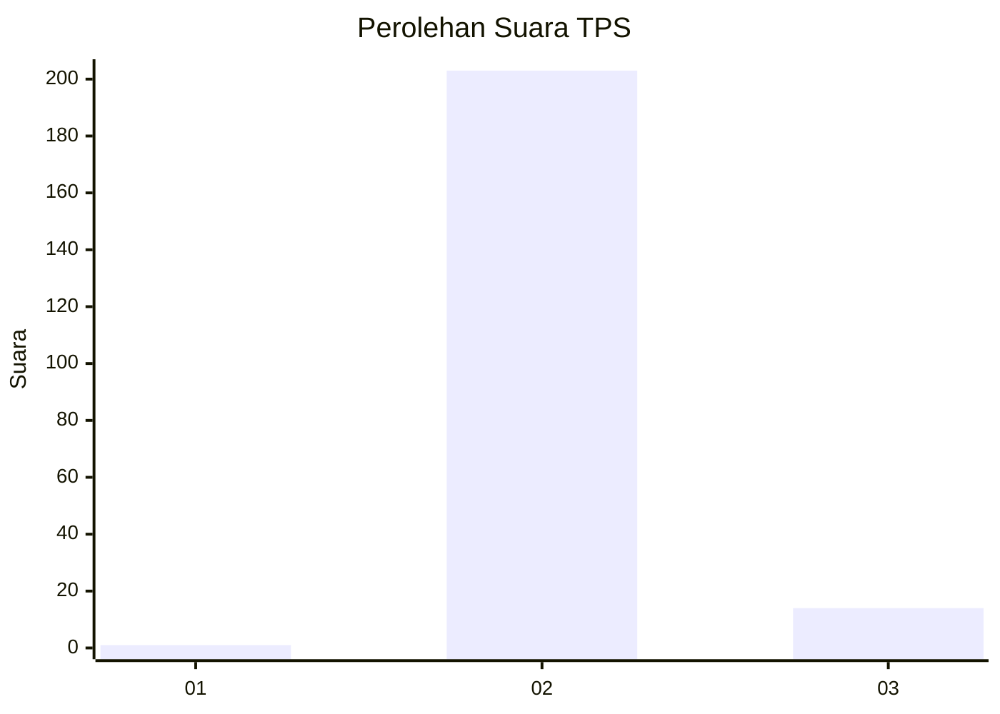
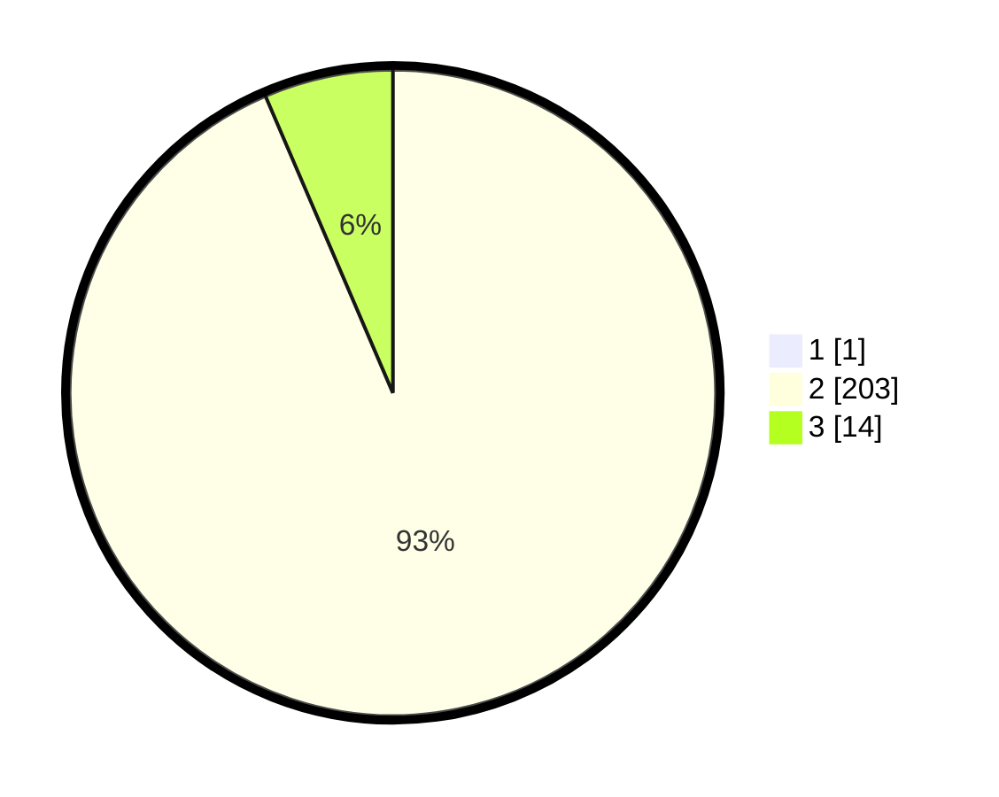

# Hasil

## Grafik

## Tabel

| No. | Nama Paslon    | Suara | Suara (raw) | Persentase |
|:--- |:-------------- | -----:| -----------:| ----------:|
| 1   | ANIES MUHAIMIN | 1     | [1][p-1]    | 0,46       |
| 2   | PRABOWO GIBRAN | 203   | [203][p-2]  | 93,12      |
| 3   | GANJAR MAHFUD  | 14    | [14][p-3]   | 6,42       |

[p-1]: https://github.com/gigit-pemilu/pemilu-2024/blob/main/pilpres/hitung-suara/sub/12-sumatera-utara/sub/14-nias-selatan/sub/27-boronadu/sub/2005-sinar-helaowo/sub/001-tps/sub/paslon-1.txt
[p-2]: https://github.com/gigit-pemilu/pemilu-2024/blob/main/pilpres/hitung-suara/sub/12-sumatera-utara/sub/14-nias-selatan/sub/27-boronadu/sub/2005-sinar-helaowo/sub/001-tps/sub/paslon-2.txt
[p-3]: https://github.com/gigit-pemilu/pemilu-2024/blob/main/pilpres/hitung-suara/sub/12-sumatera-utara/sub/14-nias-selatan/sub/27-boronadu/sub/2005-sinar-helaowo/sub/001-tps/sub/paslon-3.txt

## Foto C Plano

https://sirekap-obj-formc.kpu.go.id/95e2/pemilu/ppwp/12/14/27/20/05/1214272005001-20240215-182440--36af15ac-49eb-451a-b019-ccf46fe4f6f9.jpg

https://sirekap-obj-formc.kpu.go.id/95e2/pemilu/ppwp/12/14/27/20/05/1214272005001-20240215-183016--84e4f078-c790-4bc3-b16e-bf95c034ffbb.jpg

https://sirekap-obj-formc.kpu.go.id/95e2/pemilu/ppwp/12/14/27/20/05/1214272005001-20240215-183534--97b5893f-af4b-4c20-ab5d-ff5098e7f102.jpg

## Metadata

| Key        | Value               |
| ---------- | ------------------- |
| Time Stamp | 2024-02-16 00:00:26 |

