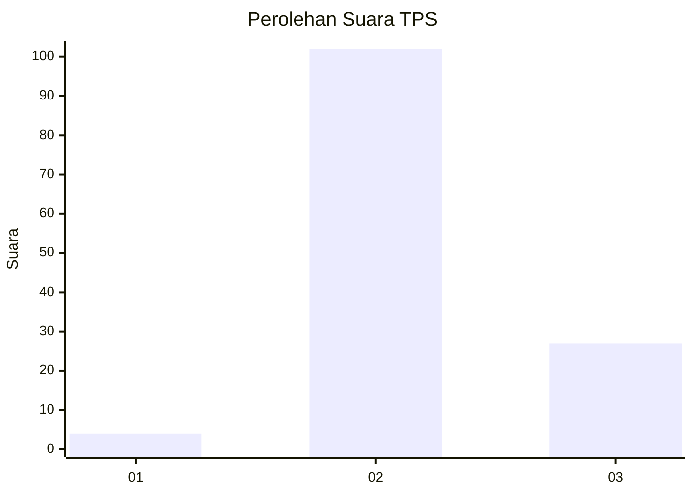

# Hasil

## Grafik

## Tabel

| No. | Nama Paslon    | Suara | Suara (raw) | Persentase |
|:--- |:-------------- | -----:| -----------:| ----------:|
| 1   | ANIES MUHAIMIN | 4     | [4][p-1]    | 3,01       |
| 2   | PRABOWO GIBRAN | 102   | [102][p-2]  | 76,69      |
| 3   | GANJAR MAHFUD  | 27    | [27][p-3]   | 20,30      |

[p-1]: https://github.com/gigit-pemilu/pemilu-2024/blob/main/pilpres/hitung-suara/sub/12-sumatera-utara/sub/14-nias-selatan/sub/29-pulau-pulau-batu-barat/sub/2006-sibaranun/sub/001-tps/sub/paslon-1.txt
[p-2]: https://github.com/gigit-pemilu/pemilu-2024/blob/main/pilpres/hitung-suara/sub/12-sumatera-utara/sub/14-nias-selatan/sub/29-pulau-pulau-batu-barat/sub/2006-sibaranun/sub/001-tps/sub/paslon-2.txt
[p-3]: https://github.com/gigit-pemilu/pemilu-2024/blob/main/pilpres/hitung-suara/sub/12-sumatera-utara/sub/14-nias-selatan/sub/29-pulau-pulau-batu-barat/sub/2006-sibaranun/sub/001-tps/sub/paslon-3.txt

## Foto C Plano

https://sirekap-obj-formc.kpu.go.id/c905/pemilu/ppwp/12/14/29/20/06/1214292006001-20240215-083229--d907eed1-031c-4f09-a224-5fef9a6b66ab.jpg

https://sirekap-obj-formc.kpu.go.id/c905/pemilu/ppwp/12/14/29/20/06/1214292006001-20240215-083442--50abbec4-1df0-4040-9de6-fd062a695f22.jpg

https://sirekap-obj-formc.kpu.go.id/c905/pemilu/ppwp/12/14/29/20/06/1214292006001-20240215-083558--a17e30c8-dcc7-44b7-97d6-880636587500.jpg

## Metadata

| Key        | Value               |
| ---------- | ------------------- |
| Time Stamp | 2024-02-20 13:00:00 |

