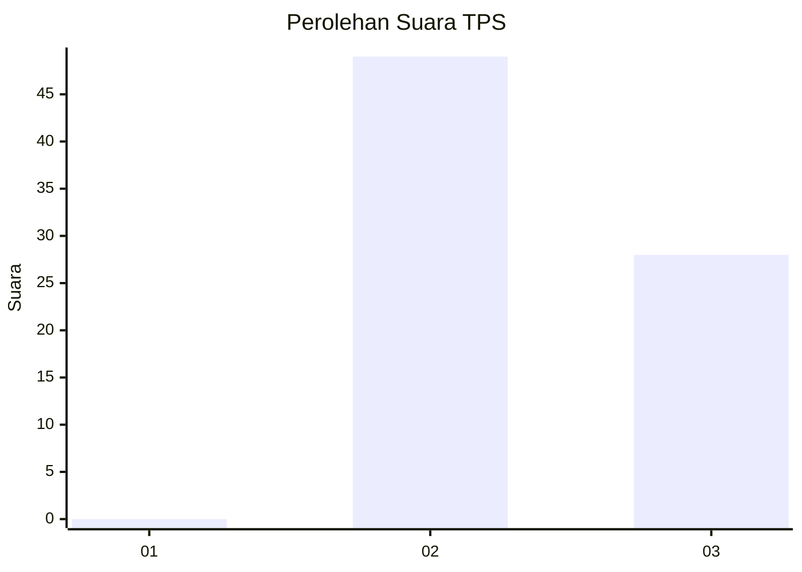
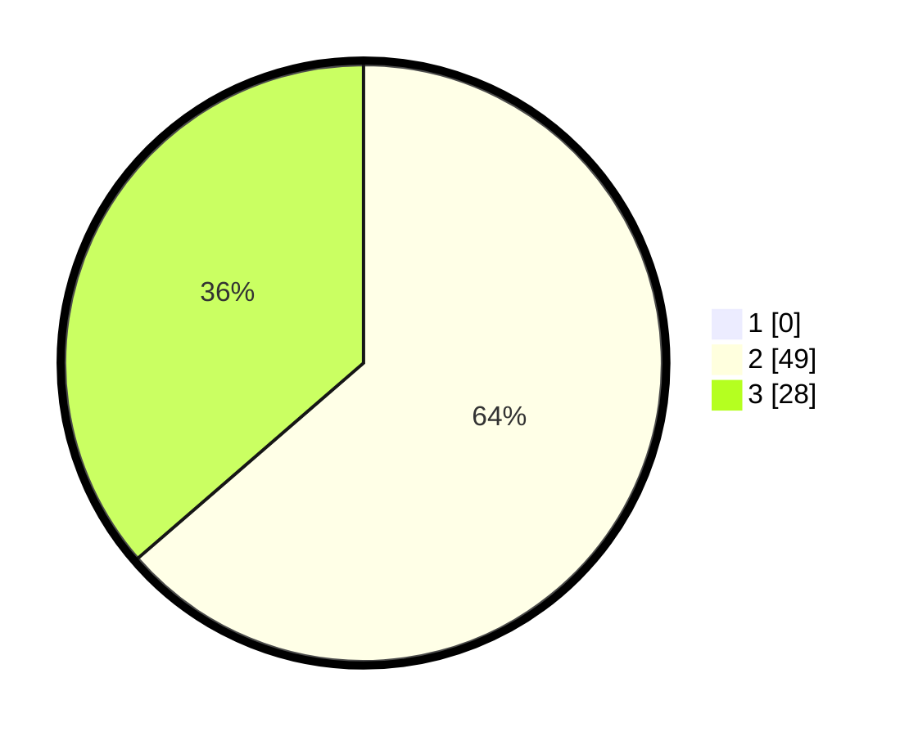

# Hasil

## Grafik

## Tabel

| No. | Nama Paslon    | Suara | Suara (raw) | Persentase |
|:--- |:-------------- | -----:| -----------:| ----------:|
| 1   | ANIES MUHAIMIN | 0     | [0][p-1]    | 0,00       |
| 2   | PRABOWO GIBRAN | 49    | [49][p-2]   | 63,64      |
| 3   | GANJAR MAHFUD  | 28    | [28][p-3]   | 36,36      |

[p-1]: https://github.com/gigit-pemilu/pemilu-2024-12-sumatera-utara/blob/main/pilpres/hitung-suara/sub/12-sumatera-utara/sub/14-nias-selatan/sub/29-pulau-pulau-batu-barat/sub/2009-hilizamorogotano/sub/001-tps/sub/paslon-1.txt
[p-2]: https://github.com/gigit-pemilu/pemilu-2024-12-sumatera-utara/blob/main/pilpres/hitung-suara/sub/12-sumatera-utara/sub/14-nias-selatan/sub/29-pulau-pulau-batu-barat/sub/2009-hilizamorogotano/sub/001-tps/sub/paslon-2.txt
[p-3]: https://github.com/gigit-pemilu/pemilu-2024-12-sumatera-utara/blob/main/pilpres/hitung-suara/sub/12-sumatera-utara/sub/14-nias-selatan/sub/29-pulau-pulau-batu-barat/sub/2009-hilizamorogotano/sub/001-tps/sub/paslon-3.txt

## Foto C Plano

https://sirekap-obj-formc.kpu.go.id/53ed/pemilu/ppwp/12/14/29/20/09/1214292009001-20240214-232110--1c06f1b6-c09a-4268-ad7c-b449e1a3d84d.jpg

https://sirekap-obj-formc.kpu.go.id/53ed/pemilu/ppwp/12/14/29/20/09/1214292009001-20240214-232418--134b1603-4e9c-42eb-aede-93bdeb8c3e01.jpg

https://sirekap-obj-formc.kpu.go.id/53ed/pemilu/ppwp/12/14/29/20/09/1214292009001-20240214-232717--859d1a5a-6afe-4592-94dd-28dbe2939b94.jpg

## Metadata

| Key        | Value               |
| ---------- | ------------------- |
| Time Stamp | 2024-02-15 22:30:27 |

