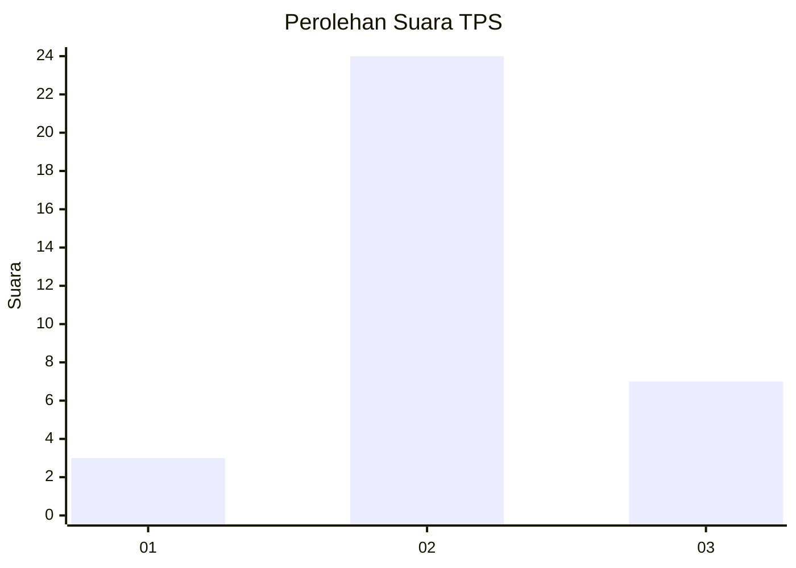
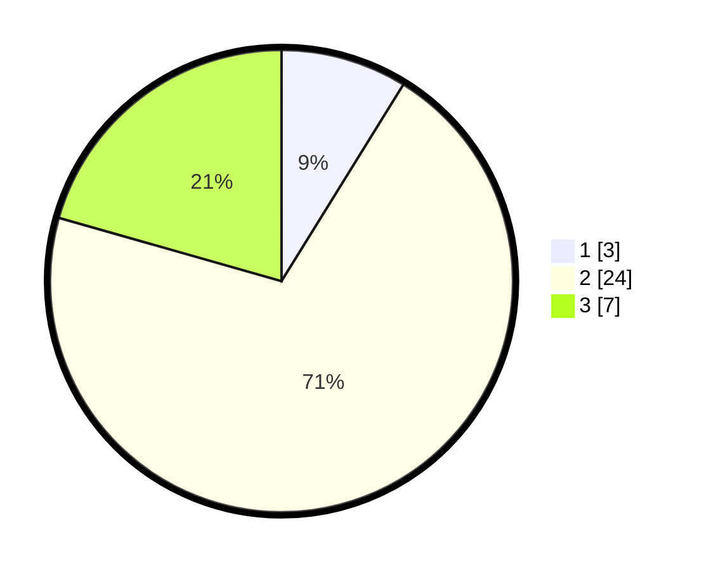

# Hasil

## Grafik

## Tabel

| No. | Nama Paslon    | Suara | Suara (raw) | Persentase |
|:--- |:-------------- | -----:| -----------:| ----------:|
| 1   | ANIES MUHAIMIN | 3     | [3][p-1]    | 8,82       |
| 2   | PRABOWO GIBRAN | 24    | [24][p-2]   | 70,59      |
| 3   | GANJAR MAHFUD  | 7     | [7][p-3]    | 20,59      |

[p-1]: https://github.com/gigit-pemilu/pemilu-2024/blob/main/pilpres/hitung-suara/sub/12-sumatera-utara/sub/14-nias-selatan/sub/30-pulau-pulau-batu-utara/sub/2006-bale-bale/sub/002-tps/sub/paslon-1.txt
[p-2]: https://github.com/gigit-pemilu/pemilu-2024/blob/main/pilpres/hitung-suara/sub/12-sumatera-utara/sub/14-nias-selatan/sub/30-pulau-pulau-batu-utara/sub/2006-bale-bale/sub/002-tps/sub/paslon-2.txt
[p-3]: https://github.com/gigit-pemilu/pemilu-2024/blob/main/pilpres/hitung-suara/sub/12-sumatera-utara/sub/14-nias-selatan/sub/30-pulau-pulau-batu-utara/sub/2006-bale-bale/sub/002-tps/sub/paslon-3.txt

## Foto C Plano

https://sirekap-obj-formc.kpu.go.id/0d5c/pemilu/ppwp/12/14/30/20/06/1214302006002-20240216-151057--b76d0a3c-4fad-405e-a645-fc6b6eb0f318.jpg

https://sirekap-obj-formc.kpu.go.id/0d5c/pemilu/ppwp/12/14/30/20/06/1214302006002-20240216-151058--fcd6d9f3-1717-45f2-8920-f8636e572c25.jpg

https://sirekap-obj-formc.kpu.go.id/0d5c/pemilu/ppwp/12/14/30/20/06/1214302006002-20240216-151058--cc2b0652-c5f7-41b8-a125-9ae73890c981.jpg

## Metadata

| Key        | Value               |
| ---------- | ------------------- |
| Time Stamp | 2024-02-24 22:31:28 |

## DATA PEMILIH TETAP

Jumlah pemilih dalam DPT: **34**.
 * L: **17**.
 * P: **17**.

## DATA PENGGUNA HAK PILIH

Jumlah pengguna hak pilih dalam DPT: **32**.
 * L: **17**.
 * P: **15**.

Jumlah pengguna hak pilih dalam DPTb: **3**.
 * L: **1**.
 * P: **2**.

Jumlah pengguna hak pilih dalam DPK: **0**.
 * L: **0**.
 * P: **0**.

Jumlah pengguna hak pilih: **35**.
 * L: **18**.
 * P: **17**.

## JUMLAH SUARA SAH DAN TIDAK SAH

JUMLAH SELURUH SUARA SAH: **34**.

JUMLAH SUARA TIDAK SAH: **1**.

JUMLAH SELURUH SUARA SAH DAN SUARA TIDAK SAH: **35**.

