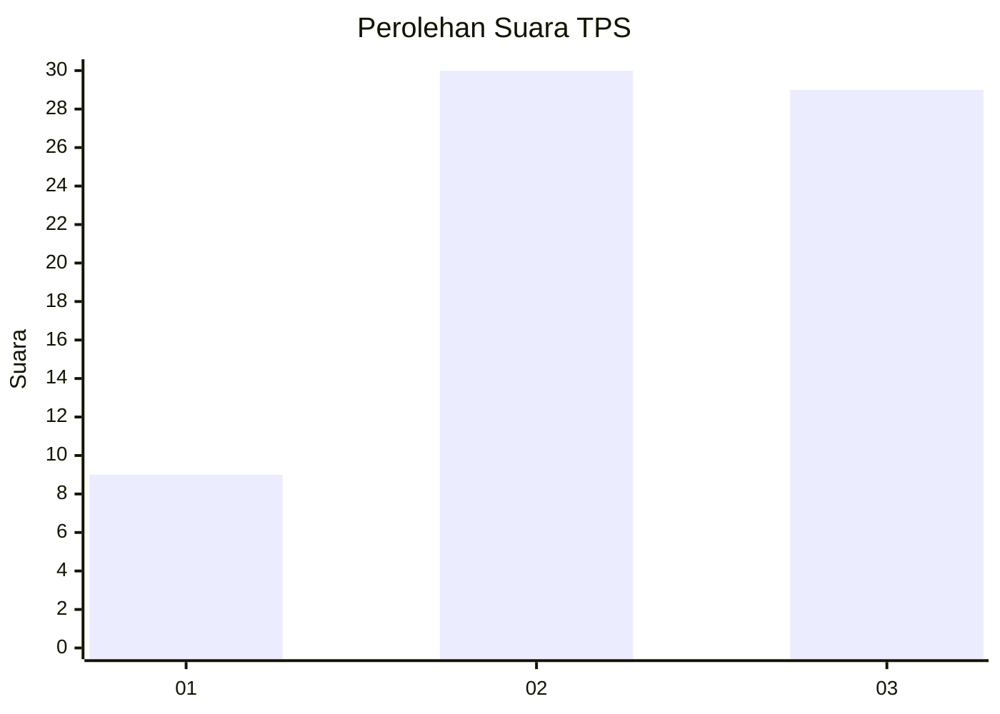
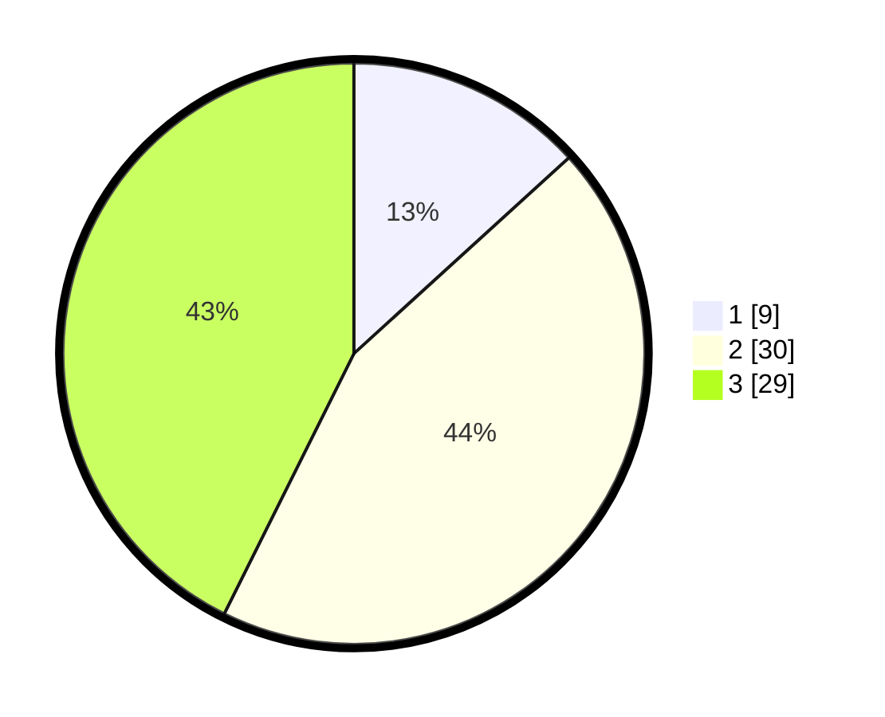

# Hasil

## Grafik

## Tabel

| No. | Nama Paslon    | Suara | Suara (raw) | Persentase |
|:--- |:-------------- | -----:| -----------:| ----------:|
| 1   | ANIES MUHAIMIN | 9     | [9][p-1]    | 13,24      |
| 2   | PRABOWO GIBRAN | 30    | [30][p-2]   | 44,12      |
| 3   | GANJAR MAHFUD  | 29    | [29][p-3]   | 42,65      |

[p-1]: https://github.com/gigit-pemilu/pemilu-2024/blob/main/pilpres/hitung-suara/sub/12-sumatera-utara/sub/14-nias-selatan/sub/30-pulau-pulau-batu-utara/sub/2009-marit-baru/sub/002-tps/sub/paslon-1.txt
[p-2]: https://github.com/gigit-pemilu/pemilu-2024/blob/main/pilpres/hitung-suara/sub/12-sumatera-utara/sub/14-nias-selatan/sub/30-pulau-pulau-batu-utara/sub/2009-marit-baru/sub/002-tps/sub/paslon-2.txt
[p-3]: https://github.com/gigit-pemilu/pemilu-2024/blob/main/pilpres/hitung-suara/sub/12-sumatera-utara/sub/14-nias-selatan/sub/30-pulau-pulau-batu-utara/sub/2009-marit-baru/sub/002-tps/sub/paslon-3.txt

## Foto C Plano

https://sirekap-obj-formc.kpu.go.id/5ef1/pemilu/ppwp/12/14/30/20/09/1214302009002-20240215-130849--f48f11d4-f043-4d1c-acdf-c8d4265488b6.jpg

https://sirekap-obj-formc.kpu.go.id/5ef1/pemilu/ppwp/12/14/30/20/09/1214302009002-20240215-130951--b5c79e9e-6c18-4174-a1b5-d07ed2f500bf.jpg

https://sirekap-obj-formc.kpu.go.id/5ef1/pemilu/ppwp/12/14/30/20/09/1214302009002-20240215-083743--d9d74e63-3d42-4315-b90a-c4a372f0683a.jpg

## Metadata

| Key        | Value               |
| ---------- | ------------------- |
| Time Stamp | 2024-02-20 13:00:00 |

