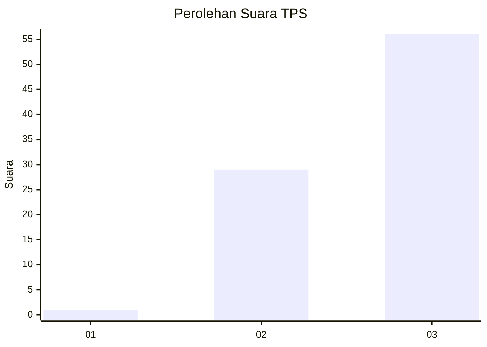
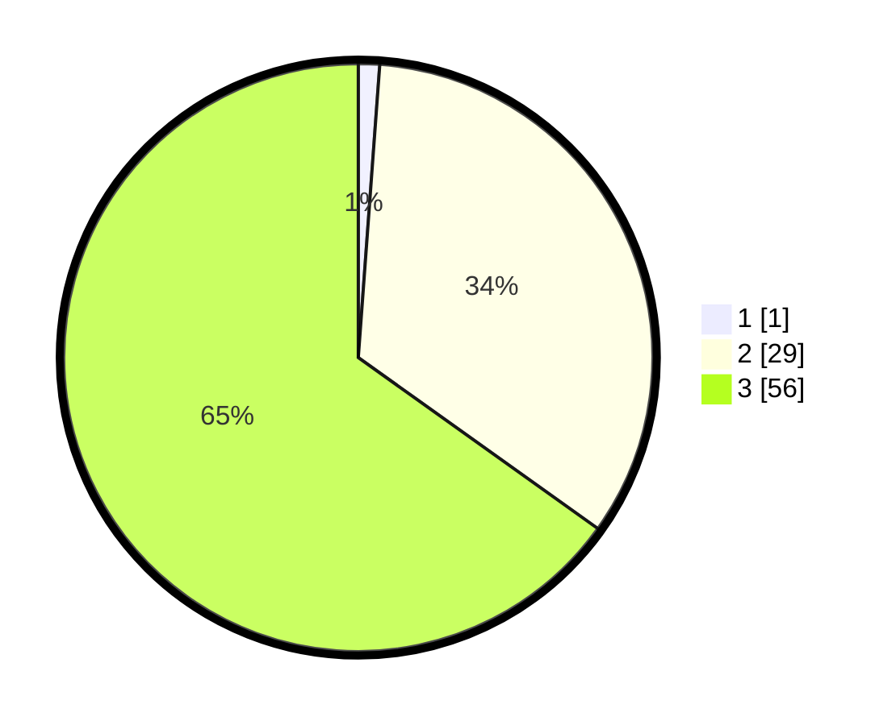

# Hasil

## Grafik

## Tabel

| No. | Nama Paslon    | Suara | Suara (raw) | Persentase |
|:--- |:-------------- | -----:| -----------:| ----------:|
| 1   | ANIES MUHAIMIN | 1     | [1][p-1]    | 1,16       |
| 2   | PRABOWO GIBRAN | 29    | [29][p-2]   | 33,72      |
| 3   | GANJAR MAHFUD  | 56    | [56][p-3]   | 65,12      |

[p-1]: https://github.com/gigit-pemilu/pemilu-2024-12-sumatera-utara/blob/main/pilpres/hitung-suara/sub/12-sumatera-utara/sub/14-nias-selatan/sub/31-tanah-masa/sub/2010-saeru-melayu/sub/001-tps/sub/paslon-1.txt
[p-2]: https://github.com/gigit-pemilu/pemilu-2024-12-sumatera-utara/blob/main/pilpres/hitung-suara/sub/12-sumatera-utara/sub/14-nias-selatan/sub/31-tanah-masa/sub/2010-saeru-melayu/sub/001-tps/sub/paslon-2.txt
[p-3]: https://github.com/gigit-pemilu/pemilu-2024-12-sumatera-utara/blob/main/pilpres/hitung-suara/sub/12-sumatera-utara/sub/14-nias-selatan/sub/31-tanah-masa/sub/2010-saeru-melayu/sub/001-tps/sub/paslon-3.txt

## Foto C Plano

https://sirekap-obj-formc.kpu.go.id/32ee/pemilu/ppwp/12/14/31/20/10/1214312010001-20240216-072343--90cdcd1e-ed6d-476d-85d7-6f8c3bbbb134.jpg

https://sirekap-obj-formc.kpu.go.id/32ee/pemilu/ppwp/12/14/31/20/10/1214312010001-20240216-072420--656172af-4419-480a-b519-562356311362.jpg

https://sirekap-obj-formc.kpu.go.id/32ee/pemilu/ppwp/12/14/31/20/10/1214312010001-20240216-072439--ee250613-65a9-418a-9277-be7e57133fba.jpg

## Metadata

| Key        | Value               |
| ---------- | ------------------- |
| Time Stamp | 2024-02-20 07:00:00 |

