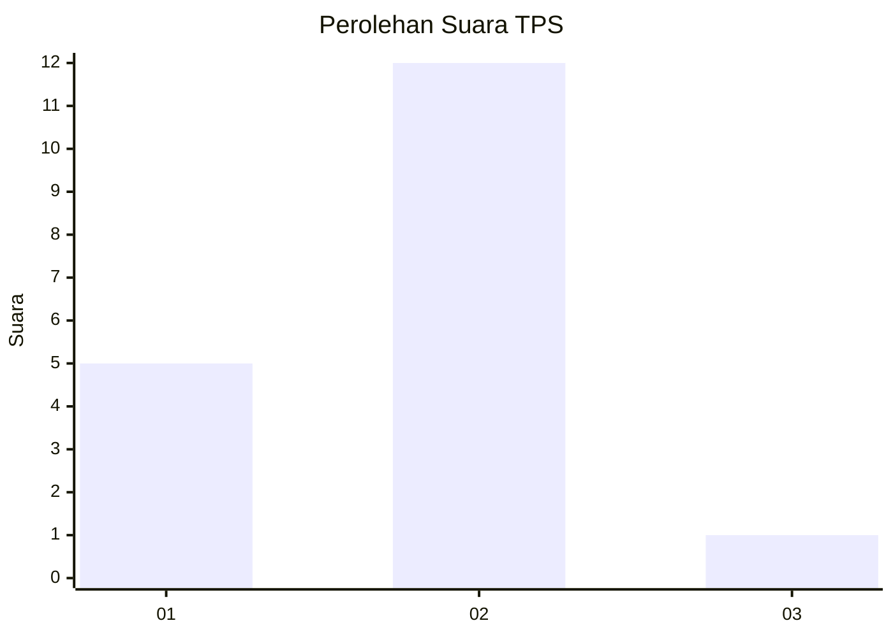
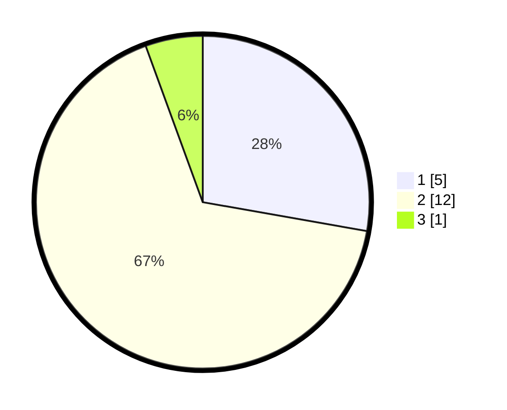

# Hasil

## Grafik

## Tabel

| No. | Nama Paslon    | Suara | Suara (raw) | Persentase |
|:--- |:-------------- | -----:| -----------:| ----------:|
| 1   | ANIES MUHAIMIN | 5     | [5][p-1]    | 27,78      |
| 2   | PRABOWO GIBRAN | 12    | [12][p-2]   | 66,67      |
| 3   | GANJAR MAHFUD  | 1     | [1][p-3]    | 5,56       |

[p-1]: https://github.com/gigit-pemilu/pemilu-2024/blob/main/pilpres/hitung-suara/sub/12-sumatera-utara/sub/14-nias-selatan/sub/31-tanah-masa/sub/2012-hiliomasio/sub/002-tps/sub/paslon-1.txt
[p-2]: https://github.com/gigit-pemilu/pemilu-2024/blob/main/pilpres/hitung-suara/sub/12-sumatera-utara/sub/14-nias-selatan/sub/31-tanah-masa/sub/2012-hiliomasio/sub/002-tps/sub/paslon-2.txt
[p-3]: https://github.com/gigit-pemilu/pemilu-2024/blob/main/pilpres/hitung-suara/sub/12-sumatera-utara/sub/14-nias-selatan/sub/31-tanah-masa/sub/2012-hiliomasio/sub/002-tps/sub/paslon-3.txt

## Foto C Plano

https://sirekap-obj-formc.kpu.go.id/20a8/pemilu/ppwp/12/14/31/20/12/1214312012002-20240215-090609--58d6d0fe-b589-4ccf-bd6e-7ed243c701bb.jpg

https://sirekap-obj-formc.kpu.go.id/20a8/pemilu/ppwp/12/14/31/20/12/1214312012002-20240215-101818--9d0a622a-6d6c-410d-aee4-7cdb7268d7bf.jpg

https://sirekap-obj-formc.kpu.go.id/20a8/pemilu/ppwp/12/14/31/20/12/1214312012002-20240215-100056--eb675e63-93e2-4a15-bced-efc53acc43f1.jpg

## Metadata

| Key        | Value               |
| ---------- | ------------------- |
| Time Stamp | 2024-02-20 07:00:00 |

