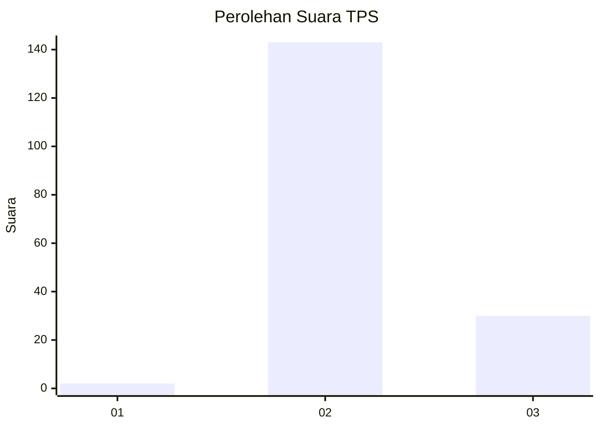
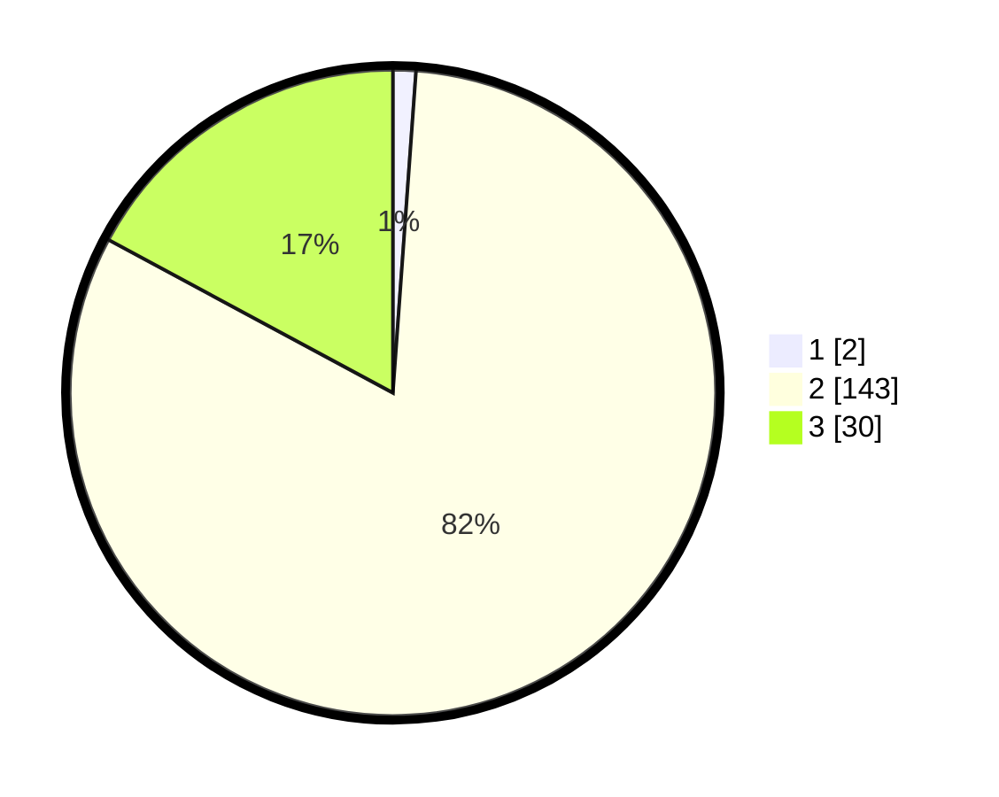

# Hasil

## Grafik

## Tabel

| No. | Nama Paslon    | Suara | Suara (raw) | Persentase |
|:--- |:-------------- | -----:| -----------:| ----------:|
| 1   | ANIES MUHAIMIN | 2     | [2][p-1]    | 1,14       |
| 2   | PRABOWO GIBRAN | 143   | [143][p-2]  | 81,71      |
| 3   | GANJAR MAHFUD  | 30    | [30][p-3]   | 17,14      |

[p-1]: https://github.com/gigit-pemilu/pemilu-2024/blob/main/pilpres/hitung-suara/sub/12-sumatera-utara/sub/14-nias-selatan/sub/32-luahagundre-maniamolo/sub/2001-botohilitano/sub/004-tps/sub/paslon-1.txt
[p-2]: https://github.com/gigit-pemilu/pemilu-2024/blob/main/pilpres/hitung-suara/sub/12-sumatera-utara/sub/14-nias-selatan/sub/32-luahagundre-maniamolo/sub/2001-botohilitano/sub/004-tps/sub/paslon-2.txt
[p-3]: https://github.com/gigit-pemilu/pemilu-2024/blob/main/pilpres/hitung-suara/sub/12-sumatera-utara/sub/14-nias-selatan/sub/32-luahagundre-maniamolo/sub/2001-botohilitano/sub/004-tps/sub/paslon-3.txt

## Foto C Plano

https://sirekap-obj-formc.kpu.go.id/afbb/pemilu/ppwp/12/14/32/20/01/1214322001004-20240215-100949--e9ee52a6-8816-4884-a2e6-d285148df622.jpg

https://sirekap-obj-formc.kpu.go.id/afbb/pemilu/ppwp/12/14/32/20/01/1214322001004-20240215-101104--d30531b2-a11a-4d3d-b697-94f05ec768c7.jpg

https://sirekap-obj-formc.kpu.go.id/afbb/pemilu/ppwp/12/14/32/20/01/1214322001004-20240215-101212--5fdf1e4d-8fc3-4b8a-afa0-1266cc8dd5c9.jpg

## Metadata

| Key        | Value               |
| ---------- | ------------------- |
| Time Stamp | 2024-02-20 13:00:00 |

