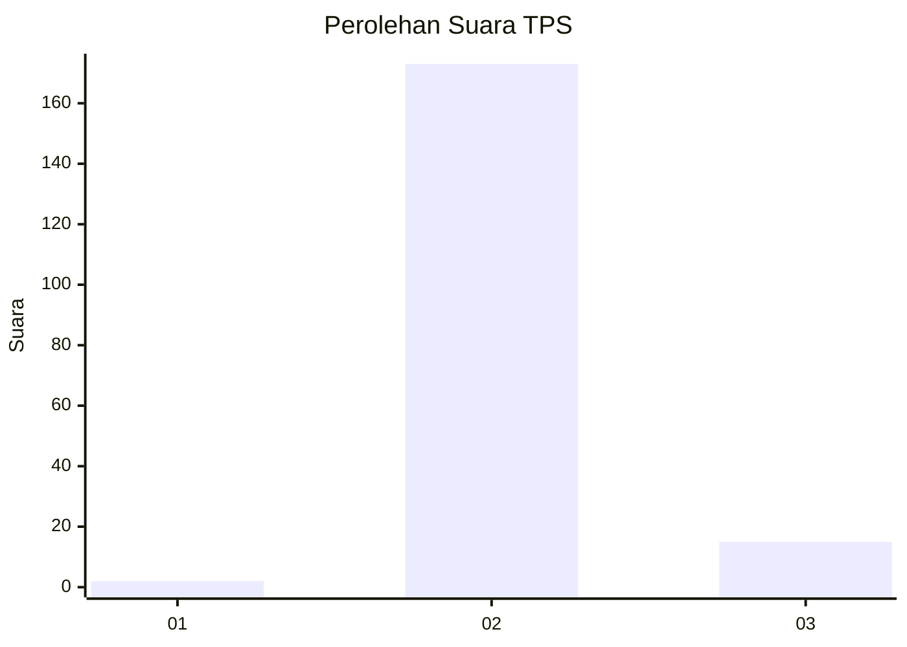
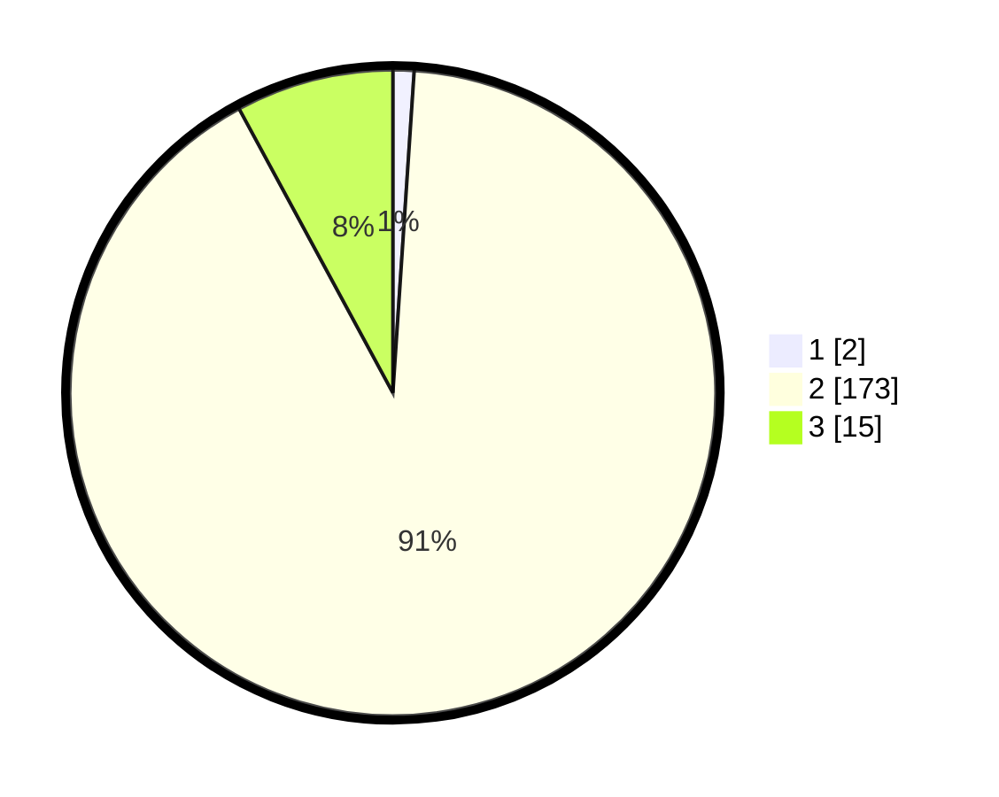

# Hasil

## Grafik

## Tabel

| No. | Nama Paslon    | Suara | Suara (raw) | Persentase |
|:--- |:-------------- | -----:| -----------:| ----------:|
| 1   | ANIES MUHAIMIN | 2     | [2][p-1]    | 1,05       |
| 2   | PRABOWO GIBRAN | 173   | [173][p-2]  | 91,05      |
| 3   | GANJAR MAHFUD  | 15    | [15][p-3]   | 7,89       |

[p-1]: https://github.com/gigit-pemilu/pemilu-2024-12-sumatera-utara/blob/main/pilpres/hitung-suara/sub/12-sumatera-utara/sub/14-nias-selatan/sub/32-luahagundre-maniamolo/sub/2002-botohilisalo'o/sub/001-tps/sub/paslon-1.txt
[p-2]: https://github.com/gigit-pemilu/pemilu-2024-12-sumatera-utara/blob/main/pilpres/hitung-suara/sub/12-sumatera-utara/sub/14-nias-selatan/sub/32-luahagundre-maniamolo/sub/2002-botohilisalo'o/sub/001-tps/sub/paslon-2.txt
[p-3]: https://github.com/gigit-pemilu/pemilu-2024-12-sumatera-utara/blob/main/pilpres/hitung-suara/sub/12-sumatera-utara/sub/14-nias-selatan/sub/32-luahagundre-maniamolo/sub/2002-botohilisalo'o/sub/001-tps/sub/paslon-3.txt

## Foto C Plano

https://sirekap-obj-formc.kpu.go.id/5ea7/pemilu/ppwp/12/14/32/20/02/1214322002001-20240218-140920--64a5e3ce-0eba-485f-a3f9-1ef9b10741ef.jpg

https://sirekap-obj-formc.kpu.go.id/5ea7/pemilu/ppwp/12/14/32/20/02/1214322002001-20240218-163629--1332af84-619d-425b-8e58-b8fc8b339887.jpg

https://sirekap-obj-formc.kpu.go.id/5ea7/pemilu/ppwp/12/14/32/20/02/1214322002001-20240218-163738--99b2f82b-3f25-4ccd-b05a-a2499c6059d4.jpg

## Metadata

| Key        | Value               |
| ---------- | ------------------- |
| Time Stamp | 2024-02-25 15:00:00 |

