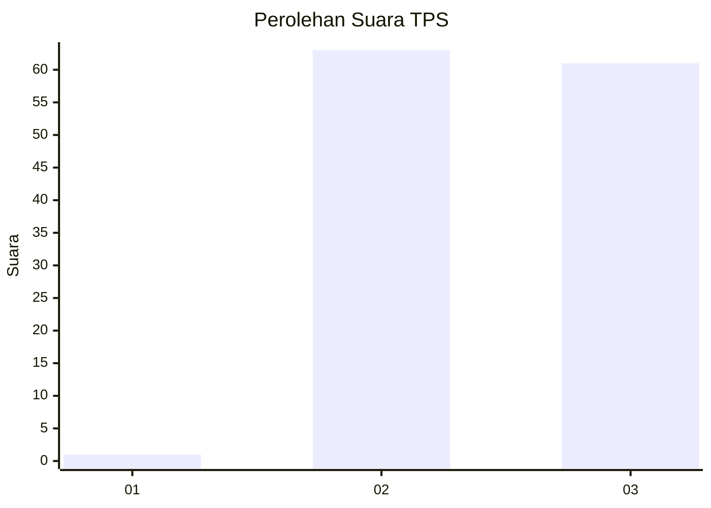
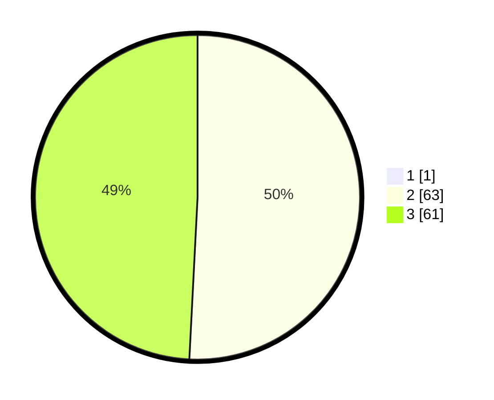

# Hasil

## Grafik

## Tabel

| No. | Nama Paslon    | Suara | Suara (raw) | Persentase |
|:--- |:-------------- | -----:| -----------:| ----------:|
| 1   | ANIES MUHAIMIN | 1     | [1][p-1]    | 0,80       |
| 2   | PRABOWO GIBRAN | 63    | [63][p-2]   | 50,40      |
| 3   | GANJAR MAHFUD  | 61    | [61][p-3]   | 48,80      |

[p-1]: https://github.com/gigit-pemilu/pemilu-2024/blob/main/pilpres/hitung-suara/sub/12-sumatera-utara/sub/14-nias-selatan/sub/32-luahagundre-maniamolo/sub/2004-orahili-faomasi/sub/002-tps/sub/paslon-1.txt
[p-2]: https://github.com/gigit-pemilu/pemilu-2024/blob/main/pilpres/hitung-suara/sub/12-sumatera-utara/sub/14-nias-selatan/sub/32-luahagundre-maniamolo/sub/2004-orahili-faomasi/sub/002-tps/sub/paslon-2.txt
[p-3]: https://github.com/gigit-pemilu/pemilu-2024/blob/main/pilpres/hitung-suara/sub/12-sumatera-utara/sub/14-nias-selatan/sub/32-luahagundre-maniamolo/sub/2004-orahili-faomasi/sub/002-tps/sub/paslon-3.txt

## Foto C Plano

https://sirekap-obj-formc.kpu.go.id/5814/pemilu/ppwp/12/14/32/20/04/1214322004002-20240214-234132--2b15cd59-97bf-435d-a6f5-85e412b3a38a.jpg

https://sirekap-obj-formc.kpu.go.id/5814/pemilu/ppwp/12/14/32/20/04/1214322004002-20240214-234446--b6bfd0b4-cbce-481c-b866-f70840cec358.jpg

https://sirekap-obj-formc.kpu.go.id/5814/pemilu/ppwp/12/14/32/20/04/1214322004002-20240214-234858--0bed9ce8-f471-4151-b710-c15d0564d6ea.jpg

## Metadata

| Key        | Value               |
| ---------- | ------------------- |
| Time Stamp | 2024-02-16 12:51:22 |

