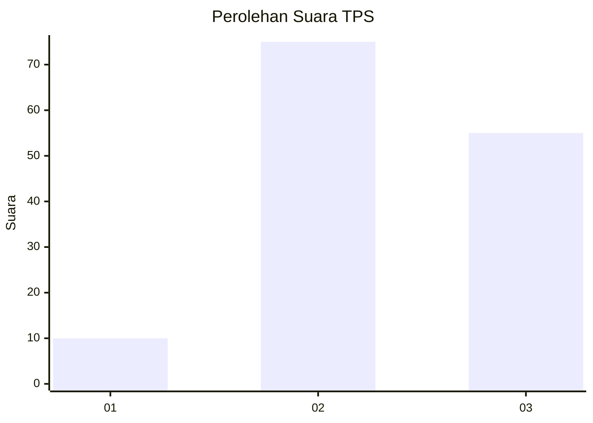
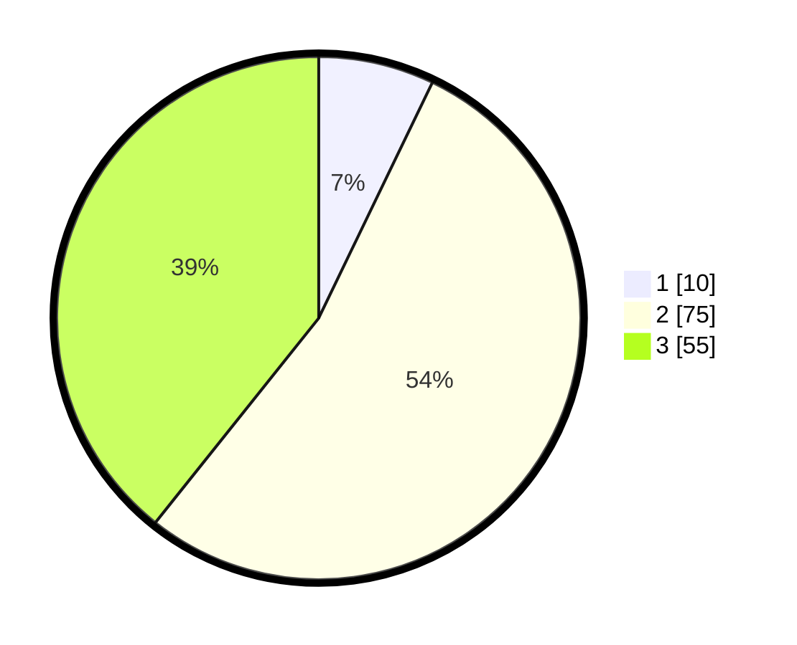

# Hasil

## Grafik

## Tabel

| No. | Nama Paslon    | Suara | Suara (raw) | Persentase |
|:--- |:-------------- | -----:| -----------:| ----------:|
| 1   | ANIES MUHAIMIN | 10    | [10][p-1]   | 7,14       |
| 2   | PRABOWO GIBRAN | 75    | [75][p-2]   | 53,57      |
| 3   | GANJAR MAHFUD  | 55    | [55][p-3]   | 39,29      |

[p-1]: https://github.com/gigit-pemilu/pemilu-2024-12-sumatera-utara/blob/main/pilpres/hitung-suara/sub/12-sumatera-utara/sub/14-nias-selatan/sub/33-onolalu/sub/2001-hilifalago/sub/002-tps/sub/paslon-1.txt
[p-2]: https://github.com/gigit-pemilu/pemilu-2024-12-sumatera-utara/blob/main/pilpres/hitung-suara/sub/12-sumatera-utara/sub/14-nias-selatan/sub/33-onolalu/sub/2001-hilifalago/sub/002-tps/sub/paslon-2.txt
[p-3]: https://github.com/gigit-pemilu/pemilu-2024-12-sumatera-utara/blob/main/pilpres/hitung-suara/sub/12-sumatera-utara/sub/14-nias-selatan/sub/33-onolalu/sub/2001-hilifalago/sub/002-tps/sub/paslon-3.txt

## Foto C Plano

https://sirekap-obj-formc.kpu.go.id/b285/pemilu/ppwp/12/14/33/20/01/1214332001002-20240215-014845--0aabf9b4-0c6c-41b6-81c7-751d9018d344.jpg

https://sirekap-obj-formc.kpu.go.id/b285/pemilu/ppwp/12/14/33/20/01/1214332001002-20240215-013017--0ef86398-03df-43a7-a395-64981ff19a73.jpg

https://sirekap-obj-formc.kpu.go.id/b285/pemilu/ppwp/12/14/33/20/01/1214332001002-20240215-013503--8c1813e0-a3af-4a11-9323-aa224187a83c.jpg

## Metadata

| Key        | Value               |
| ---------- | ------------------- |
| Time Stamp | 2024-02-15 15:00:29 |

