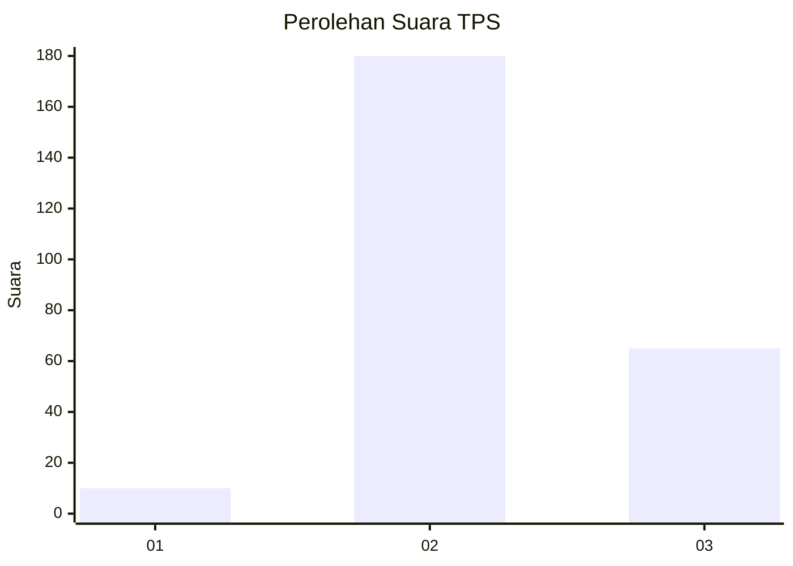
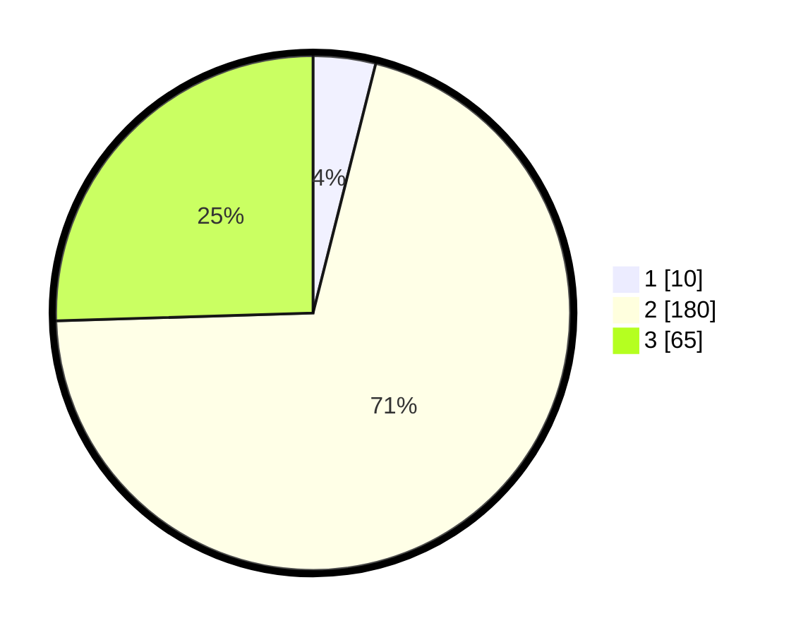

# Hasil

## Grafik

## Tabel

| No. | Nama Paslon    | Suara | Suara (raw) | Persentase |
|:--- |:-------------- | -----:| -----------:| ----------:|
| 1   | ANIES MUHAIMIN | 10    | [10][p-1]   | 3,92       |
| 2   | PRABOWO GIBRAN | 180   | [180][p-2]  | 70,59      |
| 3   | GANJAR MAHFUD  | 65    | [65][p-3]   | 25,49      |

[p-1]: https://github.com/gigit-pemilu/pemilu-2024/blob/main/pilpres/hitung-suara/sub/12-sumatera-utara/sub/14-nias-selatan/sub/33-onolalu/sub/2001-hilifalago/sub/003-tps/sub/paslon-1.txt
[p-2]: https://github.com/gigit-pemilu/pemilu-2024/blob/main/pilpres/hitung-suara/sub/12-sumatera-utara/sub/14-nias-selatan/sub/33-onolalu/sub/2001-hilifalago/sub/003-tps/sub/paslon-2.txt
[p-3]: https://github.com/gigit-pemilu/pemilu-2024/blob/main/pilpres/hitung-suara/sub/12-sumatera-utara/sub/14-nias-selatan/sub/33-onolalu/sub/2001-hilifalago/sub/003-tps/sub/paslon-3.txt

## Foto C Plano

https://sirekap-obj-formc.kpu.go.id/ab70/pemilu/ppwp/12/14/33/20/01/1214332001003-20240214-225627--304f06d9-d79b-46f3-a743-7181d05a3b26.jpg

https://sirekap-obj-formc.kpu.go.id/ab70/pemilu/ppwp/12/14/33/20/01/1214332001003-20240215-014637--285adf75-3666-40bd-b973-47234586c964.jpg

https://sirekap-obj-formc.kpu.go.id/ab70/pemilu/ppwp/12/14/33/20/01/1214332001003-20240214-231633--5ae54f43-dfaa-426e-912c-6bb05cda780a.jpg

## Metadata

| Key        | Value               |
| ---------- | ------------------- |
| Time Stamp | 2024-02-20 13:00:00 |

