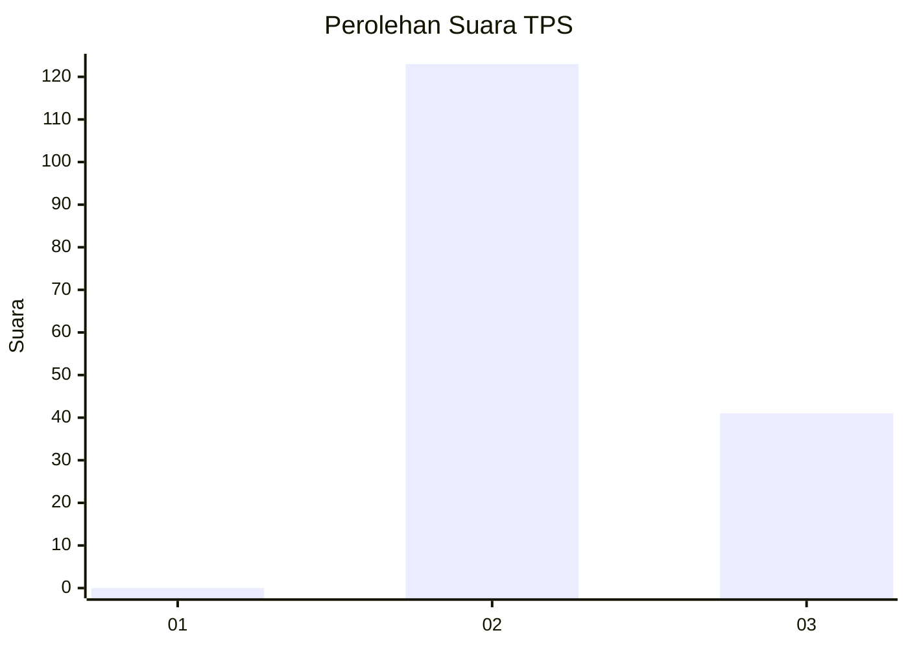
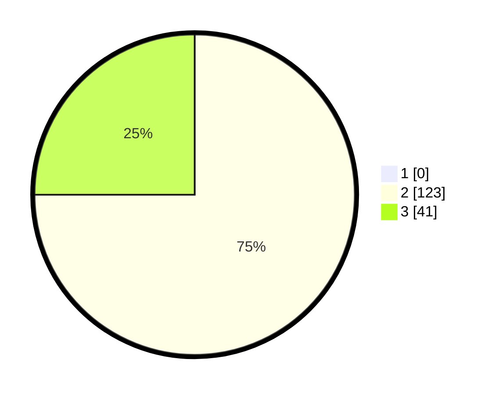

# Hasil

## Grafik

## Tabel

| No. | Nama Paslon    | Suara | Suara (raw) | Persentase |
|:--- |:-------------- | -----:| -----------:| ----------:|
| 1   | ANIES MUHAIMIN | 0     | [0][p-1]    | 0,00       |
| 2   | PRABOWO GIBRAN | 123   | [123][p-2]  | 75,00      |
| 3   | GANJAR MAHFUD  | 41    | [41][p-3]   | 25,00      |

[p-1]: https://github.com/gigit-pemilu/pemilu-2024/blob/main/pilpres/hitung-suara/sub/12-sumatera-utara/sub/14-nias-selatan/sub/33-onolalu/sub/2002-hilimondregeraya/sub/001-tps/sub/paslon-1.txt
[p-2]: https://github.com/gigit-pemilu/pemilu-2024/blob/main/pilpres/hitung-suara/sub/12-sumatera-utara/sub/14-nias-selatan/sub/33-onolalu/sub/2002-hilimondregeraya/sub/001-tps/sub/paslon-2.txt
[p-3]: https://github.com/gigit-pemilu/pemilu-2024/blob/main/pilpres/hitung-suara/sub/12-sumatera-utara/sub/14-nias-selatan/sub/33-onolalu/sub/2002-hilimondregeraya/sub/001-tps/sub/paslon-3.txt

## Foto C Plano

https://sirekap-obj-formc.kpu.go.id/531b/pemilu/ppwp/12/14/33/20/02/1214332002001-20240215-160719--1b5e6f82-28f2-46f5-b78a-06f09a7dc634.jpg

https://sirekap-obj-formc.kpu.go.id/531b/pemilu/ppwp/12/14/33/20/02/1214332002001-20240215-160915--023787f9-e384-4dc3-b57a-108243409f24.jpg

https://sirekap-obj-formc.kpu.go.id/531b/pemilu/ppwp/12/14/33/20/02/1214332002001-20240215-161119--7d5ef995-5cf5-498c-9d5a-2c3f0661664f.jpg

## Metadata

| Key        | Value               |
| ---------- | ------------------- |
| Time Stamp | 2024-02-15 23:29:50 |

