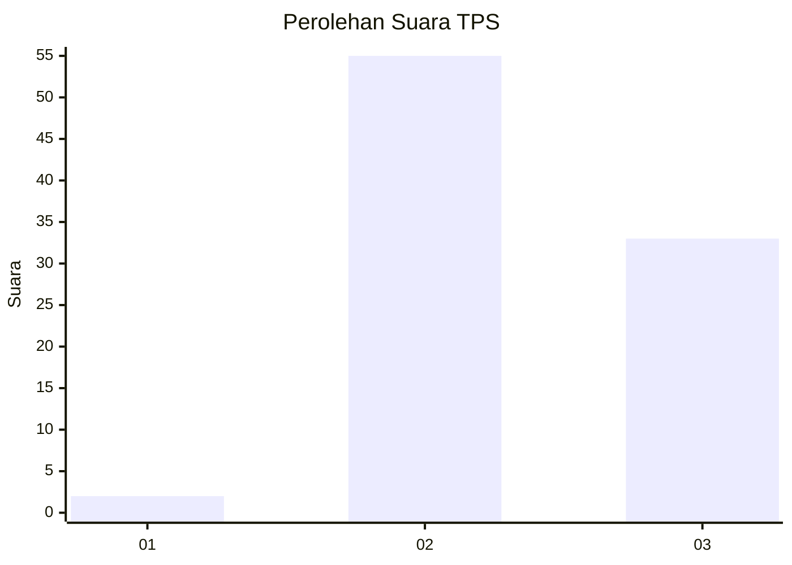
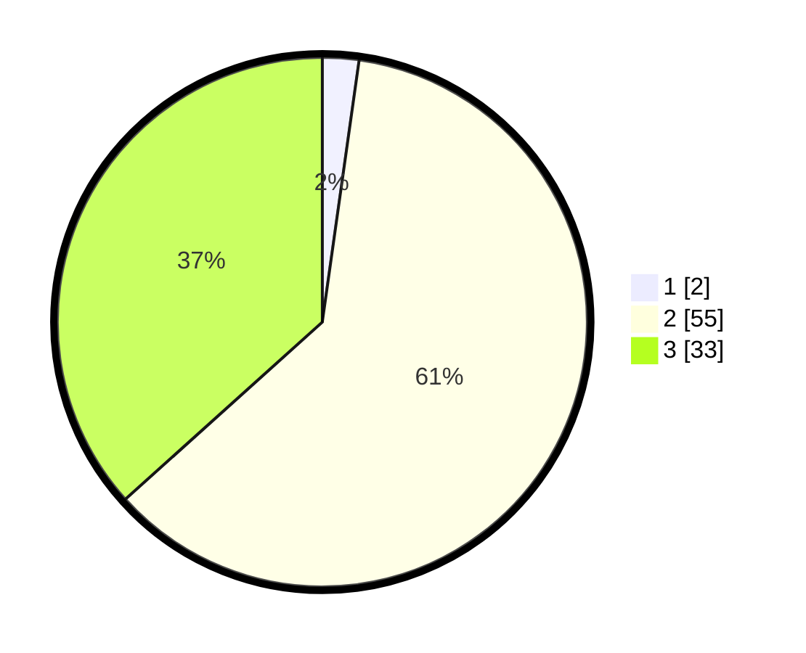

# Hasil

## Grafik

## Tabel

| No. | Nama Paslon    | Suara | Suara (raw) | Persentase |
|:--- |:-------------- | -----:| -----------:| ----------:|
| 1   | ANIES MUHAIMIN | 2     | [2][p-1]    | 2,22       |
| 2   | PRABOWO GIBRAN | 55    | [55][p-2]   | 61,11      |
| 3   | GANJAR MAHFUD  | 33    | [33][p-3]   | 36,67      |

[p-1]: https://github.com/gigit-pemilu/pemilu-2024/blob/main/pilpres/hitung-suara/sub/12-sumatera-utara/sub/14-nias-selatan/sub/33-onolalu/sub/2007-hilialito-saua/sub/002-tps/sub/paslon-1.txt
[p-2]: https://github.com/gigit-pemilu/pemilu-2024/blob/main/pilpres/hitung-suara/sub/12-sumatera-utara/sub/14-nias-selatan/sub/33-onolalu/sub/2007-hilialito-saua/sub/002-tps/sub/paslon-2.txt
[p-3]: https://github.com/gigit-pemilu/pemilu-2024/blob/main/pilpres/hitung-suara/sub/12-sumatera-utara/sub/14-nias-selatan/sub/33-onolalu/sub/2007-hilialito-saua/sub/002-tps/sub/paslon-3.txt

## Foto C Plano

https://sirekap-obj-formc.kpu.go.id/9e49/pemilu/ppwp/12/14/33/20/07/1214332007002-20240214-230817--d60f23b5-3962-40db-9311-d5af2a0310eb.jpg

https://sirekap-obj-formc.kpu.go.id/9e49/pemilu/ppwp/12/14/33/20/07/1214332007002-20240214-225430--665228fc-834e-4a51-b675-300dbf118361.jpg

https://sirekap-obj-formc.kpu.go.id/9e49/pemilu/ppwp/12/14/33/20/07/1214332007002-20240214-225932--4412aebf-8280-4354-806d-8a2fbd8330cb.jpg

## Metadata

| Key        | Value               |
| ---------- | ------------------- |
| Time Stamp | 2024-02-20 13:00:00 |

