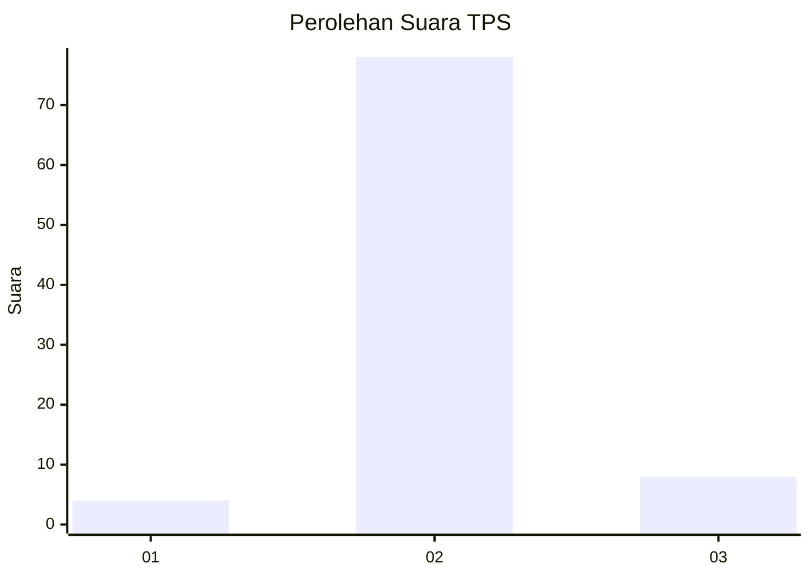
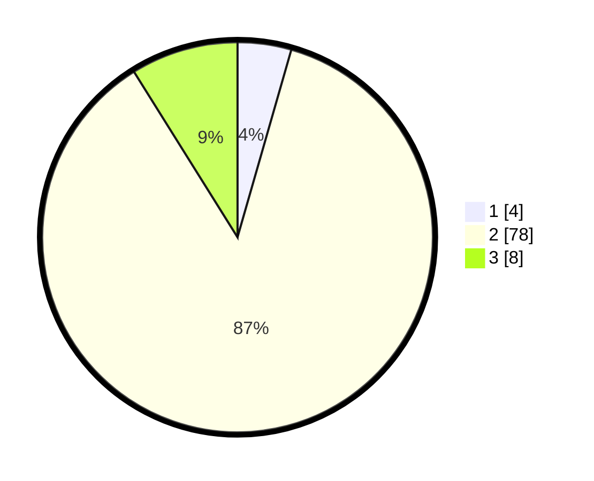

# Hasil

## Grafik

## Tabel

| No. | Nama Paslon    | Suara | Suara (raw) | Persentase |
|:--- |:-------------- | -----:| -----------:| ----------:|
| 1   | ANIES MUHAIMIN | 4     | [4][p-1]    | 4,44       |
| 2   | PRABOWO GIBRAN | 78    | [78][p-2]   | 86,67      |
| 3   | GANJAR MAHFUD  | 8     | [8][p-3]    | 8,89       |

[p-1]: https://github.com/gigit-pemilu/pemilu-2024-12-sumatera-utara/blob/main/pilpres/hitung-suara/sub/12-sumatera-utara/sub/14-nias-selatan/sub/34-ulu-idanotae/sub/2001-fanedanu/sub/001-tps/sub/paslon-1.txt
[p-2]: https://github.com/gigit-pemilu/pemilu-2024-12-sumatera-utara/blob/main/pilpres/hitung-suara/sub/12-sumatera-utara/sub/14-nias-selatan/sub/34-ulu-idanotae/sub/2001-fanedanu/sub/001-tps/sub/paslon-2.txt
[p-3]: https://github.com/gigit-pemilu/pemilu-2024-12-sumatera-utara/blob/main/pilpres/hitung-suara/sub/12-sumatera-utara/sub/14-nias-selatan/sub/34-ulu-idanotae/sub/2001-fanedanu/sub/001-tps/sub/paslon-3.txt

## Foto C Plano

https://sirekap-obj-formc.kpu.go.id/7678/pemilu/ppwp/12/14/34/20/01/1214342001001-20240214-224940--704040dc-0d13-4810-aba6-4a0958154a80.jpg

https://sirekap-obj-formc.kpu.go.id/7678/pemilu/ppwp/12/14/34/20/01/1214342001001-20240214-211704--5a80bb06-9083-4525-875b-ee5b3549ab09.jpg

https://sirekap-obj-formc.kpu.go.id/7678/pemilu/ppwp/12/14/34/20/01/1214342001001-20240214-212656--51ec5dc8-3fc4-4a30-9b76-6b3b64f2feb0.jpg

## Metadata

| Key        | Value               |
| ---------- | ------------------- |
| Time Stamp | 2024-02-15 21:30:27 |

