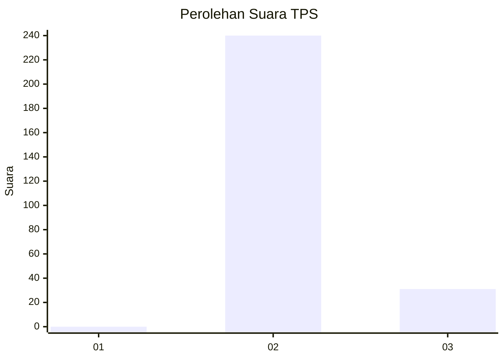
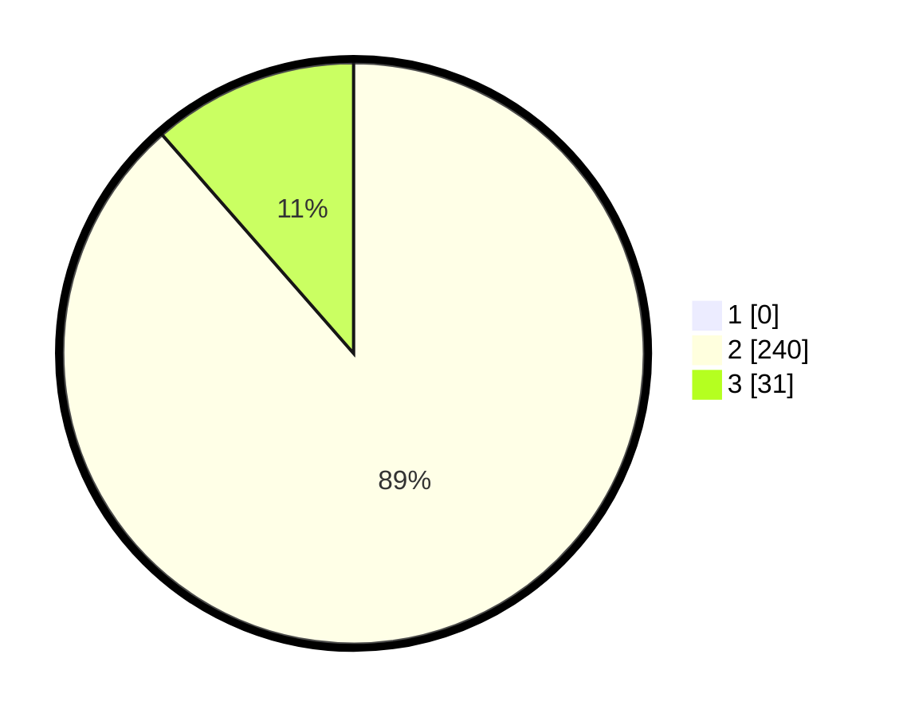

# Hasil

## Grafik

## Tabel

| No. | Nama Paslon    | Suara | Suara (raw) | Persentase |
|:--- |:-------------- | -----:| -----------:| ----------:|
| 1   | ANIES MUHAIMIN | 0     | [0][p-1]    | 0,00       |
| 2   | PRABOWO GIBRAN | 240   | [240][p-2]  | 88,56      |
| 3   | GANJAR MAHFUD  | 31    | [31][p-3]   | 11,44      |

[p-1]: https://github.com/gigit-pemilu/pemilu-2024/blob/main/pilpres/hitung-suara/sub/12-sumatera-utara/sub/14-nias-selatan/sub/34-ulu-idanotae/sub/2011-sindrolo/sub/002-tps/sub/paslon-1.txt
[p-2]: https://github.com/gigit-pemilu/pemilu-2024/blob/main/pilpres/hitung-suara/sub/12-sumatera-utara/sub/14-nias-selatan/sub/34-ulu-idanotae/sub/2011-sindrolo/sub/002-tps/sub/paslon-2.txt
[p-3]: https://github.com/gigit-pemilu/pemilu-2024/blob/main/pilpres/hitung-suara/sub/12-sumatera-utara/sub/14-nias-selatan/sub/34-ulu-idanotae/sub/2011-sindrolo/sub/002-tps/sub/paslon-3.txt

## Foto C Plano

https://sirekap-obj-formc.kpu.go.id/b189/pemilu/ppwp/12/14/34/20/11/1214342011002-20240215-083307--2f81c77f-98a0-43cc-a756-03e3c2213912.jpg

https://sirekap-obj-formc.kpu.go.id/b189/pemilu/ppwp/12/14/34/20/11/1214342011002-20240215-083544--045300a0-61da-49d5-9fa1-fde47e87647a.jpg

https://sirekap-obj-formc.kpu.go.id/b189/pemilu/ppwp/12/14/34/20/11/1214342011002-20240215-083726--f775736b-9c13-4b2f-9116-fd646054b058.jpg

## Metadata

| Key        | Value               |
| ---------- | ------------------- |
| Time Stamp | 2024-02-15 22:00:27 |

