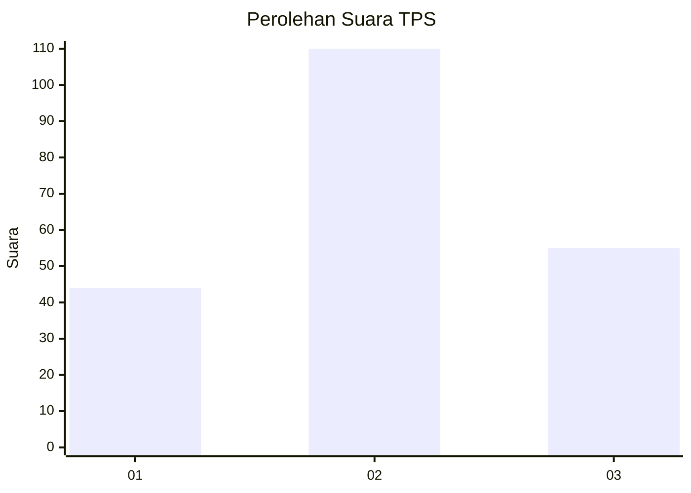
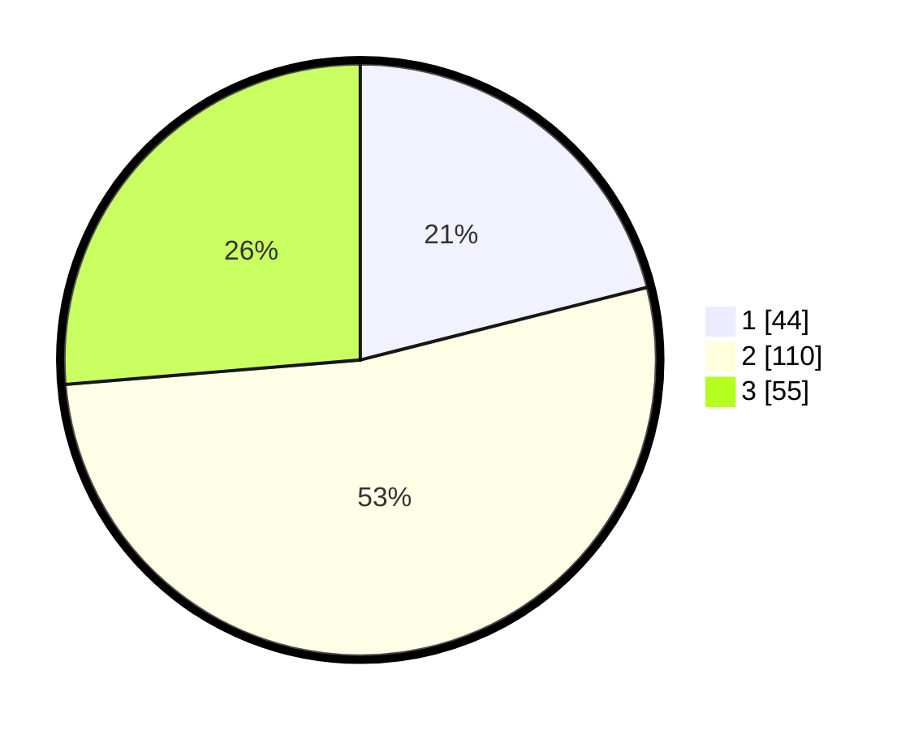

# Hasil

## Grafik

## Tabel

| No. | Nama Paslon    | Suara | Suara (raw) | Persentase |
|:--- |:-------------- | -----:| -----------:| ----------:|
| 1   | ANIES MUHAIMIN | 44    | [44][p-1]   | 21,05      |
| 2   | PRABOWO GIBRAN | 110   | [110][p-2]  | 52,63      |
| 3   | GANJAR MAHFUD  | 55    | [55][p-3]   | 26,32      |

[p-1]: https://github.com/gigit-pemilu/pemilu-2024/blob/main/pilpres/hitung-suara/sub/12-sumatera-utara/sub/14-nias-selatan/sub/35-idanotae/sub/2001-lahusa-idanotae/sub/001-tps/sub/paslon-1.txt
[p-2]: https://github.com/gigit-pemilu/pemilu-2024/blob/main/pilpres/hitung-suara/sub/12-sumatera-utara/sub/14-nias-selatan/sub/35-idanotae/sub/2001-lahusa-idanotae/sub/001-tps/sub/paslon-2.txt
[p-3]: https://github.com/gigit-pemilu/pemilu-2024/blob/main/pilpres/hitung-suara/sub/12-sumatera-utara/sub/14-nias-selatan/sub/35-idanotae/sub/2001-lahusa-idanotae/sub/001-tps/sub/paslon-3.txt

## Foto C Plano

https://sirekap-obj-formc.kpu.go.id/fce2/pemilu/ppwp/12/14/35/20/01/1214352001001-20240215-005834--4cc329bb-6e49-4bd1-b1da-043c5c6d3f24.jpg

https://sirekap-obj-formc.kpu.go.id/fce2/pemilu/ppwp/12/14/35/20/01/1214352001001-20240215-010214--52ba1334-46f2-4a72-88b2-5a99b40c222a.jpg

https://sirekap-obj-formc.kpu.go.id/fce2/pemilu/ppwp/12/14/35/20/01/1214352001001-20240215-010443--8bc5c278-52e6-487d-b59e-e156f68fd545.jpg

## Metadata

| Key        | Value               |
| ---------- | ------------------- |
| Time Stamp | 2024-02-15 21:30:27 |

