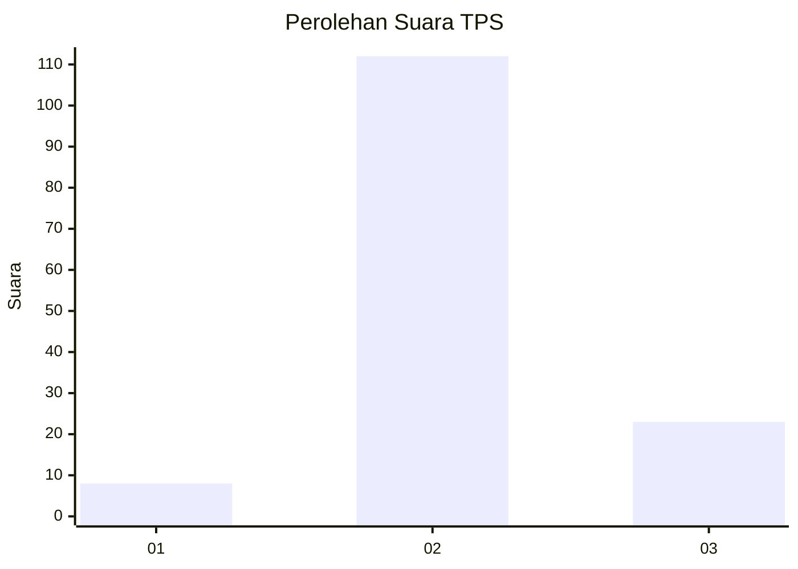
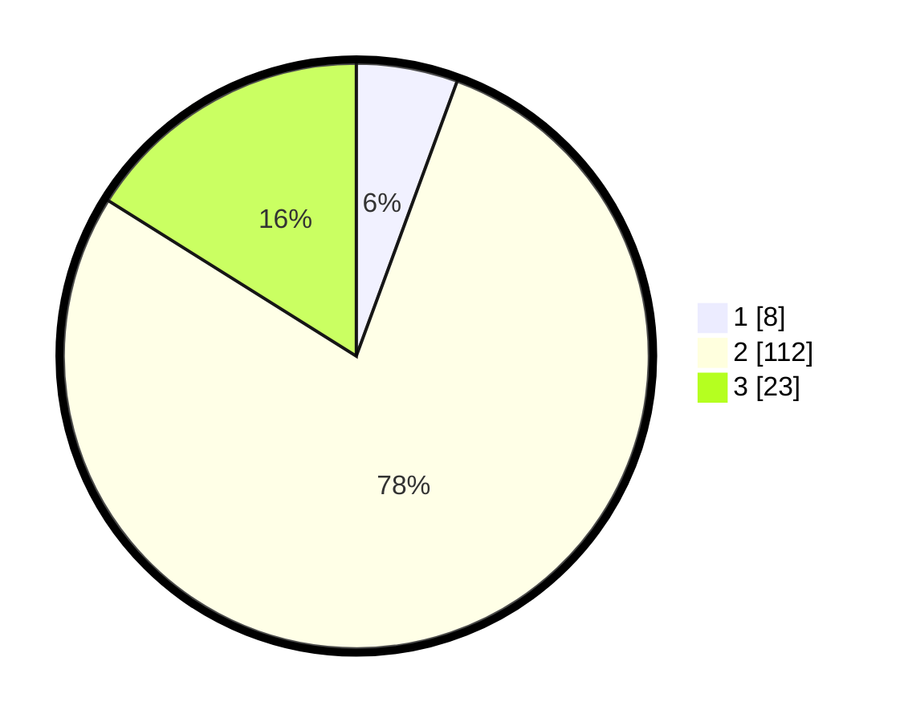

# Hasil

## Grafik

## Tabel

| No. | Nama Paslon    | Suara | Suara (raw) | Persentase |
|:--- |:-------------- | -----:| -----------:| ----------:|
| 1   | ANIES MUHAIMIN | 8     | [8][p-1]    | 5,59       |
| 2   | PRABOWO GIBRAN | 112   | [112][p-2]  | 78,32      |
| 3   | GANJAR MAHFUD  | 23    | [23][p-3]   | 16,08      |

[p-1]: https://github.com/gigit-pemilu/pemilu-2024-12-sumatera-utara/blob/main/pilpres/hitung-suara/sub/12-sumatera-utara/sub/14-nias-selatan/sub/35-idanotae/sub/2001-lahusa-idanotae/sub/003-tps/sub/paslon-1.txt
[p-2]: https://github.com/gigit-pemilu/pemilu-2024-12-sumatera-utara/blob/main/pilpres/hitung-suara/sub/12-sumatera-utara/sub/14-nias-selatan/sub/35-idanotae/sub/2001-lahusa-idanotae/sub/003-tps/sub/paslon-2.txt
[p-3]: https://github.com/gigit-pemilu/pemilu-2024-12-sumatera-utara/blob/main/pilpres/hitung-suara/sub/12-sumatera-utara/sub/14-nias-selatan/sub/35-idanotae/sub/2001-lahusa-idanotae/sub/003-tps/sub/paslon-3.txt

## Foto C Plano

https://sirekap-obj-formc.kpu.go.id/466b/pemilu/ppwp/12/14/35/20/01/1214352001003-20240215-011840--4c8c15ef-6e13-4786-a1c4-2d7bfa806435.jpg

https://sirekap-obj-formc.kpu.go.id/466b/pemilu/ppwp/12/14/35/20/01/1214352001003-20240215-012411--47b5f9ea-5aa7-4861-93f9-8b6df575fad0.jpg

https://sirekap-obj-formc.kpu.go.id/466b/pemilu/ppwp/12/14/35/20/01/1214352001003-20240215-012745--22d2271a-8e01-4419-b54d-35737c337ae9.jpg

## Metadata

| Key        | Value               |
| ---------- | ------------------- |
| Time Stamp | 2024-02-15 21:30:27 |

