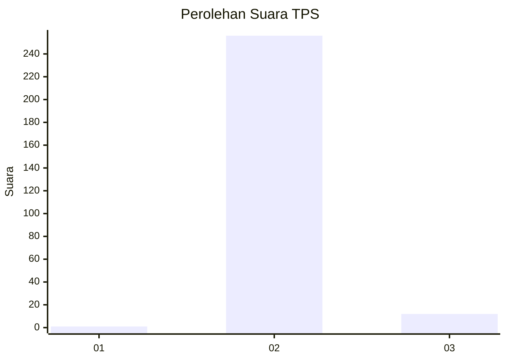
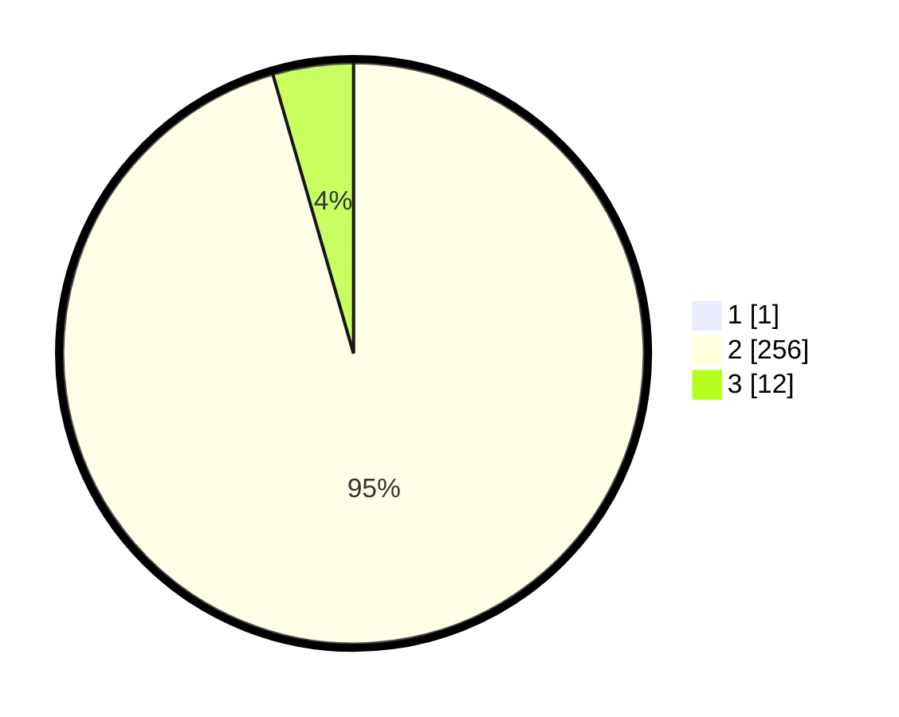

# Hasil

## Grafik

## Tabel

| No. | Nama Paslon    | Suara | Suara (raw) | Persentase |
|:--- |:-------------- | -----:| -----------:| ----------:|
| 1   | ANIES MUHAIMIN | 1     | [1][p-1]    | 0,37       |
| 2   | PRABOWO GIBRAN | 256   | [256][p-2]  | 95,17      |
| 3   | GANJAR MAHFUD  | 12    | [12][p-3]   | 4,46       |

[p-1]: https://github.com/gigit-pemilu/pemilu-2024-12-sumatera-utara/blob/main/pilpres/hitung-suara/sub/12-sumatera-utara/sub/14-nias-selatan/sub/35-idanotae/sub/2003-orahua/sub/002-tps/sub/paslon-1.txt
[p-2]: https://github.com/gigit-pemilu/pemilu-2024-12-sumatera-utara/blob/main/pilpres/hitung-suara/sub/12-sumatera-utara/sub/14-nias-selatan/sub/35-idanotae/sub/2003-orahua/sub/002-tps/sub/paslon-2.txt
[p-3]: https://github.com/gigit-pemilu/pemilu-2024-12-sumatera-utara/blob/main/pilpres/hitung-suara/sub/12-sumatera-utara/sub/14-nias-selatan/sub/35-idanotae/sub/2003-orahua/sub/002-tps/sub/paslon-3.txt

## Foto C Plano

https://sirekap-obj-formc.kpu.go.id/8233/pemilu/ppwp/12/14/35/20/03/1214352003002-20240214-202248--5dd1613b-c5c7-4f08-8c79-3370b7b2875f.jpg

https://sirekap-obj-formc.kpu.go.id/8233/pemilu/ppwp/12/14/35/20/03/1214352003002-20240214-203101--d9d9e119-a9c1-458c-8735-811ba4d9d274.jpg

https://sirekap-obj-formc.kpu.go.id/8233/pemilu/ppwp/12/14/35/20/03/1214352003002-20240214-203824--ab2e556e-ec05-43ea-b259-31ee67645586.jpg

## Metadata

| Key        | Value               |
| ---------- | ------------------- |
| Time Stamp | 2024-02-15 23:29:50 |

