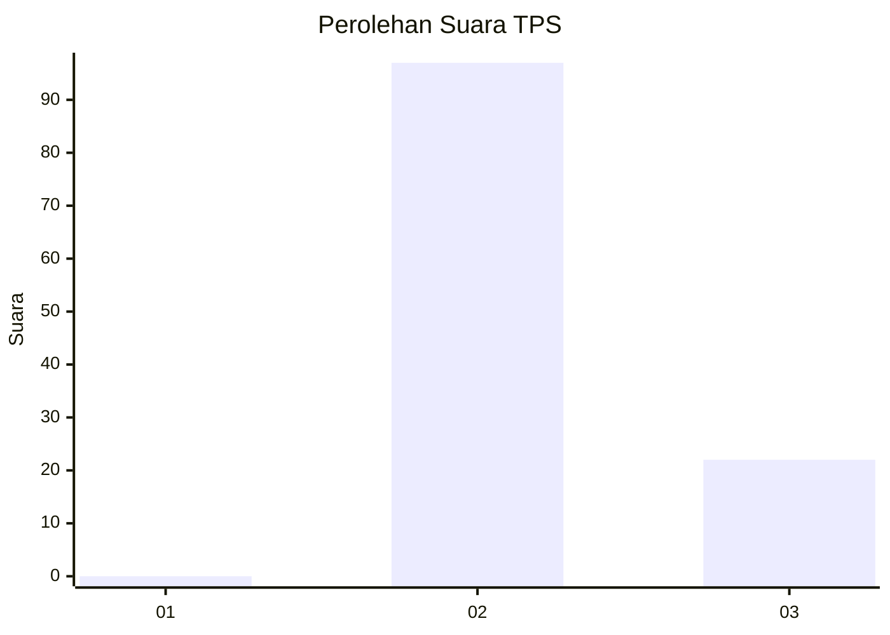
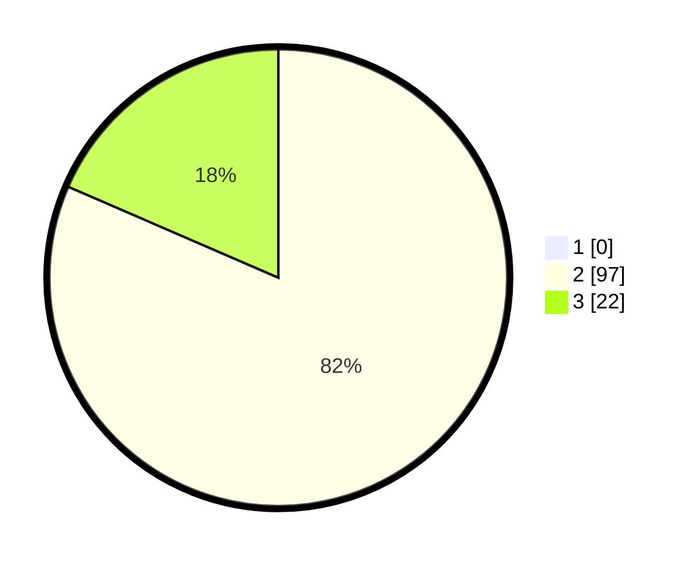

# Hasil

## Grafik

## Tabel

| No. | Nama Paslon    | Suara | Suara (raw) | Persentase |
|:--- |:-------------- | -----:| -----------:| ----------:|
| 1   | ANIES MUHAIMIN | 0     | [0][p-1]    | 0,00       |
| 2   | PRABOWO GIBRAN | 97    | [97][p-2]   | 81,51      |
| 3   | GANJAR MAHFUD  | 22    | [22][p-3]   | 18,49      |

[p-1]: https://github.com/gigit-pemilu/pemilu-2024/blob/main/pilpres/hitung-suara/sub/12-sumatera-utara/sub/14-nias-selatan/sub/35-idanotae/sub/2006-umbu-idanotae/sub/002-tps/sub/paslon-1.txt
[p-2]: https://github.com/gigit-pemilu/pemilu-2024/blob/main/pilpres/hitung-suara/sub/12-sumatera-utara/sub/14-nias-selatan/sub/35-idanotae/sub/2006-umbu-idanotae/sub/002-tps/sub/paslon-2.txt
[p-3]: https://github.com/gigit-pemilu/pemilu-2024/blob/main/pilpres/hitung-suara/sub/12-sumatera-utara/sub/14-nias-selatan/sub/35-idanotae/sub/2006-umbu-idanotae/sub/002-tps/sub/paslon-3.txt

## Foto C Plano

https://sirekap-obj-formc.kpu.go.id/8f55/pemilu/ppwp/12/14/35/20/06/1214352006002-20240215-145321--d690f9a3-c41e-4f52-bdcb-9e3942ffddfa.jpg

https://sirekap-obj-formc.kpu.go.id/8f55/pemilu/ppwp/12/14/35/20/06/1214352006002-20240215-145613--bd99af31-ee85-45ed-95a0-51004173d22d.jpg

https://sirekap-obj-formc.kpu.go.id/8f55/pemilu/ppwp/12/14/35/20/06/1214352006002-20240215-145907--ec0b08a7-9b88-4a9d-83d0-bc5a8d5f27b1.jpg

## Metadata

| Key        | Value               |
| ---------- | ------------------- |
| Time Stamp | 2024-02-15 23:29:50 |

