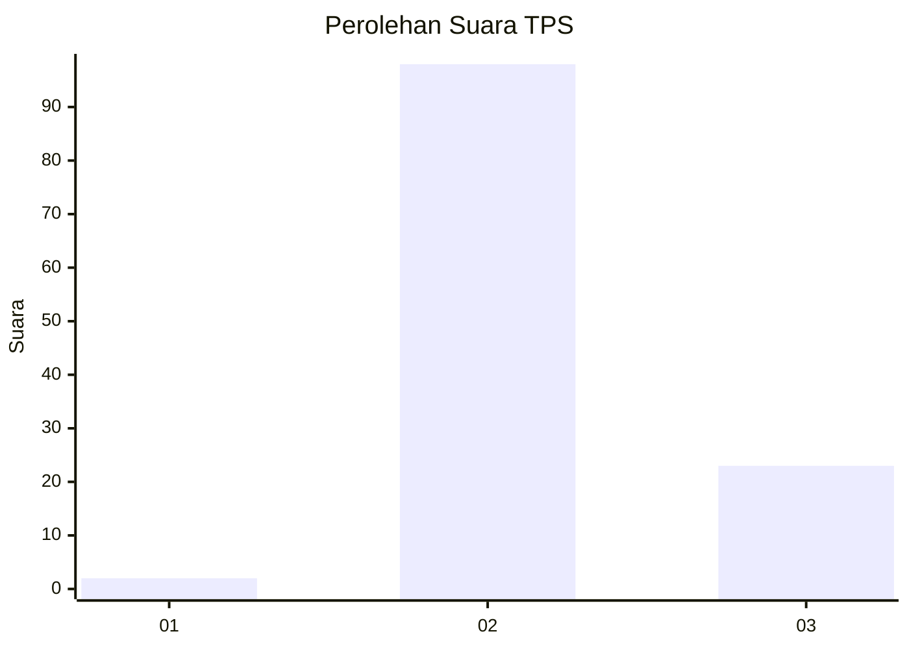
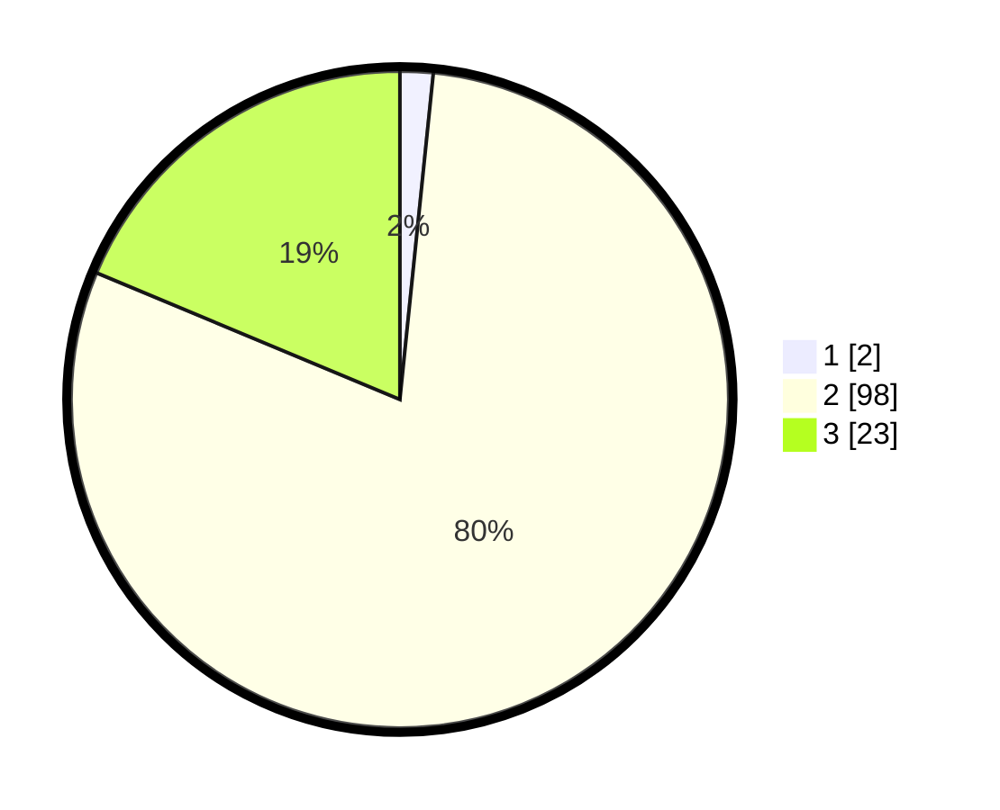

# Hasil

## Grafik

## Tabel

| No. | Nama Paslon    | Suara | Suara (raw) | Persentase |
|:--- |:-------------- | -----:| -----------:| ----------:|
| 1   | ANIES MUHAIMIN | 2     | [2][p-1]    | 1,63       |
| 2   | PRABOWO GIBRAN | 98    | [98][p-2]   | 79,67      |
| 3   | GANJAR MAHFUD  | 23    | [23][p-3]   | 18,70      |

[p-1]: https://github.com/gigit-pemilu/pemilu-2024-12-sumatera-utara/blob/main/pilpres/hitung-suara/sub/12-sumatera-utara/sub/14-nias-selatan/sub/35-idanotae/sub/2006-umbu-idanotae/sub/003-tps/sub/paslon-1.txt
[p-2]: https://github.com/gigit-pemilu/pemilu-2024-12-sumatera-utara/blob/main/pilpres/hitung-suara/sub/12-sumatera-utara/sub/14-nias-selatan/sub/35-idanotae/sub/2006-umbu-idanotae/sub/003-tps/sub/paslon-2.txt
[p-3]: https://github.com/gigit-pemilu/pemilu-2024-12-sumatera-utara/blob/main/pilpres/hitung-suara/sub/12-sumatera-utara/sub/14-nias-selatan/sub/35-idanotae/sub/2006-umbu-idanotae/sub/003-tps/sub/paslon-3.txt

## Foto C Plano

https://sirekap-obj-formc.kpu.go.id/cf2e/pemilu/ppwp/12/14/35/20/06/1214352006003-20240215-170942--fb0e4437-cf57-4677-817f-0ed6da3f1601.jpg

https://sirekap-obj-formc.kpu.go.id/cf2e/pemilu/ppwp/12/14/35/20/06/1214352006003-20240215-171627--280fb77c-c5db-4cbc-9c88-fca30cea1ed3.jpg

https://sirekap-obj-formc.kpu.go.id/cf2e/pemilu/ppwp/12/14/35/20/06/1214352006003-20240215-171807--cb3cf7af-53c5-4f8f-8760-8e63522b1b52.jpg

## Metadata

| Key        | Value               |
| ---------- | ------------------- |
| Time Stamp | 2024-02-20 13:00:00 |

