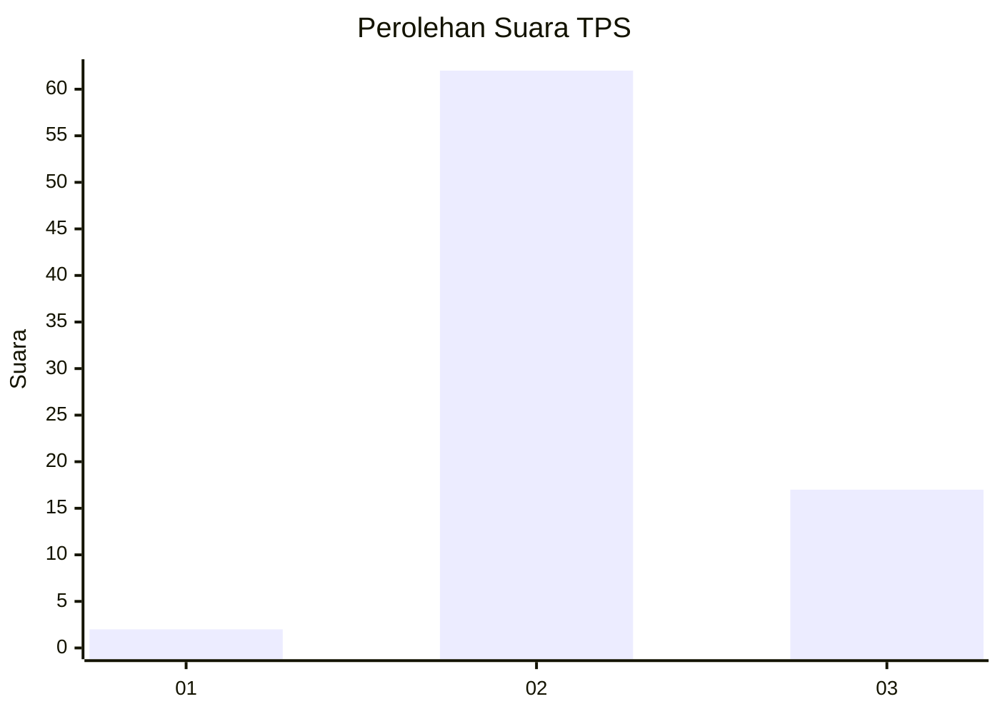

# Hasil

## Grafik

## Tabel

| No. | Nama Paslon    | Suara | Suara (raw) | Persentase |
|:--- |:-------------- | -----:| -----------:| ----------:|
| 1   | ANIES MUHAIMIN | 2     | [2][p-1]    | 2,47       |
| 2   | PRABOWO GIBRAN | 62    | [62][p-2]   | 76,54      |
| 3   | GANJAR MAHFUD  | 17    | [17][p-3]   | 20,99      |

[p-1]: https://github.com/gigit-pemilu/pemilu-2024/blob/main/pilpres/hitung-suara/sub/12-sumatera-utara/sub/14-nias-selatan/sub/35-idanotae/sub/2008-hilisalo'o/sub/001-tps/sub/paslon-1.txt
[p-2]: https://github.com/gigit-pemilu/pemilu-2024/blob/main/pilpres/hitung-suara/sub/12-sumatera-utara/sub/14-nias-selatan/sub/35-idanotae/sub/2008-hilisalo'o/sub/001-tps/sub/paslon-2.txt
[p-3]: https://github.com/gigit-pemilu/pemilu-2024/blob/main/pilpres/hitung-suara/sub/12-sumatera-utara/sub/14-nias-selatan/sub/35-idanotae/sub/2008-hilisalo'o/sub/001-tps/sub/paslon-3.txt

## Foto C Plano

https://sirekap-obj-formc.kpu.go.id/3b19/pemilu/ppwp/12/14/35/20/08/1214352008001-20240215-124424--735d88a6-adef-411d-94ec-056e6c9d0ccb.jpg

https://sirekap-obj-formc.kpu.go.id/3b19/pemilu/ppwp/12/14/35/20/08/1214352008001-20240215-124927--3e01da06-c72b-4909-bfec-e76711d74da1.jpg

https://sirekap-obj-formc.kpu.go.id/3b19/pemilu/ppwp/12/14/35/20/08/1214352008001-20240215-125405--d6200190-ddfb-4ab6-b557-26dd26a0b941.jpg

## Metadata

| Key        | Value               |
| ---------- | ------------------- |
| Time Stamp | 2024-02-15 23:29:50 |

