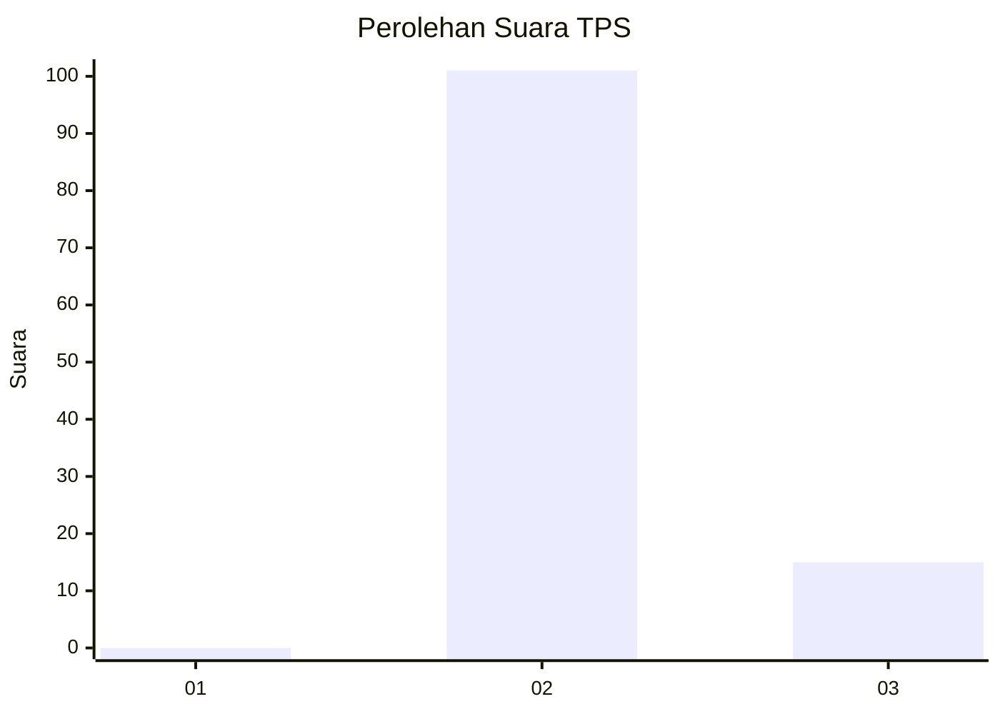
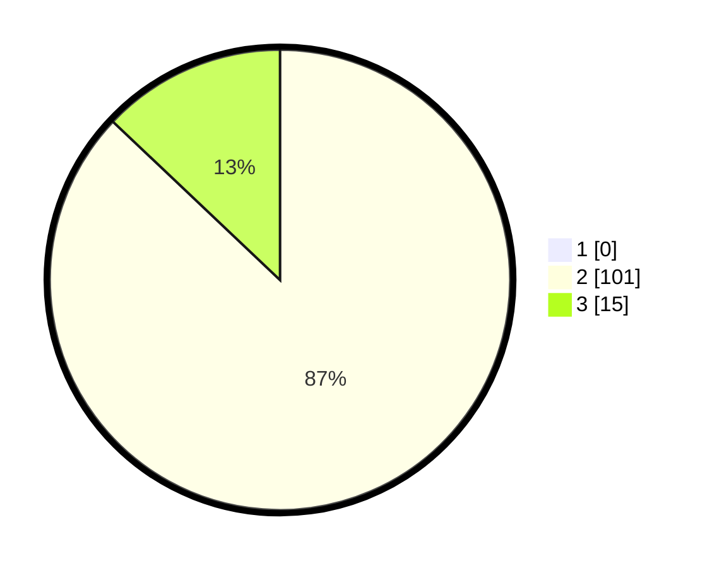

# Hasil

## Grafik

## Tabel

| No. | Nama Paslon    | Suara | Suara (raw) | Persentase |
|:--- |:-------------- | -----:| -----------:| ----------:|
| 1   | ANIES MUHAIMIN | 0     | [0][p-1]    | 0,00       |
| 2   | PRABOWO GIBRAN | 101   | [101][p-2]  | 87,07      |
| 3   | GANJAR MAHFUD  | 15    | [15][p-3]   | 12,93      |

[p-1]: https://github.com/gigit-pemilu/pemilu-2024/blob/main/pilpres/hitung-suara/sub/12-sumatera-utara/sub/14-nias-selatan/sub/35-idanotae/sub/2008-hilisalo'o/sub/002-tps/sub/paslon-1.txt
[p-2]: https://github.com/gigit-pemilu/pemilu-2024/blob/main/pilpres/hitung-suara/sub/12-sumatera-utara/sub/14-nias-selatan/sub/35-idanotae/sub/2008-hilisalo'o/sub/002-tps/sub/paslon-2.txt
[p-3]: https://github.com/gigit-pemilu/pemilu-2024/blob/main/pilpres/hitung-suara/sub/12-sumatera-utara/sub/14-nias-selatan/sub/35-idanotae/sub/2008-hilisalo'o/sub/002-tps/sub/paslon-3.txt

## Foto C Plano

https://sirekap-obj-formc.kpu.go.id/36a3/pemilu/ppwp/12/14/35/20/08/1214352008002-20240215-141847--3d1f452a-a40e-457f-843a-2c09c0135c8a.jpg

https://sirekap-obj-formc.kpu.go.id/36a3/pemilu/ppwp/12/14/35/20/08/1214352008002-20240215-141618--5fb5da97-bc11-4d7b-8c7d-7b0ca02cc4a6.jpg

https://sirekap-obj-formc.kpu.go.id/36a3/pemilu/ppwp/12/14/35/20/08/1214352008002-20240215-142030--5727af29-1c58-41e0-b18b-5dbc4a662de0.jpg

## Metadata

| Key        | Value               |
| ---------- | ------------------- |
| Time Stamp | 2024-02-20 13:00:00 |

