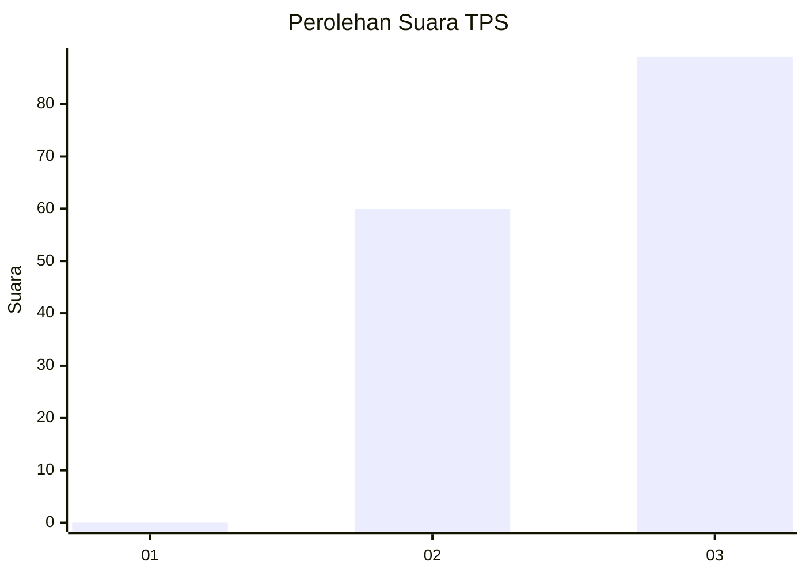
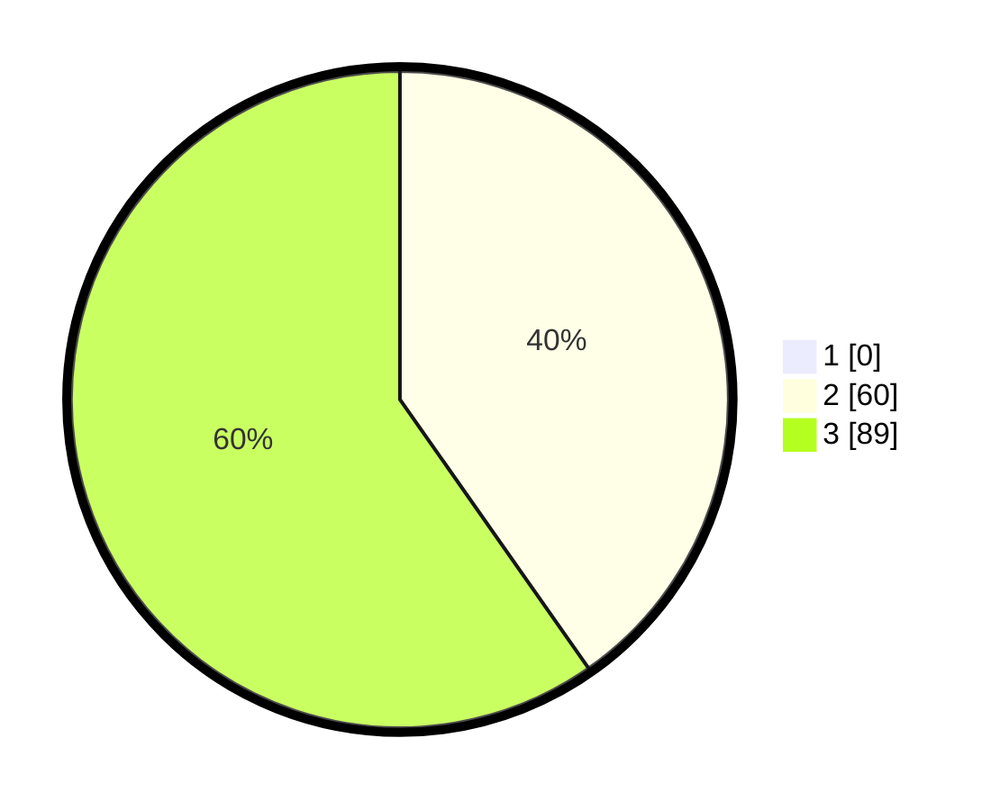

# Hasil

## Grafik

## Tabel

| No. | Nama Paslon    | Suara | Suara (raw) | Persentase |
|:--- |:-------------- | -----:| -----------:| ----------:|
| 1   | ANIES MUHAIMIN | 0     | [0][p-1]    | 0,00       |
| 2   | PRABOWO GIBRAN | 60    | [60][p-2]   | 40,27      |
| 3   | GANJAR MAHFUD  | 89    | [89][p-3]   | 59,73      |

[p-1]: https://github.com/gigit-pemilu/pemilu-2024-12-sumatera-utara/blob/main/pilpres/hitung-suara/sub/12-sumatera-utara/sub/14-nias-selatan/sub/35-idanotae/sub/2009-balombaruzo-orahua/sub/001-tps/sub/paslon-1.txt
[p-2]: https://github.com/gigit-pemilu/pemilu-2024-12-sumatera-utara/blob/main/pilpres/hitung-suara/sub/12-sumatera-utara/sub/14-nias-selatan/sub/35-idanotae/sub/2009-balombaruzo-orahua/sub/001-tps/sub/paslon-2.txt
[p-3]: https://github.com/gigit-pemilu/pemilu-2024-12-sumatera-utara/blob/main/pilpres/hitung-suara/sub/12-sumatera-utara/sub/14-nias-selatan/sub/35-idanotae/sub/2009-balombaruzo-orahua/sub/001-tps/sub/paslon-3.txt

## Foto C Plano

https://sirekap-obj-formc.kpu.go.id/f158/pemilu/ppwp/12/14/35/20/09/1214352009001-20240215-100828--15cd9a3a-67c5-4bb9-a21c-806540485c8a.jpg

https://sirekap-obj-formc.kpu.go.id/f158/pemilu/ppwp/12/14/35/20/09/1214352009001-20240215-101007--90289bac-72c6-4a65-b745-bdd07b1f9b1e.jpg

https://sirekap-obj-formc.kpu.go.id/f158/pemilu/ppwp/12/14/35/20/09/1214352009001-20240215-101156--4a2ba16b-a404-4515-aed6-4fc3451f3108.jpg

## Metadata

| Key        | Value               |
| ---------- | ------------------- |
| Time Stamp | 2024-02-15 23:29:50 |

