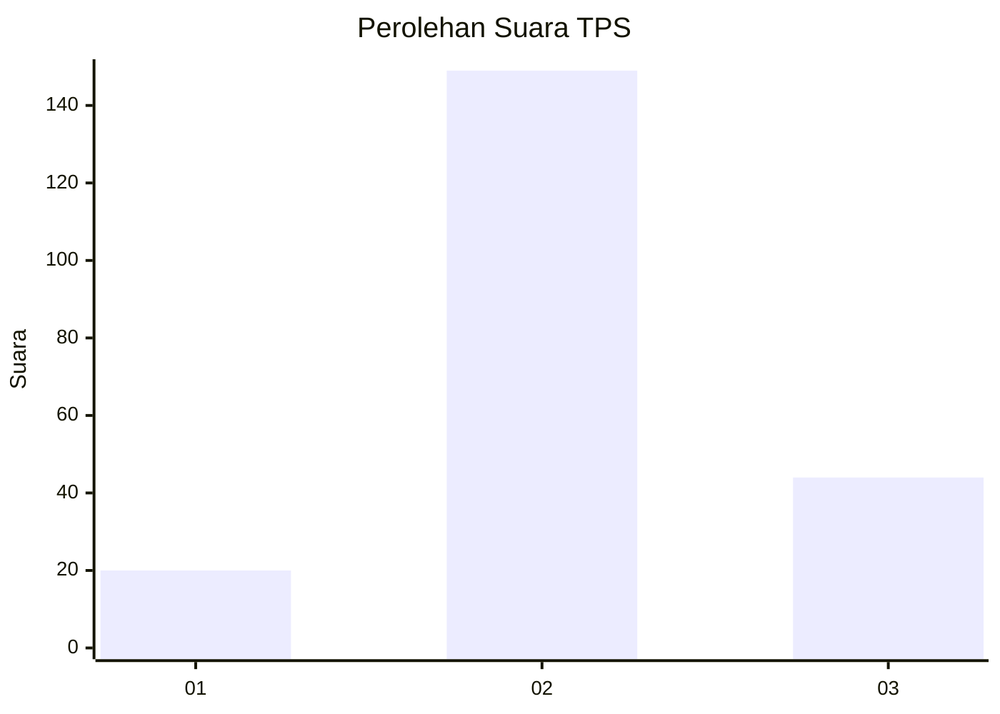
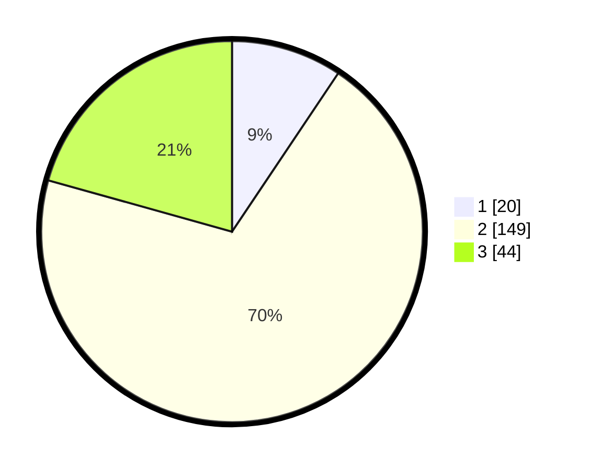

# Hasil

## Grafik

## Tabel

| No. | Nama Paslon    | Suara | Suara (raw) | Persentase |
|:--- |:-------------- | -----:| -----------:| ----------:|
| 1   | ANIES MUHAIMIN | 20    | [20][p-1]   | 9,39       |
| 2   | PRABOWO GIBRAN | 149   | [149][p-2]  | 69,95      |
| 3   | GANJAR MAHFUD  | 44    | [44][p-3]   | 20,66      |

[p-1]: https://github.com/gigit-pemilu/pemilu-2024/blob/main/pilpres/hitung-suara/sub/12-sumatera-utara/sub/15-pakpak-bharat/sub/03-salak/sub/2002-salak-ii/sub/002-tps/sub/paslon-1.txt
[p-2]: https://github.com/gigit-pemilu/pemilu-2024/blob/main/pilpres/hitung-suara/sub/12-sumatera-utara/sub/15-pakpak-bharat/sub/03-salak/sub/2002-salak-ii/sub/002-tps/sub/paslon-2.txt
[p-3]: https://github.com/gigit-pemilu/pemilu-2024/blob/main/pilpres/hitung-suara/sub/12-sumatera-utara/sub/15-pakpak-bharat/sub/03-salak/sub/2002-salak-ii/sub/002-tps/sub/paslon-3.txt

## Foto C Plano

https://sirekap-obj-formc.kpu.go.id/a877/pemilu/ppwp/12/15/03/20/02/1215032002002-20240214-155802--851dbadc-212b-4f7c-b26f-dc2ec82e760f.jpg

https://sirekap-obj-formc.kpu.go.id/a877/pemilu/ppwp/12/15/03/20/02/1215032002002-20240214-234342--7a8c677a-af30-4ebd-b708-c134cf3055e9.jpg

https://sirekap-obj-formc.kpu.go.id/a877/pemilu/ppwp/12/15/03/20/02/1215032002002-20240214-224654--4cf347cb-6c5b-4e13-b7ab-f3b83e14fb88.jpg

## Metadata

| Key        | Value               |
| ---------- | ------------------- |
| Time Stamp | 2024-02-15 16:30:25 |

