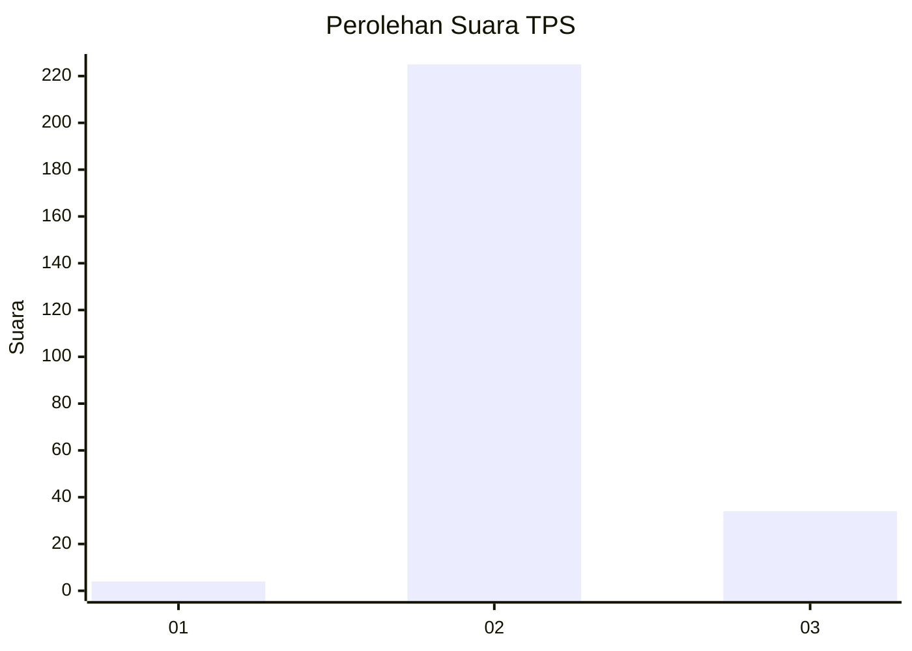
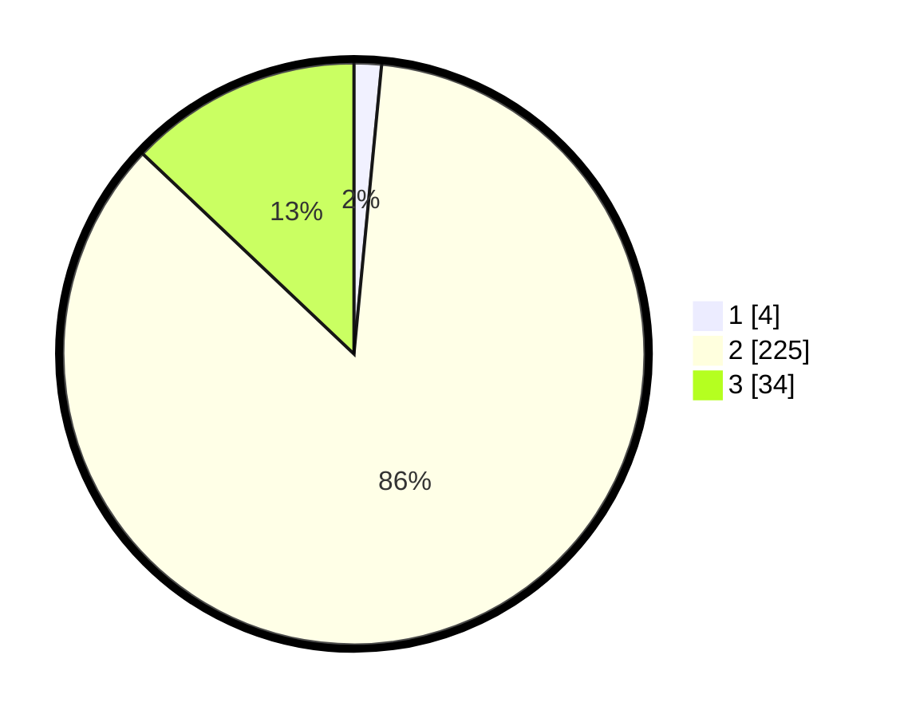

# Hasil

## Grafik

## Tabel

| No. | Nama Paslon    | Suara | Suara (raw) | Persentase |
|:--- |:-------------- | -----:| -----------:| ----------:|
| 1   | ANIES MUHAIMIN | 4     | [4][p-1]    | 1,52       |
| 2   | PRABOWO GIBRAN | 225   | [225][p-2]  | 85,55      |
| 3   | GANJAR MAHFUD  | 34    | [34][p-3]   | 12,93      |

[p-1]: https://github.com/gigit-pemilu/pemilu-2024-12-sumatera-utara/blob/main/pilpres/hitung-suara/sub/12-sumatera-utara/sub/16-humbang-hasundutan/sub/01-parlilitan/sub/2016-sihotang-hasugian-habinsaran/sub/001-tps/sub/paslon-1.txt
[p-2]: https://github.com/gigit-pemilu/pemilu-2024-12-sumatera-utara/blob/main/pilpres/hitung-suara/sub/12-sumatera-utara/sub/16-humbang-hasundutan/sub/01-parlilitan/sub/2016-sihotang-hasugian-habinsaran/sub/001-tps/sub/paslon-2.txt
[p-3]: https://github.com/gigit-pemilu/pemilu-2024-12-sumatera-utara/blob/main/pilpres/hitung-suara/sub/12-sumatera-utara/sub/16-humbang-hasundutan/sub/01-parlilitan/sub/2016-sihotang-hasugian-habinsaran/sub/001-tps/sub/paslon-3.txt

## Foto C Plano

https://sirekap-obj-formc.kpu.go.id/ebe8/pemilu/ppwp/12/16/01/20/16/1216012016001-20240219-110359--9d31692d-0011-47da-9d0e-5e372e3ba3fd.jpg

https://sirekap-obj-formc.kpu.go.id/ebe8/pemilu/ppwp/12/16/01/20/16/1216012016001-20240219-110954--3edd4a3a-d01f-4ea2-8843-4b7f93de71ba.jpg

https://sirekap-obj-formc.kpu.go.id/ebe8/pemilu/ppwp/12/16/01/20/16/1216012016001-20240219-110747--95187b13-403e-4604-a762-ca7b051a588c.jpg

## Metadata

| Key        | Value               |
| ---------- | ------------------- |
| Time Stamp | 2024-02-19 12:00:00 |

## DATA PEMILIH TETAP

Jumlah pemilih dalam DPT: **267**.
 * L: **930**.
 * P: **137**.

## DATA PENGGUNA HAK PILIH

Jumlah pengguna hak pilih dalam DPT: **207**.
 * L: **883**.
 * P: **805**.

Jumlah pengguna hak pilih dalam DPTb: **842**.
 * L: **745**.
 * P: **702**.

Jumlah pengguna hak pilih dalam DPK: **243**.
 * L: **245**.
 * P: **242**.

Jumlah pengguna hak pilih: **263**.
 * L: **382**.
 * P: **882**.

## JUMLAH SUARA SAH DAN TIDAK SAH

JUMLAH SELURUH SUARA SAH: **208**.

JUMLAH SUARA TIDAK SAH: **5**.

JUMLAH SELURUH SUARA SAH DAN SUARA TIDAK SAH: **212**.

