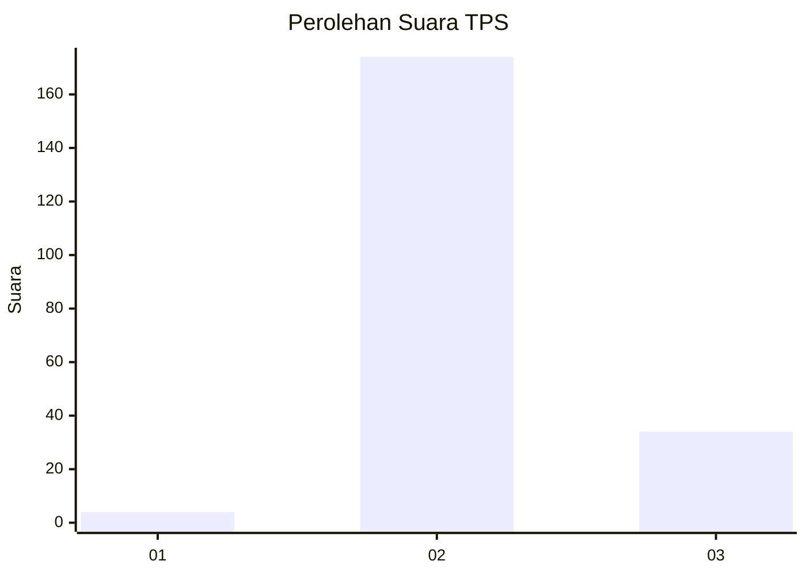
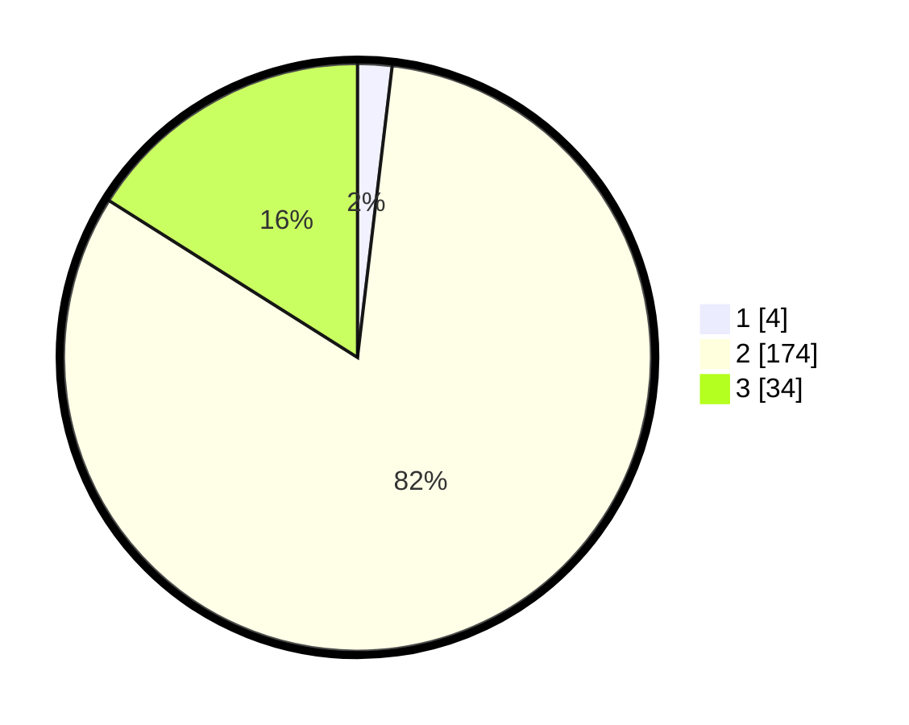

# Hasil

## Grafik

## Tabel

| No. | Nama Paslon    | Suara | Suara (raw) | Persentase |
|:--- |:-------------- | -----:| -----------:| ----------:|
| 1   | ANIES MUHAIMIN | 4     | [4][p-1]    | 1,89       |
| 2   | PRABOWO GIBRAN | 174   | [174][p-2]  | 82,08      |
| 3   | GANJAR MAHFUD  | 34    | [34][p-3]   | 16,04      |

[p-1]: https://github.com/gigit-pemilu/pemilu-2024/blob/main/pilpres/hitung-suara/sub/12-sumatera-utara/sub/16-humbang-hasundutan/sub/03-baktiraja/sub/2001-marbun-toruan/sub/002-tps/sub/paslon-1.txt
[p-2]: https://github.com/gigit-pemilu/pemilu-2024/blob/main/pilpres/hitung-suara/sub/12-sumatera-utara/sub/16-humbang-hasundutan/sub/03-baktiraja/sub/2001-marbun-toruan/sub/002-tps/sub/paslon-2.txt
[p-3]: https://github.com/gigit-pemilu/pemilu-2024/blob/main/pilpres/hitung-suara/sub/12-sumatera-utara/sub/16-humbang-hasundutan/sub/03-baktiraja/sub/2001-marbun-toruan/sub/002-tps/sub/paslon-3.txt

## Foto C Plano

https://sirekap-obj-formc.kpu.go.id/c01e/pemilu/ppwp/12/16/03/20/01/1216032001002-20240214-213444--2261273d-8396-4585-ac70-79ecab446622.jpg

https://sirekap-obj-formc.kpu.go.id/c01e/pemilu/ppwp/12/16/03/20/01/1216032001002-20240214-204226--803e312b-b3d3-4cbe-8c1b-058d3392bfab.jpg

https://sirekap-obj-formc.kpu.go.id/c01e/pemilu/ppwp/12/16/03/20/01/1216032001002-20240214-204413--b92145b6-2a08-419b-b253-299b110e167c.jpg

## Metadata

| Key        | Value               |
| ---------- | ------------------- |
| Time Stamp | 2024-02-15 09:00:24 |

